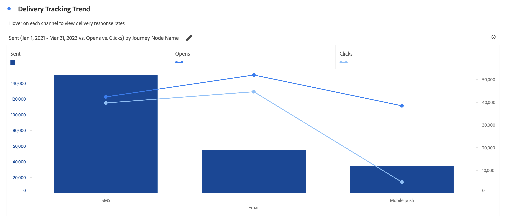

# Kombination {#combo}

<!-- markdownlint-disable MD034 -->

>[!CONTEXTUALHELP]
>id="workspace_combo_button"
>title="Kombination"
>abstract="Skapa snabbt en visualisering av kombinationsdiagram utan att först behöva skapa en frihandstabell."

<!-- markdownlint-enable MD034 -->

>[!BEGINSHADEBOX]

_I den här artikeln dokumenteras kombinationsvisualiseringen i_  _&#x200B;**Adobe Analytics**._

_Se [Combo](https://experienceleague.adobe.com/en/docs/analytics-platform/using/cja-workspace/visualizations/combo-charts) för_  _&#x200B;**Customer Journey Analytics**-versionen av den här artikeln._

>[!ENDSHADEBOX]

Visualiseringen av  **[!UICONTROL Combo]** gör det enkelt att snabbt skapa en jämförelsevisualisering utan att först behöva skapa en tabell. Du kan enkelt visa trender i dina data i en kombination av rad och rad.

Använd en [!UICONTROL Combo] för att:

* Jämför den här veckans order med order vid samma tidpunkt förra månaden (och förra året).
* Analysera och jämför snabbt flera mätvärden (som [!UICONTROL Persons] och [!UICONTROL Revenue]) mot varandra i samma diagram.
* Analysera ett mätvärde mot en funktion (till exempel [!UICONTROL Cumulative Average]) över en tidshorisont.

Kom ihåg att:

* Du kan lägga till flera jämförelser i en enda [!UICONTROL Combo chart].
* Om du lägger till en eller flera jämförelser måste de vara av samma typ, till exempel [!UICONTROL Time comparison].
* Du kan lägga till upp till fem jämförelser.
* Du kan använda upp till tre filter på ett mätresultat.
* Beräknade mått stöds inte i kombinationsdiagram.

## Använd

1. Lägg till en  [!UICONTROL Combo]-visualisering. Se [Lägga till en visualisering på en panel](freeform-analysis-visualizations.md#add-visualizations-to-a-panel)

1. Välj en dimension för X-axeln och ett mått för Y-axeln i listrutan.

1. Välj den typ av [!UICONTROL Line comparison] som du vill använda.

   | Jämförelsetyp | Definition |
   | --- | --- |
   | **[!UICONTROL Time comparison]** | Den vanligaste typen av jämförelse - till exempel en jämförelse mellan den här tidsperioden och för 4 veckor sedan. Om du har valt [!UICONTROL Time comparison] kan du göra ett andra val för vilken tidsperiod du vill jämföra.
 |
   | **[!UICONTROL Function]** | Du kan introducera en funktion som [!UICONTROL Average] i jämförelsen. Se listan med [funktioner som stöds](#supported-functions).
 |
   | **[!UICONTROL Secondary metric]** | Du kan till exempel jämföra [!UICONTROL Revenue] med ett annat mått.
 |

   {style="table-layout:auto"}

1. Välj **[!UICONTROL Build]**.

   Utdata ser ut ungefär som:

   

   Den aktuella perioden visas i stapeldiagrammet. Raddiagrammet representerar jämförelseperioden. Punkter i linjediagrammet kallas *streck*.

## Funktioner som stöds

Om du väljer **[!UICONTROL Function]** som [!UICONTROL Line comparison type] returneras en funktion för det valda måttet.

| Funktion | Definition |
| --- | --- |
| **[!UICONTROL Column Sum]** | Lägger till alla numeriska värden för ett mått i en kolumn (över elementen i en dimension) |
| **[!UICONTROL Cumulative Average]** | Returnera medelvärdet för de sista N raderna. |
| **[!UICONTROL Median]** | Returnerar medianvärdet för ett mått i en kolumn. Medianvärdet är talet i mitten av en sifferuppsättning. Hälften av talen har värden som är större än eller lika med medianen, och hälften av talet har värden som är mindre än eller lika med medianen. |
| **[!UICONTROL Cumulative]** | Den kumulativa summan av N-rader. |
| **[!UICONTROL Column Maximum]** | Returnerar det största värdet i en uppsättning dimensionselement för en måttkolumn. |
| **[!UICONTROL Mean]** | Returnerar det aritmetiska medelvärdet, eller medelvärdet, för ett mått. |
| **[!UICONTROL Column Minimum]** | Returnerar det minsta värdet i en uppsättning dimensionselement för en måttkolumn. |

{style="table-layout:auto"}

Här är ett exempel på det ackumulerade genomsnittet för intäktsmåttet:

Här följer ett exempel på ett kombinationsdiagram med funktioner för både Cumulativt medelvärde och Medel:

>[!MORELIKETHIS]
>
>[Lägg till en visualisering på en panel](/help/analyze/analysis-workspace/visualizations/freeform-analysis-visualizations.md#add-visualizations-to-a-panel)
>&#x200B;>[Visualiseringsinställningar](/help/analyze/analysis-workspace/visualizations/freeform-analysis-visualizations.md#settings)
>&#x200B;>[Snabbmenyn Visualisering ](/help/analyze/analysis-workspace/visualizations/freeform-analysis-visualizations.md#context-menu)
>
