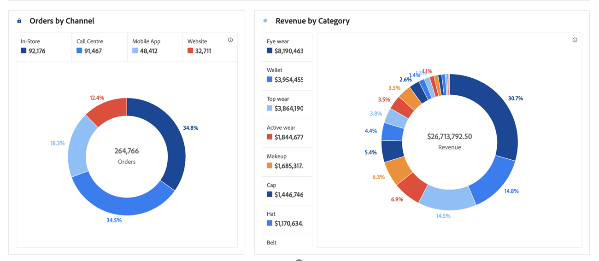

# [!UICONTROL Donut] {#donut}

<!-- markdownlint-disable MD034 -->

>[!CONTEXTUALHELP]
>id="workspace_donut_button"
>title="Munk"
>abstract="Skapa en munstycksvisualisering för att jämföra procentandelar av en summa, vanligtvis med ett litet antal objekt."

<!-- markdownlint-enable MD034 -->

>[!BEGINSHADEBOX]

*I den här artikeln dokumenteras Donut-visualiseringen i **Adobe Analytics**. Se [Donut](https://experienceleague.adobe.com/en/docs/analytics-platform/using/cja-workspace/visualizations/donut) för versionen **Customer Journey Analytics**av den här artikeln.*

>[!ENDSHADEBOX]

På samma sätt som ett cirkeldiagram visar den här visualiseringen data som delar eller segment av en helhet. Använd ett [!UICONTROL Donut]-diagram när du jämför procentandelar av en summa, vanligtvis med ett litet antal objekt.

Här är en video om hur du använder visualiseringen [!UICONTROL Donut]:

>[!VIDEO](https://video.tv.adobe.com/v/334309/?quality=12)
