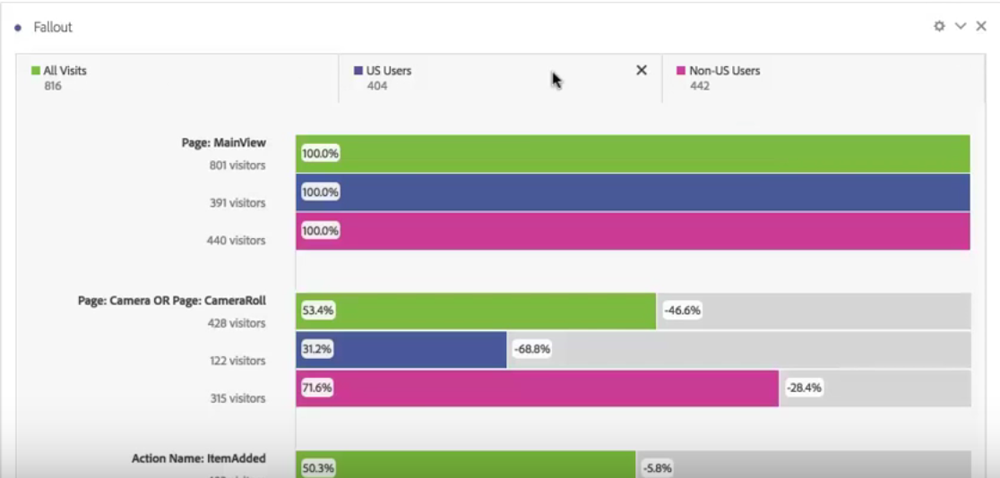

# Använd segment i utfallsanalys

Du kan skapa segment från en kontaktyta, lägga till segment som kontaktyta och jämföra viktiga arbetsflöden mellan olika segment i Analysis Workspace.

>[!IMPORTANT]
>
>Segment som används som kontrollpunkter i utfall måste använda en behållare som är på en lägre nivå än den övergripande kontexten för utfallsvisualiseringen. Med en besökarkontextutvikning måste segment som används som kontrollpunkter vara besök eller träffbaserade segment. Med en utvikning för besökskontext måste segment som används som kontrollpunkt vara träffbaserade segment. Om du använder en ogiltig kombination blir utfallet 100 %. En varning visas i Utfallsvisualiseringen när du lägger till ett inkompatibelt segment som kontaktyta. Vissa ogiltiga kombinationer av segmentbehållare leder till ogiltiga utfallsdiagram, som:
>
>* Använda ett besöksbaserat segment som kontaktyta inuti en besökarsammanhangsbaserad utfallsvisualisering.
>* Använda ett besöksbaserat segment som kontaktyta i en snabbutfallsvisualisering.
>* Använda ett besöksbaserat segment som kontaktyta i en snabbutfallsvisualisering.
>

## Skapa ett segment från en kontaktyta {#section_915E8FBF35CD4F34828F860C1CCC2272}

1. Skapa ett segment från en viss kontaktyta som du är särskilt intresserad av och som kan vara användbar för andra rapporter. Det gör du genom att högerklicka på kontaktytan och välja **[!UICONTROL Create segment from touchpoint]**.

   

   Segmentbyggaren öppnas, ifyllt med det fördefinierade sekventiella segmentet som matchar den kontaktyta du valde:

   

1. Ge segmentet en rubrik och beskrivning och spara det.

   Du kan nu använda det här segmentet i vilken rapport som helst.

## Lägga till ett segment som kontaktyta {#section_17611C1A07444BE891DC21EE8FC03EFC}

Om du till exempel vill se hur användarna i USA trendar och påverkar utfallet drar du bara segmentet för användare i USA till utfallet:

Du kan också skapa en OCH-kontaktyta genom att dra användarsegmentet i USA till en annan kontrollpunkt.

## Jämför segment i utfall {#section_E0B761A69B1545908B52E05379277B56}

Du kan jämföra ett obegränsat antal segment i utfallsvisualiseringen. (Observera att det i videon nedan står att du kan jämföra upp till tre segment, vilket är fel.)

>[!BEGINSHADEBOX]

Se  [Jämför segment i en utfallsvisualisering](https://video.tv.adobe.com/v/24046?quality=12&learn=on){target="_blank"} för en demonstrationsvideo.

>[!ENDSHADEBOX]

1. Markera de segment som du vill jämföra i fältet [!UICONTROL Segments] till vänster. I vårt exempel har vi valt två segment: Användare i USA och Användare utanför USA.
1. Dra dem till segmentsläppzonen längst upp.

   

1. Valfritt: Du kan behålla &quot;Alla besök&quot; som standardbehållare eller ta bort den.

   

1. Du kan nu jämföra utfallet mellan de två segmenten, till exempel var ett segment presterar bättre än ett annat, eller andra insikter.
