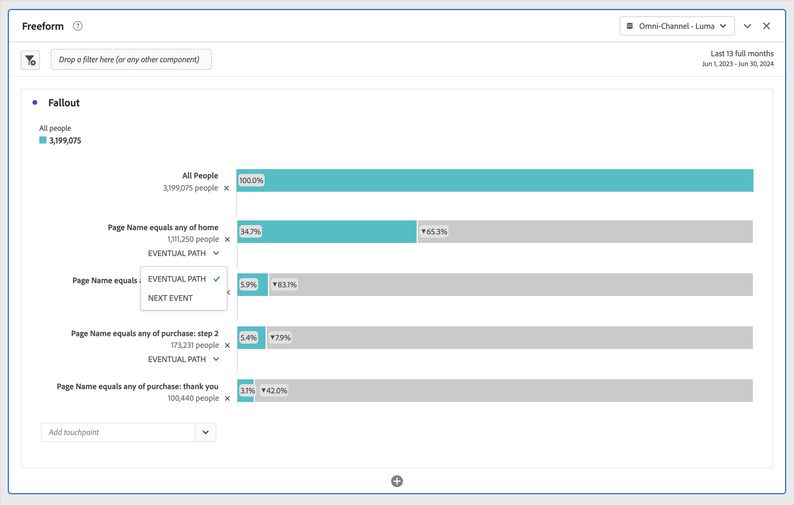
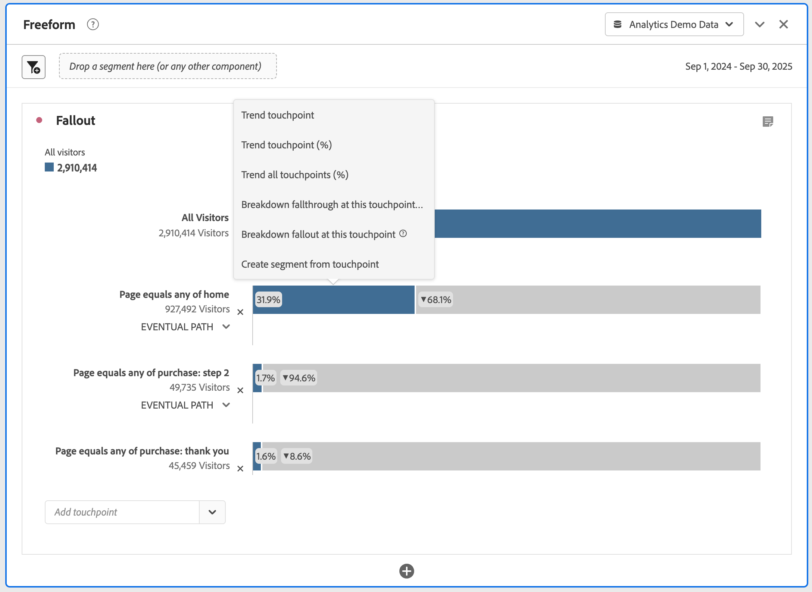

# Konfigurera en utfallsvisualisering

Du kan ange kontaktytorna för att skapa en flerdimensionell utfallssekvens. Vanligtvis är en kontaktyta en sida på din webbplats. Kontaktpunkterna är dock inte begränsade till sidor. Du kan t.ex. lägga till händelser, t.ex. enheter, samt unika personer och returbesök. Du kan också lägga till dimensioner, t.ex. en kategori, webbläsartyp eller ett internt sökord.

Du kan till och med lägga till segment inom en kontaktyta. Du kanske vill jämföra segment som iOS- och Android™-användare. Dra de önskade segmenten högst upp i utfallet och information om dessa segment läggs till i utfallsrapporten. Om du bara vill visa de segmenten kan du ta bort baslinjen Alla besök.

Det finns ingen begränsning för hur många steg du kan lägga till eller hur många dimensioner som kan användas.

Du kan göra målningar på dimensioner, mätvärden och segment. Anta till exempel att någon tittar på skor, skjorta på en sida och på nästa sida tittar de på skjorta, strumpor. Nästa produktflödesrapport från skor blir skjorta och strumpa, INTE skjorta.

## Använd

1. Lägg till en  **[!UICONTROL Fallout]**-visualisering. Se [Lägga till en visualisering på en panel](../freeform-analysis-visualizations.md#add-visualizations-to-a-panel).
1. Dra en sida, till exempel hemsidan, från siddimensionen till listrutan *Lägg till kontaktyta* .

   

   Håll muspekaren över en kontaktyta för att se utfallet och annan information om den nivån, till exempel namnet på kontaktytan och antalet personer vid den punkten. Och se hur framgångsrik kontaktytan är (och jämför framgångssiffran med andra kontaktytor).

   De cirklade siffrorna i den grå delen av fältet visar utfallet mellan kontaktytor (inte det övergripande utfallet till den punkten). I **[!UICONTROL Touchpoint %]** visas det lyckade fallet från föregående steg till det aktuella steget i utfallsrapporten.

   Du kan också lägga till en sida i utfallsrapporten, i stället för hela dimensionen. Klicka på högerpilen  på siddimensionen för att välja en specifik sida som ska läggas till i utfallsrapporten.

1. Fortsätt lägga till kontaktytor tills sekvensen är klar.

   Du kan **kombinera flera kontaktytor** genom att dra en eller flera ytterligare komponenter till en kontaktyta.

   >[!NOTE]
   >
   >Flera segment förenas med AND, men flera objekt som dimensionsposter och mätvärden förenas med OR.

   

1. Du kan också **begränsa enskilda kontaktytor till nästa händelse** (till skillnad från *så småningom*) i banan. Under varje kontaktyta finns det en väljare med alternativen **[!UICONTROL Eventual path]** och **[!UICONTROL Next event]**, vilket visas här:

   

   | Alternativ | Beskrivning |
   |---|---|
   | **[!UICONTROL Eventual path]** (standard) | Personer räknas som *så småningom* landar på nästa sida i sökvägen, men inte nödvändigtvis på nästa händelse. |
   | **[!UICONTROL Next event]** | Vi räknar med att landa på nästa sida i banan vid nästa händelse. |

## Inställningar

Som en del av visualiseringen är specifika inställningar tillgängliga.

| Bortfallsbehållare | Beskrivning |
|--- |--- |
| **[!UICONTROL Session]** eller **[!UICONTROL Person]** | Växla mellan [!UICONTROL Session] och [!UICONTROL Person] för att analysera personsökvägen. Standardvärdet är [!UICONTROL Person]. Dessa inställningar hjälper er att förstå personengagemang på personnivå (mellan sessioner) eller begränsa analysen till en enda session. |

## Snabbmeny

Som en del av visualiseringen finns det specifika alternativ för snabbmenyer.

| Alternativ | Beskrivning |
|--- |--- |
| **[!UICONTROL Trend touchpoint]** | Se trenddata för en kontaktyta i ett linjediagram med vissa fördefinierade avvikelseidentifieringsdata. |
| **[!UICONTROL Trend touchpoint (%)]** | Trends the total fallout percentage. |
| **[!UICONTROL Trend all touchpoints (%)]** | Trends all the touchpoint percentage in the fallout (except **[!UICONTROL All People]**, if it is included), on the same chart. |
| **[!UICONTROL Break down fallthrough at this touchpoint]** | Se vad personer gjorde mellan två kontaktytor (den här kontaktytan och nästa kontaktyta) om de fortsatte till nästa kontaktyta. Då skapas en frihandstabell med dina mått. Du kan ersätta dimensioner och andra element i tabellen. |
| **[!UICONTROL Break down fallout at this touchpoint]** | Se vad de som inte klarade sig igenom tratten gjorde direkt efter det valda steget. |
| **[!UICONTROL Create segment from touchpoint]** | Skapa ett nytt segment från den markerade kontaktytan. |

>[!MORELIKETHIS]
>
>[Lägg till en visualisering på en panel](/help/analyze/analysis-workspace/visualizations/freeform-analysis-visualizations.md#add-visualizations-to-a-panel)
>>[Visualiseringsinställningar](/help/analyze/analysis-workspace/visualizations/freeform-analysis-visualizations.md#settings)
>>[Snabbmenyn Visualisering ](/help/analyze/analysis-workspace/visualizations/freeform-analysis-visualizations.md#context-menu)
>

