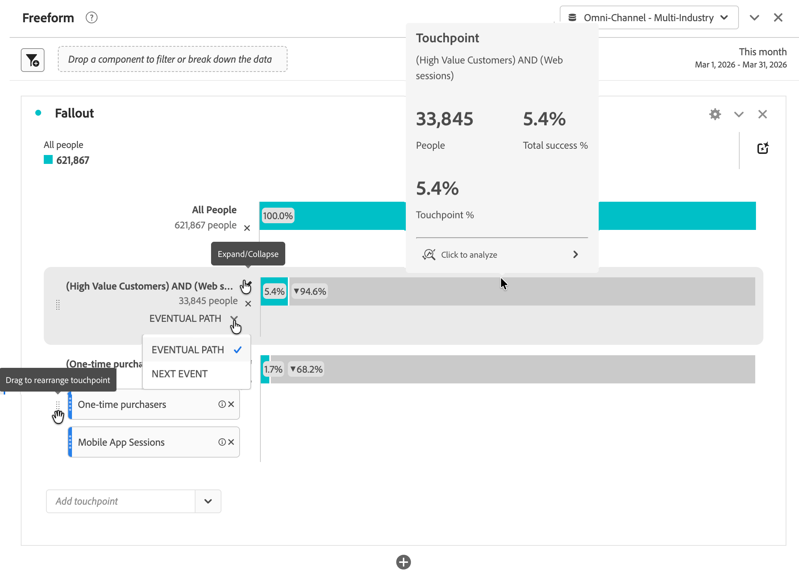

# Konfigurera en utfallsvisualisering

Du kan ange **kontaktytor** om du vill skapa en flerdimensionell utfallssekvens. I många fall är en kontaktyta en sida på din webbplats. Kontaktpunkterna är dock inte begränsade till sidor. Du kan t.ex. lägga till händelser, t.ex. enheter, samt unika personer och returbesök. Du kan också lägga till dimensioner, t.ex. en kategori, webbläsartyp eller ett internt sökord.

Du kan till och med lägga till segment inom en kontaktyta. Du kanske vill jämföra segment, till exempel iOS- och Android-användare. Dra de önskade segmenten högst upp i utfallet och information om dessa segment läggs till i utfallsrapporten. Om du bara vill visa de segmenten kan du ta bort baslinjen Alla besök.

Bortfallsvisualiseringar har ingen begränsning av antalet kontaktytor som du kan lägga till eller antalet komponenter som du kan använda.

Du kan göra målningar på dimensioner, mätvärden och segment. Anta till exempel att någon tittar på `shoes, shirt` på en sida och på nästa sida tittar de på `shirt, socks`. Nästa produktflödesrapport från skor blir skjorta och strumpa, INTE skjorta.

## Använd

1. Lägg till en  **[!UICONTROL Fallout]**-visualisering. Se [Lägga till en visualisering på en panel](../freeform-analysis-visualizations.md#add-visualizations-to-a-panel).

1. Dra en komponent till listrutan **[!UICONTROL Add touchpoint]**.

   >[!TIP]
   >
   >Du kan lägga till en enda sida i utfallsrapporten, i stället för hela dimensionen. Klicka på högerpilen  på siddimensionen för att välja en viss sida, till exempel **[!UICONTROL home]**, som ska läggas till i utfallsrapporten.

   

1. Fortsätt lägga till kontaktytor tills sekvensen är klar.

   De cirklade siffrorna i den grå delen av fältet visar utfallet mellan kontaktytor (inte det övergripande utfallet till den punkten). De cirklade siffrorna i den gröna delen av fältet visar att det lyckades gå igenom från föregående kontaktyta till den aktuella kontaktytan.

   

   När du lägger till kontaktytor kan du göra något av följande:

   * Kombinera flera komponenter genom att dra en eller flera ytterligare komponenter till en enda kontaktyta.

     >[!NOTE]
     >
     >Flera segment förenas med AND, men flera objekt som dimensionsposter och mätvärden förenas med OR.

   * Ändra ordning på kontaktpunkterna genom att dra dem till en annan nivå i utfallshierarkin.

   * Kombinera två kontaktytor genom att dra en kontaktyta till en annan. Släpp kontaktytan när du ser ordet **[!UICONTROL Combine]**.

   * Begränsa enskilda kontaktytor till nästa träff (till skillnad från *så småningom*) i banan. Under varje kontaktyta finns det en väljare med alternativen **[!UICONTROL Eventual path]** och **[!UICONTROL Next hit]**, vilket visas här:

     | Alternativ | Beskrivning |
     |---|---|
     | **[!UICONTROL Eventual path]** (standard) | Besökare räknas som *så småningom* hamnar på nästa sida i sökvägen, men inte nödvändigtvis på nästa besök. |
     | **[!UICONTROL Next hit]** | Besökare räknas som kommer att landa på nästa sida i banan vid nästa träff. |

   * Håll pekaren över en kontaktyta för att se utfallet och annan information om den nivån. Informationen innehåller kontaktpunktens namn, antalet personer och antalet lyckade försök. Du kan också jämföra framgångssiffran med andra kontaktytor.

## Inställningar

Följande visualiseringsinställningar är tillgängliga:

| Bortfallsbehållare | Beskrivning |
|--- |--- |
| **[!UICONTROL Visits]** eller **[!UICONTROL Visitors]** | Växla mellan [!UICONTROL visits] och [!UICONTROL Visitors] för att analysera personsökvägen. Standardvärdet är [!UICONTROL Visitors]. Dessa inställningar hjälper er att förstå besökarnas engagemang på besökarnivå (mellan besök) eller begränsa analysen till ett enda besök. |

## Snabbmeny

Som en del av visualiseringen finns det specifika alternativ för snabbmenyer.

### Öppna snabbmenyn

Du kommer åt snabbmenyn på något av följande sätt:

* Hovra över en kontaktyta i visualiseringen och välj sedan **[!UICONTROL Click to analyze]**.

  

* Högerklicka på en kontaktyta i visualiseringen.

  

### Alternativ på snabbmenyn

Följande snabbmenyalternativ är tillgängliga:

| Alternativ | Beskrivning |
|--- |--- |
| **[!UICONTROL Trend touchpoint]** | Se trenddata för en kontaktyta i ett linjediagram med vissa fördefinierade avvikelseidentifieringsdata. |
| **[!UICONTROL Trend touchpoint (%)]** | Trends the total fallout percentage. |
| **[!UICONTROL Trend all touchpoints (%)]** | Trends all the touchpoint percentage in the fallout (except **[!UICONTROL All Visitors]**, if it is included), on the same chart. |
| **[!UICONTROL Breakdown fallthrough at this touchpoint]** | Se vad besökarna gjorde mellan två kontaktytor (den här kontaktytan och nästa kontaktyta) om de fortsatte till nästa kontaktyta. Med det här alternativet skapas en frihandstabell med dina mått. Du kan ersätta dimensioner och andra element i tabellen. En tabell som till exempel har etiketten **[!UICONTROL Fallthrough: All Visitors > Page equals any of home]** och innehåller **[!UICONTROL Page]** som dimension och **[!UICONTROL Unique Visitors]** segmenterad av snabbsegmentet [endast för projekt](/help/components/segmentation/segmentation-workflow/seg-quick.md) **[!UICONTROL Fallthrough: All Visitors > Page equals any of home]** som måttenhet. Inspektera segmentet för att förstå hur grundsegmentet bestäms. |
| **[!UICONTROL Breakdown fallout at this touchpoint]** | Se vad besökare som inte klarade sig genom funnel gjorde direkt efter det valda steget. Med det här alternativet skapas en frihandstabell med dina mått. Du kan ersätta dimensioner och andra element i tabellen. En tabell som till exempel har etiketten **[!UICONTROL Fallout: All Visitors > Page equals any of home]** och innehåller **[!UICONTROL Page]** som dimension och **[!UICONTROL Unique Visitors]** segmenterad av snabbsegmentet [endast för projekt](/help/components/segmentation/segmentation-workflow/seg-quick.md) **[!UICONTROL Fallthrough: All Visitors > Page equals any of home]** som måttenhet. Kontrollera segmentet för att förstå hur utfallssegmentet bestäms. |
| **[!UICONTROL Create segment from touchpoint]** | Skapa ett nytt segment från den markerade kontaktytan. |

>[!MORELIKETHIS]
>
>[Lägg till en visualisering på en panel](/help/analyze/analysis-workspace/visualizations/freeform-analysis-visualizations.md#add-visualizations-to-a-panel)
>[Visualiseringsinställningar](/help/analyze/analysis-workspace/visualizations/freeform-analysis-visualizations.md#settings)
>[Snabbmenyn Visualisering ](/help/analyze/analysis-workspace/visualizations/freeform-analysis-visualizations.md#context-menu)
>

