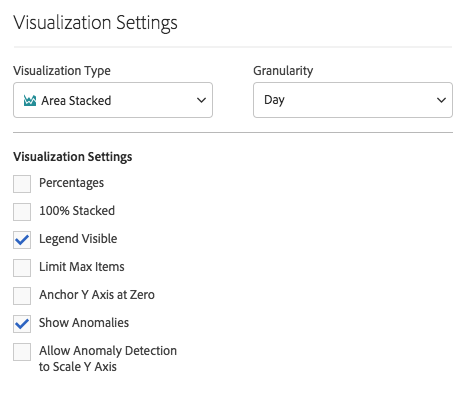
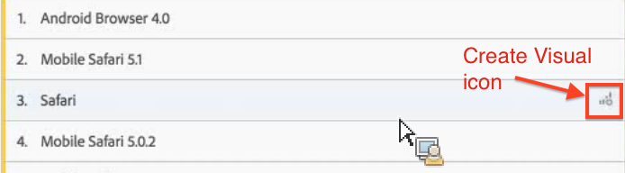

# Översikt över visualiseringar

Lär dig mer om visualiseringar och visualiseringsinställningar i Analysis Workspace.

[Visualiseringstyper i Analysis Workspace på YouTube](https://www.youtube.com/watch?v=b1zLEywRa6w&index=39&list=PL2tCx83mn7GuNnQdYGOtlyCu0V5mEZ8sS) (2:57)

## Panelen Visualiseringar {#section_DC07F032FBEF4046A40F7B95C28DA018}

Om du vill visa visualiseringspanelen klickar du **[!UICONTROL Visualizations]** på sidopanelen.

De flesta visualiseringstyper (till exempel Area-, Bar-, Donut- och Line-diagram) är välbekanta för dig om du använder Adobe Analytics. Analysis Workspace innehåller dock visualiseringsinställningar och många nya eller unika visualiseringstyper med interaktiva funktioner.

## Visualiseringsinställningar {#section_D3BB5042A92245D8BF6BCF072C66624B}

Du öppnar [!UICONTROL Visualization Settings]genom att dra en visualisering till [!UICONTROL Freeform Panel]och sedan klicka på [!UICONTROL Visualization Settings] kugghjulsikonen.

>[!IMPORTANT]
>
>Vilka visualiseringsinställningar som visas beror på visualiseringen. Alla inställningar gäller inte för alla visualiseringar. Dessutom visas vissa avancerade inställningar **bara** för specifika visualiseringar, som [histograminställningarna](/help/analyze/analysis-workspace/visualizations/histogram.md#section_09D774C584864D4CA6B5672DC2927477).

<table id="table_E0695243886046979EE609FAE5D6EA00"> 
 <thead> 
  <tr> 
   <th colname="col1" class="entry"> Inställning </th> 
   <th colname="col2" class="entry"> Beskrivning </th> 
  </tr> 
 </thead>
 <tbody> 
  <tr> 
   <td colname="col1"> 
Procenttal 
 </td> 
   <td colname="col2"> 
Visar värden i procent. 
 </td> 
  </tr> 
  <tr> 
   <td colname="col1"> 
100 % staplad 
 </td> 
   <td colname="col2"> 
Den här inställningen för staplade ytor, stolpdiagram eller skiktade vågräta staplar gör diagrammet till en"100 % staplade" visualisering. Exempel: 
 
 
 </td> 
  </tr> 
  <tr> 
   <td colname="col1"> 
Förklaring synlig 
 </td> 
   <td colname="col2"> 
Gör att du kan dölja filterinformationstexten för visualiseringen av Sammanfattningsnummer/Sammanfattningsändring. 
 </td> 
  </tr> 
  <tr> 
   <td colname="col1"> 
Begränsa maximalt antal objekt 
 </td> 
   <td colname="col2"> 
Gör att du kan begränsa antalet objekt som visas i en visualisering. 
 </td> 
  </tr> 
  <tr> 
   <td colname="col1"> 
Fästpunkt Y-axel vid noll 
 </td> 
   <td colname="col2"> 
 Om alla värden som är ritade i diagrammet ligger betydligt över noll, kommer diagrammets standardvärde att göra den nedre delen av y-axeln ICKE-ZERO. Om du markerar den här rutan kommer y-axeln att tvingas till noll (och diagrammet ritas om). 
 </td> 
  </tr> 
  <tr> 
   <td colname="col1"> 
Normalisering 
 </td> 
   <td colname="col2"> 
Tvingar måtten att ha samma proportioner. Se <a href="https://marketing.adobe.com/resources/help/en_US/reference/normalization.html"  > Normalisering</a>. 
 </td> 
  </tr> 
  <tr> 
   <td colname="col1"> 
Visa dubbel axel 
 </td> 
   <td colname="col2"> 
Gäller endast om du har två mätvärden - du kan ha en y-axel till vänster (för ett mätresultat) och till höger (för det andra måttet). 
 </td> 
  </tr> 
  <tr> 
   <td colname="col1"> 
Visa avvikelser 
 </td> 
   <td colname="col2"> 
Förbättrar linjediagram och frihandstabeller för att visa dataavvikelser. 
 </td> 
  </tr> 
 </tbody> 
</table>

## Ikonen Skapa visuell {#section_9C11D9DEDC42413AA53E69A71A509DFC}

Om du är osäker på vilken visualisering du ska välja klickar du på **[!UICONTROL Create Visual]** ikonen i valfri tabellrad. Den här ikonen visas när du hovrar över tabellraden. När du klickar på den uppmanas Analysis Workspace att göra en kvalificerad gissning på vilken visualisering som bäst passar dina data. Om du till exempel har markerat upp till tre segment skapas ett Venndiagram. För mer än tre segment skapas ett stapeldiagram. För andra typer av data kan det skapa ett linjediagram osv.

## Högerklicka på visualisering/panelmeny {#section_05B7914D4C9E443F97E2BFFDEC70240C}

Inställningar som är sammanhangsbaserade för ett diagram kan nås när du högerklickar bredvid ett visualiserings- eller panelhuvud. Vissa eller alla av följande inställningar kommer att vara tillgängliga:

| Inställning | Beskrivning |
|--- |--- |
| Infoga kopierad visualisering/panel | Gör att du kan klistra in (&quot;infoga&quot;) det kopierade elementet på en annan plats i projektet eller i ett helt annat projekt. |
| Kopiera visualisering/panel | Gör att du kan högerklicka och kopiera en visualisering eller panel. |
| Duplicera visualisering/panel | Skapar en exakt kopia av den aktuella visualiseringen, som du sedan kan ändra. |
| Komprimera alla paneler | Komprimerar alla projektpaneler. |
| Komprimera alla visualiseringar i panelen | Komprimerar alla visualiseringar i den här projektpanelen. |
| Expandera alla paneler | Expanderar alla projektpaneler. |
| Expandera alla visualiseringar i panelen | Utökar alla visualiseringar i den här projektpanelen. |
| Redigera beskrivning | Lägg till (eller redigera) en textbeskrivning för visualiseringen/panelen. Den här beskrivningen visas i Projekt > Projektinformation och inställningar . |
| Hämta panellänk | Du kan dirigera någon till en viss panel i ett projekt. |
| Hämta visualiseringslänk | Gör att du kan kopiera och dela den här länken för att skicka andra direkt till den här visualiseringen. Användarna måste logga in. |
| Börja om | (Works for Flow, Venn, Histogram) Tar bort konfigurationen för den aktuella visualiseringen och öppnar en ny panel där du kan konfigurera om den. |

## Redigera förklaringsetiketter {#section_94F1988CB4B9434BA1D9C6034062C3DE}

Du kan byta namn på serienamn i visualiseringsteckenförklaringar (Utfall, Område, Staplad, Stapel, Staplad liggande stapel, Donut, Histogram, Vågrät stapel, Staplad linje, Spridning och Venndiagram) för att göra bilderna mer konsumerbara.

Redigering av förklaringar gäller **inte** för: Treemap, Bullet, Summary Change or Number, Text, Freeform, Histogram, Kohort eller Flow-visualiseringar.

Om du vill redigera en förklaringsetikett i ett linjediagram, till exempel

1. Högerklicka på någon av förklaringsetiketterna.
1. Klicka på **[!UICONTROL Edit Label]**.

   

1. Ange den nya etikettexten.
1. Tryck för **[!UICONTROL Enter]** att spara.

Här är en [länk till en video](https://www.youtube.com/watch?v=mry3vDrTml0&index=61&list=PL2tCx83mn7GuNnQdYGOtlyCu0V5mEZ8sS) om det här ämnet.
