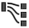

# Visualiseringar - översikt

Workspace erbjuder ett antal visualiseringar som gör att du kan generera visuella representationer av dina data, till exempel stapeldiagram, dondiagram, histogram, linjediagram, kartor, punktdiagram med mera. De flesta visualiseringstyper är välbekanta för dig om du använder Adobe Analytics. Men Analysis Workspace har visualiseringsinställningar och många nya eller unika visualiseringstyper med interaktiva funktioner.

## Visualiseringstyper

Följande visualiseringstyper finns i Analysis Workspace:

| Visualiseringsnamn | Beskrivning |
| --- | --- |
| [Område](/help/analyze/analysis-workspace/visualizations/area.md)

 | Som ett linjediagram, men med ett färgat område under linjen. Använd ett ytdiagram när du har flera mätvärden och vill visualisera området som uttrycks genom skärningspunkten för två eller flera mätvärden. |
| [Bar](/help/analyze/analysis-workspace/visualizations/bar.md)

 | Visar lodräta staplar som representerar olika värden för ett eller flera mätvärden. |
| [Punktdiagram](/help/analyze/analysis-workspace/visualizations/bullet-graph.md)

 | Visar hur ett värde som du är intresserad av jämförs med eller mäter mot andra prestandaintervall (mål). |
| [Kohortabell](/help/analyze/analysis-workspace/visualizations/cohort-table/cohort-analysis.md)

 | En *`cohort`* är en grupp personer som delar gemensamma egenskaper under en angiven period. Kohortanalys är användbart för analys av kvarhållande, bortfall eller fördröjning. |
| [Ringdiagram](/help/analyze/analysis-workspace/visualizations/donut.md)

 | På samma sätt som ett cirkeldiagram visar den här visualiseringen data som delar eller segment av en helhet. |
| [Utfall](/help/analyze/analysis-workspace/visualizations/fallout/fallout-flow.md)

 | Utfallsrapporter visar var besökarna lämnade (föll ned) och fortsatte igenom (föll igenom) en fördefinierad sidsekvens. Kan anges till sekvenser av typen slutlig eller exakt |
| [Flöde](/help/analyze/analysis-workspace/visualizations/c-flow/flow.md)

 | Visar exakta kundvägar via era webbplatser och appar. |
| [Frihandstabell](/help/analyze/analysis-workspace/visualizations/freeform-table/freeform-table.md)

 | En friformstabell är inte bara en datatabell, utan också en interaktiv visualisering. Det är grunden för dataanalys i Workspace. |
| [Histogram](/help/analyze/analysis-workspace/visualizations/histogram.md)

 | Ett histogram lurar besökare, besök eller träffar i grupper baserat på en mätvolym. |
| [Vågrätt fält](/help/analyze/analysis-workspace/visualizations/horizontal-bar.md)

 | Visar vågräta staplar som representerar olika värden för ett eller flera mätvärden. |
| [Sammanfattning av nyckelmått](/help/analyze/analysis-workspace/visualizations/key-metric.md)

 | Visar hur ett mätresultat trendar inom en enskild tidsram, eller låter dig jämföra mätprestanda över två tidsramar. |
| [Linjediagram](/help/analyze/analysis-workspace/visualizations/line.md)

 | Representerar mätvärden med hjälp av en rad för att visa hur värden ändras under en tidsperiod. Ett linjediagram använder tid längs x-axeln. |
| [Mappa](/help/analyze/analysis-workspace/visualizations/map-visualization.md)

 | Gör att du kan skapa en visuell karta över alla mått (inklusive beräknade värden). |
| [Spridningsdiagram](/help/analyze/analysis-workspace/visualizations/scatterplot.md)

 | Visar relationen mellan dimensionsobjekt och upp till tre mätvärden. |
| [Sammanfattningsnummer](/help/analyze/analysis-workspace/visualizations/summary-number-change.md)

 | Visar den markerade cellen som ett stort tal. |
| [Sammanfattningsändring](/help/analyze/analysis-workspace/visualizations/summary-number-change.md)

 | Visar ändringen mellan de markerade cellerna som ett stort tal/procent. |
| [Text](/help/analyze/analysis-workspace/visualizations/text.md)

 | Gör att du kan lägga till användardefinierad text i din Workspace. Användbar för att lägga till ytterligare kontext till analyser och insikter, utöver att utnyttja beskrivningar av paneler/visualisering |
| [Treemap-diagram](/help/analyze/analysis-workspace/visualizations/treemap.md)

 | Visar hierarkiska (trädstrukturerade) data som en uppsättning kapslade rektanglar. |
| [Venn](/help/analyze/analysis-workspace/visualizations/venn.md)

 | Använder cirklar för att beskriva måttöverlappningen för upp till 3 segment. |

## Lägga till visualiseringar i en panel

1. Öppna det Analysis Workspace-projekt där du vill lägga till en visualisering.

1. Använd någon av följande metoder för att lägga till visualiseringen:

   * I den vänstra listen väljer du ikonen **Visualiseringar** <!-- add icon --> och drar sedan en visualisering till panelen där du vill lägga till den.

     

   * På den panel där du vill lägga till visualiseringen markerar du ikonen **Plus** och väljer sedan den ikon som representerar den visualisering som du vill lägga till. Håll pekaren över ikonen för varje visualisering för att se dess namn.

     

   * Lägg till en [tom panel](https://experienceleague.adobe.com/docs/analytics/analyze/analysis-workspace/panels/blank-panel.html) och välj sedan den visualisering som du vill lägga till.

     

   * Högerklicka på en befintlig panel i ditt Analysis Workspace-projekt och välj sedan [!UICONTROL **Duplicera visualisering**] eller [!UICONTROL **Kopiera visualisering**].

## Anpassa visualiseringsinställningar

Du kan anpassa visualiseringsinställningar för en enskild visualisering eller för alla visualiseringar som du skapar.

### Anpassa visualiseringsinställningar för en enda visualisering

Så här får du åtkomst till [!UICONTROL Visualization Settings] för en enskild visualisering:

1. I Analysis Workspace håller du muspekaren över den visualisering vars inställningar du vill anpassa.

1. Klicka på kugghjulet.

   Varje typ av visualisering har unika inställningar som du kan anpassa. Mer information om tillgängliga inställningar finns i [Inställningar](#settings).

### Anpassa visualiseringsinställningar för alla visualiseringar du skapar

Du kan anpassa inställningarna för alla visualiseringar som du skapar. Mer information finns i [Användarinställningar](/help/analyze/analysis-workspace/user-preferences.md).

## Inställningar {#settings}

| Inställning | Beskrivning |
| --- | --- |
| Visualiseringstyp | Ändra den typ av visuell information som används för att avbilda data. |
| Kornighet | För trendvisualiseringar kan du ändra tidshalten (dag, vecka, månad osv.) från den här listrutan. Den här ändringen gäller även för datakälltabellen. |
| Procenttal | Visar värden i procent. |
| 100 % staplad | Den här inställningen för staplade ytor, staplade staplade staplar eller vågräta staplade visualiseringar gör att diagrammet blir en&quot;100 % staplade&quot; visualisering. Exempel:  |
| Förklaring synlig | Gör att du kan dölja den detaljerade förklaringstexten för visualiseringen av Sammanfattningsnummer/Sammanfattningsändring. |
| Begränsa maximalt antal objekt | Gör att du kan begränsa antalet objekt som visas i en visualisering. |
| Fästpunkt Y-axel vid noll | Om alla värden som är ritade i diagrammet ligger betydligt över noll, kommer diagrammets standardvärde att göra den nedre delen av y-axeln ICKE-ZERO. Om du markerar den här rutan kommer y-axeln att tvingas till noll (och diagrammet ritas om). |
| Normalisering | Tvingar måtten att ha samma proportioner. Detta är praktiskt när plottade mätvärden har mycket olika förstoringsgrader. |
| Visa dubbel axel | Gäller endast om du har två mätvärden - du kan ha en y-axel till vänster (för ett mätresultat) och till höger (för det andra måttet). Detta är praktiskt när plottade mätvärden har mycket olika förstoringsgrader. |
| Visa kantlinjer | Förbättrar linjediagram och frihandstabeller genom att visa avvikelseidentifiering. Analysidentifiering i linjevisualiseringar inkluderar ett förväntat värde (streckad linje) och ett förväntat intervall (skuggat band). |

## Förklaring {#legend}

En visualiseringsförklaring hjälper dig att relatera datum i en källtabell till plottade serier i visualiseringen. Förklaringen är interaktiv - du kan klicka på ett förklaringsobjekt om du vill visa/dölja en serie i visualiseringen. Detta är praktiskt om du vill förenkla de data som visualiseras.

Dessutom kan du byta namn på förklaringsetiketter så att det blir lättare att använda bilderna. Obs! Teckenredigering gäller **inte** för: Teckenuppsättning, Punkt, Sammanfattningsändring/nummer, Text, Frihand, Histogram, Kohort eller Flödesvisualiseringar.

Så här redigerar du en förklaringsetikett:

1. Högerklicka på någon av förklaringsetiketterna.
1. Klicka på **[!UICONTROL Edit Label]**.

   

1. Ange den nya etikettexten.
1. Tryck på **[!UICONTROL Enter]** för att spara.

## Högerklicka på menyn {#right-click}

Ytterligare funktioner för en visualisering är tillgängliga genom att högerklicka på visualiseringsrubriken. Inställningarna varierar beroende på visualisering. Några av de tillgängliga inställningarna är:

| Inställning | Beskrivning |
| --- | --- |
| Infoga kopierad panel/visualisering | Gör att du kan klistra in (&quot;infoga&quot;) en kopierad panel eller visualisering på en annan plats i projektet, eller i ett helt annat projekt. |
| Kopiera visualisering | Högerklicka och kopiera en visualisering så att du kan infoga den på en annan plats i projektet eller i ett helt annat projekt. |
| [Hämta objekt som CSV](https://experienceleague.adobe.com/docs/analytics/analyze/analysis-workspace/curate-share/download-send.html?#download-items) | Hämta upp till 50 000 dimensionsobjekt för den valda dimensionen som en CSV-fil. |
| [Hämta data som CSV](https://experienceleague.adobe.com/docs/analytics/analyze/analysis-workspace/curate-share/download-send.html?#download-data) | Hämta en datakälla för visualisering som en CSV-fil. |
| Duplicera visualisering | Skapar en exakt kopia av den aktuella visualiseringen, som du sedan kan ändra. |
| Redigera beskrivning | Lägg till (eller redigera) en textbeskrivning för visualiseringen. |
| Hämta visualiseringslänk | Gör att du kan dirigera någon till en viss visualisering i ett projekt. När användaren klickar på länken måste mottagaren logga in innan den dirigeras till den exakta visualisering som är länkad till den. |
| Börja om | (Works for Flow, Venn, Histogram) Tar bort konfigurationen för den aktuella visualiseringen så att du kan konfigurera om den från början. |

## Ikonen Skapa visuell {#quick-viz}

Om du inte är säker på vilken visualisering du ska välja klickar du på ikonen **[!UICONTROL Create Visual]** i en tabellrad (tillgänglig vid hovring). Det här är det snabbaste sättet att lägga till en visualisering. När du klickar på den uppmanas Analysis Workspace att göra en kvalificerad gissning där visualiseringen bäst passar dina data. Om du till exempel har markerat 1 rad skapas ett linjediagram. Om du har markerat 3 segmentrader skapas ett Venndiagram.

## Ändra skalningsaxeln vid visualiseringar

Här är en videoöversikt:

>[!VIDEO](https://video.tv.adobe.com/v/24708/?quality=12)
