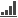
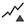
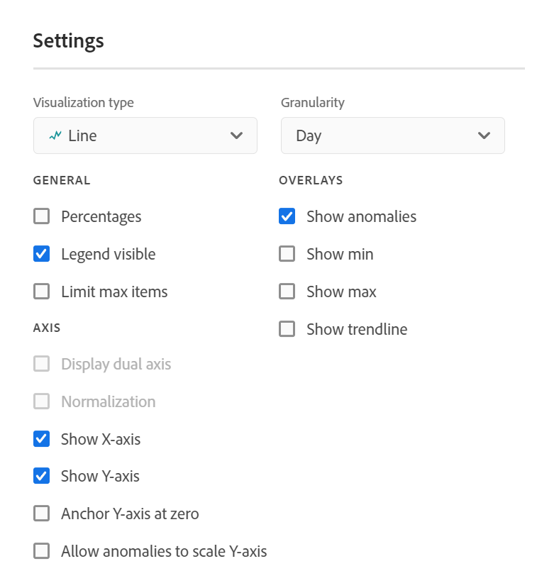

# Visualiseringar - översikt

Workspace erbjuder ett antal visualiseringar som gör att du kan generera visuella representationer av dina data, till exempel stapeldiagram, dondiagram, histogram, linjediagram, kartor, punktdiagram med mera. De flesta visualiseringstyper är välbekanta för dig om du använder Adobe Analytics. Men Analysis Workspace har visualiseringsinställningar och många nya eller unika visualiseringstyper med interaktiva funktioner.

## Visualiseringstyper

Följande visualiseringstyper finns i Analysis Workspace:

| Visualiseringsnamn | Beskrivning |
| --- | --- |
| [Område](/help/analyze/analysis-workspace/visualizations/area.md)

 | Som ett linjediagram, men med ett färgat område under linjen. Använd ett ytdiagram när du har flera mätvärden och vill visualisera området som uttrycks genom skärningspunkten för två eller flera mätvärden. |
| [Bar](/help/analyze/analysis-workspace/visualizations/bar.md)

 | Visar lodräta staplar som representerar olika värden för ett eller flera mätvärden. |
| [Punktdiagram](/help/analyze/analysis-workspace/visualizations/bullet-graph.md)

 | Visar hur ett värde som du är intresserad av jämförs med eller mäter mot andra prestandaintervall (mål). |
| [Kohortabell](/help/analyze/analysis-workspace/visualizations/cohort-table/cohort-analysis.md)

 | En *`cohort`* är en grupp personer som delar gemensamma egenskaper under en angiven period. Kohortanalys är användbart för analys av kvarhållande, bortfall eller fördröjning. |
| [Ringdiagram](/help/analyze/analysis-workspace/visualizations/donut.md)

 | På samma sätt som ett cirkeldiagram visar den här visualiseringen data som delar eller segment av en helhet. |
| [Utfall](/help/analyze/analysis-workspace/visualizations/fallout/fallout-flow.md)

 | Utfallsrapporter visar var besökarna lämnade (föll ned) och fortsatte igenom (föll igenom) en fördefinierad sidsekvens. Kan anges till sekvenser av typen slutlig eller exakt |
| [Flöde](/help/analyze/analysis-workspace/visualizations/c-flow/flow.md)

 | Visar exakta kundvägar via era webbplatser och appar. |
| [Frihandstabell](/help/analyze/analysis-workspace/visualizations/freeform-table/freeform-table.md)

 | En friformstabell är inte bara en datatabell, utan också en interaktiv visualisering. Det är grunden för dataanalys i Workspace. |
| [Histogram](/help/analyze/analysis-workspace/visualizations/histogram.md)

 | Ett histogram lurar besökare, besök eller träffar i grupper baserat på en mätvolym. |
| [Vågrätt fält](/help/analyze/analysis-workspace/visualizations/horizontal-bar.md)

 | Visar vågräta staplar som representerar olika värden för ett eller flera mätvärden. |
| [Sammanfattning av nyckelmått](/help/analyze/analysis-workspace/visualizations/key-metric.md)

 | Visar hur ett mätresultat trendar inom en enskild tidsram, eller låter dig jämföra mätprestanda över två tidsramar. |
| [Linjediagram](/help/analyze/analysis-workspace/visualizations/line.md)

 | Representerar mätvärden med hjälp av en rad för att visa hur värden ändras under en tidsperiod. Ett linjediagram använder tid längs x-axeln. |
| [Mappa](/help/analyze/analysis-workspace/visualizations/map-visualization.md)

 | Gör att du kan skapa en visuell karta över alla mått (inklusive beräknade värden). |
| [Spridningsdiagram](/help/analyze/analysis-workspace/visualizations/scatterplot.md)

 | Visar relationen mellan dimensionsobjekt och upp till tre mätvärden. |
| [Sammanfattningsnummer](/help/analyze/analysis-workspace/visualizations/summary-number-change.md)

 | Visar den markerade cellen som ett stort tal. |
| [Sammanfattningsändring](/help/analyze/analysis-workspace/visualizations/summary-number-change.md)

 | Visar ändringen mellan de markerade cellerna som ett stort tal/procent. |
| [Text](/help/analyze/analysis-workspace/visualizations/text.md)

 | Gör att du kan lägga till användardefinierad text i din Workspace. Användbar för att lägga till ytterligare kontext till analyser och insikter, utöver att utnyttja beskrivningar av paneler/visualisering |
| [Treemap-diagram](/help/analyze/analysis-workspace/visualizations/treemap.md)

 | Visar hierarkiska (trädstrukturerade) data som en uppsättning kapslade rektanglar. |
| [Venn](/help/analyze/analysis-workspace/visualizations/venn.md)

 | Använder cirklar för att beskriva måttöverlappningen för upp till 3 segment. |

## Lägga till visualiseringar i en panel

1. Öppna det Analysis Workspace-projekt där du vill lägga till en visualisering.

1. Använd någon av följande metoder för att lägga till visualiseringen:

   

   * I den vänstra panelen väljer du  **Visualiseringar** och drar sedan en visualisering till panelen där du vill lägga till visualiseringen.

   * Välj  på panelen där du vill lägga till visualiseringen och välj sedan den ikon som representerar den visualisering som du vill lägga till. Håll pekaren över ikonen för varje visualisering för att se namnet.

   * Lägg till en [tom panel](/help/analyze/analysis-workspace/c-panels/blank-panel.md) och välj sedan den visualisering som du vill lägga till.

   * Välj **[!UICONTROL Duplicate visualization]** eller **[!UICONTROL Copy visualization]** på snabbmenyn för en befintlig visualisering i ditt Analysis Workspace-projekt.

   * Använd Workspace **[!UICONTROL Insert]**-menyn för att infoga en visualisering.

   * Välj **[!UICONTROL Visualize]** på snabbmenyn i en friformstabell. Välj sedan visualisering på undermenyn. Baserat på det aktuella urvalet i tabellen avgör Workspace vilken visualisering som ska erbjudas och tolkar data för att skapa den begärda visualiseringen.

## Förklaring

En visualiseringsförklaring hjälper dig att relatera datum i en källtabell till plottade serier i visualiseringen. Förklaringen är interaktiv - du kan markera ett förklaringsobjekt om du vill visa/dölja en serie i visualiseringen, vilket är praktiskt om du vill förenkla de data som visas.

Dessutom kan du byta namn på förklaringsetiketter så att det blir lättare att använda bilderna. Obs! Teckenredigering gäller **inte** för: Teckenuppsättning, Punkt, Sammanfattningsändring/nummer, Text, Frihand, Histogram, Kohort eller Flödesvisualiseringar.

Så här redigerar du en förklaringsetikett:

1. Högerklicka på någon av förklaringsetiketterna.
1. Klicka på **[!UICONTROL Edit Label]**.

   

1. Ange den nya etikettexten.
1. Tryck på **[!UICONTROL Enter]** för att spara.

### Inställningar

Vilka visualiseringsinställningar som är tillgängliga beror på visualiseringen. Tabellen nedan sammanfattar de vanligaste inställningarna. Vissa visualiseringar har specifika inställningar. Mer information finns i dokumentationen för den enskilda visualiseringen.

| Alternativ | Beskrivning |
| --- | --- |
| **[!UICONTROL Visualization type]** | Ändra den typ av visualisering som används för att visualisera data. |
| **[!UICONTROL Granularity]** | Ändra tidgranulariteten för trendvisualiseringar. Den här ändringen gäller även för datakälltabellen. |
| **[!UICONTROL Percentages]** | Visa värden i procent. |
| **[!UICONTROL 100% stacked]** | Omvandla diagrammet till en 100 % staplad visualisering.  Gäller endast för en staplad visualisering av ytor, stolpar och vågräta staplar. |
| **[!UICONTROL Legend visible]** | Visa förklaringstext. |
| **[!UICONTROL Limit max items]** | Begränsa antalet objekt som visas i en visualisering. När du väljer det här alternativet anger du det högsta antalet objekt. |
| **[!UICONTROL Show annotations]** | Visa anteckningarna som gjorts för den här visualiseringen. |
| **[!UICONTROL Hide title]** | Dölj titeln på visualiseringen. |
| **[!UICONTROL Anchor y-axis at zero]** | Sätt y-axelns nederkant till noll. Om alla värden som är ritade i diagrammet ligger betydligt över noll gör diagrammets standardvärde att y-axelns nederdel inte är noll. Om du aktiverar det här alternativet tvingas y-axeln till noll (och diagrammet ritas om). |
| **[!UICONTROL Display dual axis]** | Visa vänster och höger y-axel för två olika mätvärden. Det här alternativet gäller bara om du har två mätvärden. Dubbla axlar är användbara när plottade mätvärden har olika magnituder. |
| **[!UICONTROL Show x-axis]** | Visa x-axeln i visualiseringen. |
| **[!UICONTROL Show y-axis]** | Visa y-axeln i visualiseringen. |
| **[!UICONTROL Show barbells on lines]** | Visa streckade linjer på linjevisualisering i en kombinationsdiagram. |
| **[!UICONTROL Normalization]** | Använd samma proportioner för mätvärden. Likvärdiga proportioner är användbara när plottade mätvärden har olika förstoringsgrader. |
| **[!UICONTROL Show anomalies]** | Förbättra linjediagram och frihandstabeller genom att visa avvikelseidentifiering. Analysidentifiering i linjevisualiseringar inkluderar ett förväntat värde (streckad linje) och ett förväntat intervall (skuggat band). |
| **[!UICONTROL Show forecast]** | Förbättra linjediagram och frihandstabeller genom att visa prognosvärden. |
| **[!UICONTROL Show min]** | Visa det minsta värdet i visualiseringen. |
| **[!UICONTROL Show max]** | Visa det högsta värdet i visualiseringen. |
| **[!UICONTROL Show trendline]** | Visa en trendlinje i visualiseringen. När du väljer det här alternativet kan du välja typ av trendlinje i den nedrullningsbara menyn. |

Du kan anpassa inställningarna för alla visualiseringar som du skapar. Mer information finns i [Användarinställningar](/help/analyze/analysis-workspace/user-preferences.md).

## Snabbmeny {#right-click}

Använd snabbmenyn (som är tillgänglig genom alternativ markering, till exempel högerklicka när du använder en mus) på ett visualiseringshuvud för att få tillgång till ytterligare funktioner för en visualisering. Alla alternativ är inte tillgängliga för alla visualiseringar.

| Alternativ | Beskrivning |
| --- | --- |
| **[!UICONTROL Insert copied visualization]** | Klistra in (infoga) en kopierad visualisering på en annan plats i projektet, eller i ett helt annat projekt. |
| **[!UICONTROL Copy data to clipboard]** | Kopiera data från visualiseringen till Urklipp. |
| **[!UICONTROL Copy selection to clipboard]** | Kopiera markeringen från visualiseringen till Urklipp. |
| **[!UICONTROL Download items as CSV (*dimensionsnamn *)]** | Hämta dimensionsobjekten (till högst 50 000) av visualiseringen till din lokala enhet. Högst 50 000 dimensionsartiklar för den valda dimensionen. |
| **[!UICONTROL Copy visualization]** | Kopiera visualiseringen så att du kan infoga visualiseringen på en annan plats i projektet eller i ett helt annat projekt. |
| **[!UICONTROL Download data CSV]** | Hämta visuella data till din lokala enhet. |
| **[!UICONTROL Duplicate visualization]** | Gör en exakt kopia av visualiseringen. |
| **[!UICONTROL Edit description]** | Lägg till (eller redigera) en textbeskrivning för visualiseringen. Se [Text](text.md). |
| **[!UICONTROL Get visualization link]** | Kopiera och dela en länk direkt till visualiseringen. Länken visas i en dialogruta för delning. Välj Kopiera för att kopiera länken till Urklipp. |
| **[!UICONTROL Start over]** | Ta bort konfigurationen för den aktuella visualiseringen så att du kan konfigurera om den från grunden. |

## Konfiguration

Vissa visualiseringar (som Cohort-tabellen, Fallout, Flow med flera) har en konfigurationsdialogruta som hjälper dig att skapa visualiseringen. Använd  längst upp i visualiseringen för att komma åt och ändra konfigurationen.

## Visualisera

Om du inte är säker på vilken visualisering du ska välja väljer du  **[!UICONTROL Visualize]** i valfri tabellrad på frihand (tillgänglig vid hovring). Den här markeringen är det snabbaste sättet att lägga till en visualisering. Analysis Workspace har en väl underbyggd gissning där visualisering bäst passar era data. Om du t.ex. har markerat en rad skapas ett [linjediagram](line.md). Om du har markerat tre filterrader skapas ett [venn](venn.md)-diagram.

<!--
## Settings {#settings}

| Setting | Description |
| --- | --- |
| Visualization Type | Change the type of visual used to depict the data. |
| Granularity | For trended visualizations, you can change the time granularity (day, week, month, etc.) from this drop-down list. This change also applies to the data source table. |
| Percentages | Displays values in percentages. |
| 100% Stacked | This setting on area stacked, bar stacked or horizontal bar stacked visualizations turns the chart into a "100% stacked" visualization. Example:  |
| Legend Visible | Lets you hide the detailed legend text for the Summary Number/Summary Change visualization. |
| Limit Max Items | Lets you limit the number of items that a visualization displays. |
| Anchor Y Axis at Zero | If all the values plotted on the chart are considerably above zero, the chart default will make the bottom of the y-axis NON-ZERO. If you check this box, the y-axis will be forced to zero (and it will re-draw the chart). |
| Normalization | Forces metrics to equal proportions. This is helpful when plotted metrics are of very different magnitudes. |
| Display Dual Axis | Only applies if you have two metrics - you can have a y-axis on the left (for one metric) and on the right (for the other metric). This is helpful when plotted metrics are of very different magnitudes. |
| Show Anomalies | Enhances line graphs and freeform tables by displaying anomaly detection. Anomaly detection in line visualizations includes an expected value (dashed line) and an expected range (shaded band). |

## Legend {#legend}

A visualization legend helps you to relate date in a source table to plotted series in the visualization. The legend is interactive - you can click a legend item to show/hide a series in the visualization. This is helpful if you want to simplify the data being visualized. 

Additionally, you can rename legend labels to help you make visuals more consumable. Note: legend editing does **not** apply to: Treemap, Bullet, Summary Change/Number, Text, Freeform, Histogram, Cohort or Flow visualizations.

To edit a legend label:

1. Right-click one of the legend labels.
1. Click **[!UICONTROL Edit Label]**.

   

1. Enter the new label text.
1. Press **[!UICONTROL Enter]** to save.

## Right-click menu {#right-click}

Additional functionality for a visualziation is available by right-clicking on the visualization header. Settings will vary by visualization. Some of the settings available are:

| Setting | Description |
| --- | --- |
| Insert Copied Panel/Visualization|Lets you paste ("insert") a copied panel or visualization to another place within the project, or into a completely different project. |
| Copy Visualization | Lets you right-click and copy a visualization, so that you can insert it to another place within the project, or into a completely different project. |
| [Download items as CSV](https://experienceleague.adobe.com/docs/analytics/analyze/analysis-workspace/curate-share/download-send.html?lang=sv-SE&#download-items) | Download up to 50,000 dimension items for the selected dimension as a CSV. |
| [Download data as CSV](https://experienceleague.adobe.com/docs/analytics/analyze/analysis-workspace/curate-share/download-send.html?lang=sv-SE&#download-data) | Download visualization data source as a CSV. |
| Duplicate Visualization | Makes an exact duplicate of the current visualization, which you can then modify. |
| Edit Description | Add (or edit) a text description for the visualization. |
| Get Visualization Link | Lets you direct someone to a specific visualization within a project. When the link is clicked, the recipient will be required to login before being directed to the exact visualization linked to. |
| Start Over | (Works for Flow, Venn, Histogram) Deletes the configuration for the current visualization so you can re-configure it from scratch. |

## Create Visual icon {#quick-viz}

If you are not sure which visualization to pick, click the **[!UICONTROL Create Visual]** icon in any table row (available on hover). This the the fastest way to add a visualization. Clicking it prompts Analysis Workspace to take an educated guess at which visualization would best fit your data. For example, if you have 1 row selected, it will create a trended line graph. If you have 3 segment rows selected, it will create a Venn diagram. 

## Change the scale axis on visualizations

Here is a video overview:

>[!VIDEO](https://video.tv.adobe.com/v/24708/?quality=12)

-->
