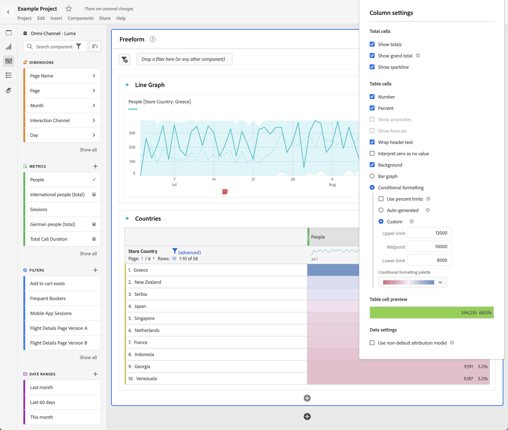
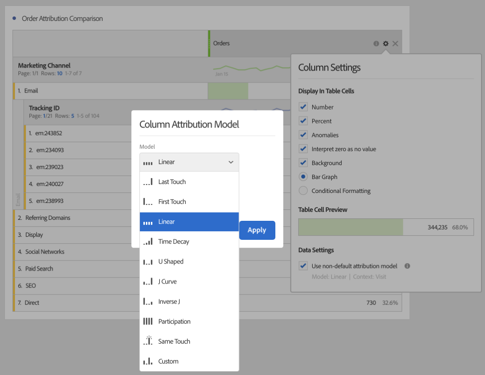

# Kolumninställningar

I [!UICONTROL Column settings] kan du konfigurera kolumnformatering, varav vissa kan vara villkorliga.

>[!BEGINSHADEBOX]

Se  [Rad- och kolumninställningar i en frihandstabell](https://video.tv.adobe.com/v/40382/?quality=12&learn=on){target="_blank"} för en demonstrationsvideo.

>[!ENDSHADEBOX]

Om du vill komma åt [!UICONTROL Column settings] väljer du  i kolumnrubriken.

Du kan redigera inställningar för flera kolumner samtidigt. Markera flera kolumner och välj  i någon av de markerade kolumnerna. Alla ändringar du gör gäller för alla kolumner där celler är markerade.

| Alternativ | Beskrivning |
| --- | --- |
| **[!UICONTROL Show total]** | Visa en summa på klientsidan av kolumnen. Den här summan tar **inte** bort dubbletter av mått som sessioner eller personer. |
| **[!UICONTROL Show grand total]** | Visa en serversidessumma av kolumnen. Det totala antalet avduplicerade mått som sessioner eller personer. |
| **[!UICONTROL Show sparkline]** | Visa ett linjediagram i kolumnrubriken. |
| **[!UICONTROL Number]** | Avgör om en cell visar/döljer det numeriska värdet för måttet. Om måttet till exempel är Sidvyer är det numeriska värdet antalet sidvyer för radobjektet. |
| **[!UICONTROL Percent]** | Avgör om en cell visar/döljer procentvärdet för måttet. Om måttet till exempel är Sidvyer är procentvärdet antalet sidvyer för radobjektet delat med de totala sidvyerna för kolumnen.  Obs! Procenttal som är större än 100 % är möjliga för att säkerställa att de är korrekta. Det övre gränsvärdet kan flyttas till 1 000 % för att förhindra att kolumnbredden blir för stor. |
| **[!UICONTROL Show anomalies]** | Kontrollera om avvikelseidentifiering körs på värdena i den här kolumnen. |
| **[!UICONTROL Show forecast]** | Kontrollera om prognosvärden visas i den här kolumnen. |
| **[!UICONTROL Wrap header text]** | Radbryt rubriktexten i frihandstabeller så att rubrikerna blir lättare att läsa och tabellerna blir mer delbara. Figursättningen är användbar för PDF-återgivning och för mått med långa namn. Aktiverat som standard. |
| **[!UICONTROL Interpret zero as no value]** | För celler med värdet 0 anger du om en 0-cell eller en tom cell ska visas. Den här tolkningen är användbar när du tittar på data för varje dag i en månad, och vissa dagar är i framtiden.  I stället för att visa 0 för framtida datum visas tomma celler i stället. Diagram följer även den här inställningen (d.v.s. diagrammen visar inte en linje eller stapel med 0 värden). |
| **[!UICONTROL Background]** | Ange om en cell ska visa/dölja all cellformatering, inklusive stapeldiagrammet och villkorsstyrd formatering. |
| **[!UICONTROL Bar Graph]** | Visa ett vågrätt stolpdiagram som representerar cellens värde i förhållande till totalvärdet för kolumnen. |
| **[!UICONTROL Conditional Formatting]** | Använd villkorlig formatering. Se [avsnittet](#conditional-formatting) nedan. |
| **[!UICONTROL Table Cell Preview]** | En förhandsvisning av hur varje cell visas med de valda formateringsalternativen. |
| **[!UICONTROL Use non-default attribution model]** | Använd en attribueringsmodell som inte är standard. Se [avsnittet](#use-non-default-attribution-model) nedan. |

## Villkorsstyrd formatering {#conditional-formatting}

Villkorsstyrd formatering tillämpar formatering på övre, mellersta och nedre gränser som du kan definiera. Användning av villkorsstyrd formatering i frihandstabeller aktiveras också automatiskt vid uppdelningar, såvida inte [!UICONTROL Custom]-gränser har valts.

| Villkorliga formateringsalternativ | Beskrivning |
| --- | --- |
| **[!UICONTROL &#x200B; Use percent limits]** | Ändra gränsintervallet så att det baseras på procentvärden i stället för absoluta värden. Procentgränsområdet fungerar för mått som enbart är procentbaserade (t.ex. studsfrekvens) och för mått som har ett antal och ett procentvärde (t.ex. sidvyer). |
| **[!UICONTROL Auto-generated]** | Beräkna automatiskt övre/mellersta/nedre gränser baserat på data. Den övre gränsen är det största värdet i den här kolumnen. Den undre gränsen är det lägsta och mittpunkten är medelvärdet av de övre och nedre gränserna. |
| **[!UICONTROL Custom]** | Tilldela **[!UICONTROL Upper limit]**, **[!UICONTROL Midpoint]** och **[!UICONTROL Lower limit]** manuellt. Begränsningar ger flexibilitet att avgöra när ett kolumnvärde blir bra, medelvärde eller dåligt. |
| **[!UICONTROL Conditional formatting palette]** | Använd en förkonfigurerad färguppsättning för celler. Beroende på vilket av de fyra tillgängliga färgscheman du väljer tilldelas olika färger till höga värden, mittpunktsvärden och låga värden.   Om du ersätter en dimension i tabellen återställs de villkorliga formateringsgränserna. Om du ersätter ett mätvärde räknas gränserna för den kolumnen om (där ett mätvärde finns på X-axeln och ett mått på Y-axeln). |

## Använd en attribueringsmodell som inte är standard {#use-non-default-attribution-model}

<!-- markdownlint-disable MD034 -->

>[!CONTEXTUALHELP]
>id="workspace_freeformtable_column_usenondefaultattributionmodel"
>title="Använd en attribueringsmodell som inte är standard"
>abstract="Aktivera en attribueringsmodell som inte är standard för de markerade kolumnerna."

<!-- markdownlint-enable MD034 -->

<!-- markdownlint-disable MD034 -->

>[!CONTEXTUALHELP]
>id="workspace_freeformtable_column_usenondefaultattributionmodel_disabled"
>title="Använd en attribueringsmodell som inte är standard"
>abstract="Attributionsläget som inte är standard är inte tillgängligt för det här måttet."

<!-- markdownlint-enable MD034 -->

>[!NOTE]
>
>Tänk på följande när du uppdaterar en komponents attribuering till en icke-standardattribueringsmodell:
>
>* **När komponenten används i en rapport med *en enda dimension*:** Komponentens attribuering ignorerar allokeringsmodellen när en icke-standardattribueringsmodell används.
>
>* **När komponenten används i en rapport med *flera dimensioner*:** Komponentens attribuering behåller allokeringsmodellen när en icke-standardattribueringsmodell används.
>
>

Så här använder du en icke-standardattribueringsmodell för ett mätresultat i Analysis Workspace:

1. Välj **[!UICONTROL Use non-default attribution model]**. När du redan har valt det här alternativet använder du **[!UICONTROL Edit]** för att redigera attribueringsmodellen. Eller avmarkera om du vill återgå till standardattribueringsmodellen.

   

2. I **[!UICONTROL Column attribution model]** väljer du en **[!UICONTROL Model]** och en **[!UICONTROL Lookback window]**. Uppslagsfönstret avgör vilket fönster med dataattribuering som används för varje konvertering.

   

### Attributionsmodeller

{{attribution-models-details}}

### Behållare

{{attribution-container}}

### Fönstret Lookback

{{attribution-lookback-window}}

### Exempel

{{attribution-example}}

>[!MORELIKETHIS]
>
>* [Hantera datakällor](/help/analyze/analysis-workspace/visualizations/t-sync-visualization.md)

>[!BEGINSHADEBOX]

Se  [Dynamiska kolumner](https://video.tv.adobe.com/v/23138?quality=12&learn=on){target="_blank"} för en demonstrationsvideo.

>[!ENDSHADEBOX]

