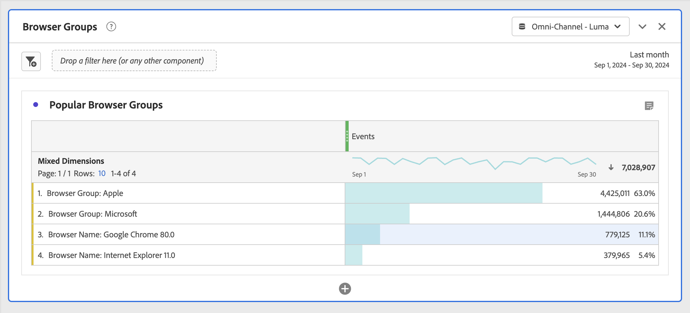

# Dynamiska jämfört med statiska dimensionsobjekt i frihandstabeller

I frihandstabeller kan raderna och kolumnerna innehålla olika komponentvärden. Dessa värden kan vara dynamiska (ändras med tid) eller statiska (ändras inte med tid), beroende på vilken analys du vill skapa.

## Dynamiska dimensionsobjekt

Objekt med dynamiska dimensioner ändras med tiden och är beroende av vilket mått som sorteras i friformstabellen. Dynamiska dimensionsobjekt föredras när du vill analysera de översta artiklarna för en given tidsperiod.

När du släpper en dimension i en frihandstabell returneras dynamiska rader. De representerar de översta artiklarna som motsvarar dimensionen för ett givet mätvärde och en viss tidsperiod. Du kan också släppa en dimension i tabellkolumner på fri hand, och dimensionen utökas automatiskt till de fem främsta dimensionsobjekten.

När du t.ex. drar dimensionen Webbläsartyp till tabellen visas dimensionsobjekten för webbläsartypen överst (t.ex. Microsoft, Apple, Google) Återgå dynamiskt till tabellraderna. Om de utelämnas i en kolumn returneras dimensionsobjekten för de fem vanligaste webbläsartyperna dynamiskt.

Objekt med dynamiska dimensioner har radfilteralternativet och gör **inte** har lås- och X-ikoner.

## Statiska dimensionsobjekt

Statiska dimensionsobjekt ändras inte med tiden. de är fasta komponenter som alltid returneras i en frihandstabell. Statiska dimensionsobjekt föredras när du alltid vill analysera samma objekt, oavsett om det är specifika kampanjer eller specifika dagar i veckan.

Varje gång du manuellt markerar och släpper specifika komponentvärden (mått, mått, segment, datumintervall) i en tabell blir resultatet en statisk lista med rader eller kolumner. Statiska dimensionsobjekt kan också skapas om du väljer att:

* Högerklicka > [!UICONTROL Display only selected rows] från rader
* Högerklicka > [!UICONTROL Make item static] från kolumner

Om du t.ex. drar över vissa objekt i webbläsartypen, t.ex. Microsoft och Apple, hämtas dessa två objekt alltid till tabellen.

Statiska dimensionsobjekt **har inte** radfilteralternativet. Istället visas lås- och X-ikoner för varje objekt. Klicka på X-ikonen för att ta bort dimensionsobjektet från tabellen.

## Blandade dimensionsobjekt

Dimensioner från olika dimensioner kan läggas till i samma tabell. Radhuvudet säger&quot;Blandade Dimensioner&quot; i dessa fall. Dessa dimensionsobjekt är statiska. Du kan till exempel lägga till specifika dimensionsobjekt från dimensionen Webbläsartyp och andra dimensionsobjekt från dimensionen Webbläsare.

## Frihandsrader

Dynamiska och statiska rader fungerar på olika sätt i den totala frihandsraden. Som standard:

* Dynamiska rader summeras på serversidan och dubblettvärden som besök och besökare tas bort
* Statiska rader summeras på klientsidan och gör **inte** avduplicerade mått. Om du vill beräkna den totala radserversidan ändrar du radinställningen till **Visa totalsumma**. [Läs mer](https://experienceleague.adobe.com/docs/analytics/analyze/analysis-workspace/visualizations/freeform-table/workspace-totals.html)
