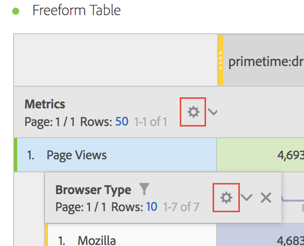

# Radinställningar

Radinställningarna varierar beroende på vilken komponent du har dragit till tabellen. Om du vill komma åt tabellradsinställningarna klickar du på inställningsikonen bredvid en dimension, ett segment, ett mått, en tidsperiod eller en uppdelning i var och en av dessa:

| Inställning | Beskrivning |
|--- |--- |
| Justera datum | Det här är en inställning på tabellnivå som justerar datum från varje kolumn så att alla börjar på samma rad. Datumjustering är aktiverat som standard när en tidsdimension används i tabellraderna och olika datumintervall används i kolumnerna. I en daglig tabell där oktober och september tillämpas på kolumnerna börjar den vänstra kolumnen med 1 oktober och den högra kolumnen börjar med 1 september. |
| Uppdelning efter position | Som standard är den här inställningen inaktiverad och uppdelningar är fasta på statiska radobjekt. Låt oss till exempel säga att du har delat upp de tre viktigaste sidobjekten (startsida, sökresultat, utcheckning) efter marknadsföringskanal. Sedan lämnar du projektet och återvänder två veckor senare. När du öppnar projektet igen har de tre översta sidorna ändrats, och nu är startsidan, sökresultaten och utcheckningen de 4-6 översta sidorna istället. Som standard visas dina Marketing Channel-indelningar fortfarande under Hemsida, Sökresultat och Utcheckning, även om de nu finns på raderna 4-6.   Däremot kommer  **Uppdelning efter** position alltid att dela upp de tre viktigaste objekten, oavsett vad de är. När du öppnar ditt projekt på nytt, som en hänvisning till vårt exempel, kommer de tre främsta sidorna i tabellen att vara kopplade till Marketing Channel-uppdelningarna, inte till Hemsida, Sökresultat och Utcheckning, som nu finns på raderna 4-6. |
| Procenttal | **Beräkna procentandelar enligt standardinställningen** för kolumn. de procentsatser som visas i en kolumn beräknas utifrån kolumnsumman.  **Beräkna procentandelar per** rader tvingar friformstabellen att beräkna cellprocenten över raden i stället för nedåt i kolumnen, med totalsumman som nämnare. Detta är särskilt användbart för att hantera procentsatser. Den här inställningen är aktiverad som standard när du använder ikonen Visa. |
| Kolumnsummor | De här inställningarna är bara tillgängliga för [statiska rader](manual-vs-dynamic-rows.md).   **Visa som summan av aktuella** rader visar en summa av raderna på klientsidan, vilket innebär att summan inte  ** dubblerar mått som besök eller besökare.    **Visa totalsummor** visar en summa på serversidan vilket innebär att summan kommer att dubblera måtten. |
