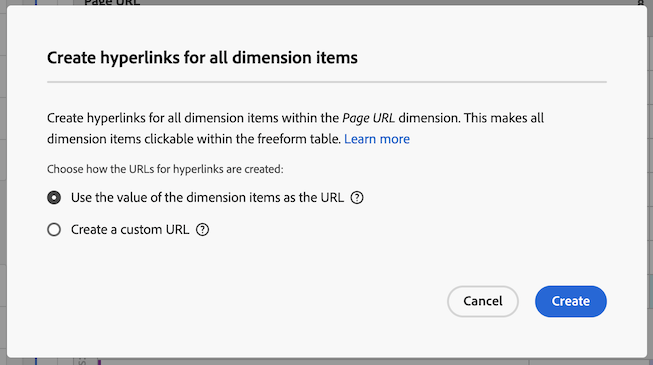

# Skapa hyperlänkar

Du kan skapa hyperlänkar för dimensionsobjekt för att göra dem klickbara i en frihandstabell i Analysis Workspace.

Den här funktionen är särskilt användbar när du skapar hyperlänkar för följande typer av dimensionsobjekt:

* Dimension-objekt som har URL-värden (t.ex. sidans URL-dimension).

* Dimension-objekt som innehåller uppdelningar som har URL-värden (t.ex. en sidnamnsdimension som har en uppdelning av sidans URL-dimension).

* Dimension-objekt eller uppdelningar som har värden som är en del av en URL (till exempel en sidnamnsdimension som är en del av en URL).

>[!BEGINSHADEBOX]

Se  [Hyperlänkar för dimension](https://video.tv.adobe.com/v/3430411?quality=12&learn=on){target="_blank"} för en demonstrationsvideo.

>[!ENDSHADEBOX]

## Skapa hyperlänkar

Tänk på följande när du skapar hyperlänkar för ett eller flera dimensionsobjekt:

* De hyperlänkar du skapar lagras på frihandstabellen i Analysis Workspace-projektet. Hyperlänkar bevaras inte när samma dimension eller dimensionsobjekt används i en annan tabell eller i ett annat projekt.

* Om du ändrar datavyn för frihandstabellen är alla hyperlänkar som har skapats för dimensioner eller dimensionsobjekt i tabellen fortfarande tillgängliga. Den här funktionen förutsätter att dimensionen fortfarande finns i datavyn.

* URL:er kontrolleras inte om de är giltiga när du skapar hyperlänken. Om du

   * skapa en hyperlänk som har en ogiltig URL, eller
   * skapa en hyperlänk som refererar till ett dimensionsobjekt som inte har något URL-värde (genom att referera till dimensionsobjektet direkt eller genom att använda variablerna `$value` eller `$breakdown`),

  sedan visas ett felmeddelande om att URL:en är ogiltig för användare som klickar på hyperlänken.

* Hyperlänkar som skapas för ett enskilt dimensionsobjekt åsidosätter hyperlänkar som skapas på dimensionen.

* Hyperlänkar fungerar inte i [hämtade PDF-filer](/help/analyze/analysis-workspace/curate-share/download-send.md).

Så här skapar du hyperlänkar för ett eller flera dimensionsobjekt:

1. Gör något av följande i en frihandstabell i Analysis Workspace:

   * **Skapa en hyperlänk för ett enskilt dimensionsobjekt:** Högerklicka på dimensionsobjektet i tabellen som du vill skapa hyperlänken för och välj sedan [!UICONTROL **Skapa hyperlänk**].

      1. Öppna snabbmenyn för dimensionsobjektet.
      1. Välj [!UICONTROL **Skapa hyperlänk**] på snabbmenyn.

         Dialogrutan [!UICONTROL **Skapa hyperlänk**] visas. Namnet på dimensionsobjektet som du skapar en hyperlänk för visas i dialogrutan.

         

   * **Skapa hyperlänkar för alla dimensionsobjekt i en dimensionskolumn:** Högerklicka på dimensionsnamnet i dimensionskolumnens rubrik och välj sedan [!UICONTROL **Skapa hyperlänkar för alla dimensionsobjekt**].

      1. Öppna snabbmenyn från dimensionskolumnrubriken.
      1. Välj [!UICONTROL **Skapa hyperlänk för alla dimensionsobjekt**] på snabbmenyn.

         <!-- Do we really need a screenshot  -->

         Dialogrutan [!UICONTROL **Skapa hyperlänkar för alla dimensionsobjekt**] visas. Namnet på dimensionen som du skapar hyperlänkar för visas i dialogrutan.

         

1. Välj bland följande alternativ:

   * [!UICONTROL **Använd värdet för dimensionsobjektet som URL**]: Välj det här alternativet för dimensionsobjekt som har URL-värden, till exempel en sidURL-dimension.

     Om du till exempel använder en sidadress där värdet för varje dimensionsobjekt är en URL, skapas en hyperlänk till URL:en om du väljer det här alternativet.

   * [!UICONTROL **Skapa en anpassad URL**]: Ange en statisk eller dynamisk anpassad URL. Välj det här alternativet om du vill skapa hyperlänkar för dimensionsobjekt som inte har URL-värden.

     Du använder till exempel en sidnamnsdimension där värdet för varje dimensionsobjekt är namnet på en sida (och inte en fullständig URL). Välj sedan det här alternativet om du vill ange en hyperlänk som ska användas som länk för dimensionsobjektet.

     Om du vill skapa dynamiska URL:er för flera dimensionsobjekt kan du använda variablerna `$value` och `$breakdown` i din anpassade URL. Se tabellen nedan för mer information.

     Om du vill skapa en anpassad URL-adress anger du följande information:

     | Fält | Beskrivning |
     |---------|----------|
     | [!UICONTROL **Anpassad URL**] | Ange en anpassad URL som du vill använda för hyperlänken. URL:er måste anges som kvalificerade URL:er. Till exempel: <https://www.example.com>
Den anpassade URL som du skapar kan vara statisk eller dynamisk:
 <ul><li>**Statiska URL:er:** Du kan ange en statisk URL för ett enskilt dimensionsobjekt eller för alla dimensionsobjekt när du vill att objekten ska länka alla till samma URL. Till exempel: `https://wiki.internal.example.com/page_name#item_definition`
</li><li>**Dynamiska URL-adresser:** Du kan skapa en dynamisk URL-adress om du vill skapa unika hyperlänkar för flera dimensionsobjekt eller för alla dimensionsobjekt i en dimensionskolumn.
Om du vill göra anpassade URL-adresser dynamiska inkluderar du en variabel i URL-adressen för att ändra URL-adressen baserat på dimensionens värde eller värdet för detaljdimensionen.

När du använder variabler är dimensionsobjekt som innehåller tecken som inte är giltiga i URL-adresser (t.ex. blanksteg) URL-kodade.

Följande variabler är tillgängliga: (**Obs!**: Även om du kan använda dessa variabler i samma URL är det vanligare att använda dem separat.)
 <ul><li>**`$value`:** Gör att du kan infoga värdet för dimensionsobjektet i den URL som du anger. 
Anta att du vill skapa hyperlänkar för alla sidobjekt i en friformstabell, där värdet för varje dimensionsobjekt är en del av webbsidans URL. I det här fallet kan du skapa en anpassad URL som dynamiskt justeras för varje dimensionsobjekt.  Till exempel: `https://example.com/browse/product#\$value`

När den här anpassade URL:en används för dimensionsobjekt för sidnamn vars värden är &quot;ProductY&quot; och &quot;ProductZ&quot;, skulle de genererade hyperlänkarna se ut ungefär så här:  `https://example.com/browse/product#ProductY` och `https://example.com/browse/product#ProductZ` 

**Tips**: Om du bara lägger till variabeln `$value` i fältet Anpassad URL är det samma som att välja alternativet [!UICONTROL **Använd värdet för dimensionsobjektet**] när du skapar URL:en.
</li><li>**`$breakdown`:** Gör att du kan infoga värdet för detaljnivåobjektet i den URL du anger. Med `$breakdown` kan du använda en dimension med ett användarvänligt namn i rapporten (till exempel en produktnamnsdimension). Och generera en hyperlänk baserad på en detaljdimension som kan vara mindre användarvänlig (som produkt-ID eller sidans URL-dimension).
När du refererar till en uppdelningsdimension är det vanligast att bara ha en uppdelningsartikel för en given dimensionsartikel. Om det finns flera uppdelningsartiklar för en given dimensionspost används värdet för den första uppdelningsartikeln i URL:en. Om inga uppdelningsobjekt visas är URL:en ogiltig. Samma sorteringsordning tillämpas på uppdelningsobjekten som i tabellen.

Du anger fördelningsdimensionen i fältet [!UICONTROL **Brytningsdimension**] nedan.
 
Titta på exempelscenariot som beskrivs för fältet [!UICONTROL **Brytningsdimension**] nedan.
</li></ul> |
     | [!UICONTROL **Brytningsdimension (valfritt)**] | Börja skriva namnet på den detaljdimension som du vill använda och välj den sedan i listrutan. 
Om du väljer en detaljdimension i det här fältet måste du referera till den med hjälp av variabeln `$breakdown` i den URL som du anger i fältet [!UICONTROL **Egen URL**].

Anta att du vill skapa hyperlänkar för alla produktnamnsdimensionsobjekt i en friformstabell. Varje produktnamnsdimensionsobjekt innehåller en uppdelning av en produkt-ID-dimension.

I det här fallet kan du skapa hyperlänkar för varje produktnamnsdimension som dirigerar användare till produktsidan genom att använda värdet för uppdelningsdimensionen för produkt-ID. 

Lägg till variabeln `$breakdown` i slutet av den anpassade URL-adress som du anger i fältet [!UICONTROL **Egen URL**] . Exempel:

`https://example.com/browse/product/$breakdown`
När den här anpassade URL:en används för dimensionsobjekt för ditt produktnamn (som har dimensionsobjekt för nedbrytning vars värden är &quot;ProductY&quot; och &quot;ProductZ&quot;) ser de genererade hyperlänkarna ut så här: `https://example.com/browse/product/ProductY` och `https://example.com/browse/product/ProductZ`

Du skulle sedan välja produkt-ID-dimensionen i fältet [!UICONTROL **Detaljdimension**] 

 |

1. Välj [!UICONTROL **Skapa**].

   Användare som visar frihandstabellen kan se de hyperlänkade dimensionsobjekten. När du klickar på ett dimensionsobjekt dirigeras användarna till de hyperlänkade sidorna på en separat webbläsarflik.

   <!-- add screenshot of a table with hyperlinks.-->

1. [Spara projektet](/help/analyze/analysis-workspace/build-workspace-project/save-projects.md) för att spara ändringarna.

## Redigera hyperlänkar

Du kan redigera hyperlänkar som har skapats på dimensioner eller dimensionsobjekt i en frihandstabell.

1. Gör något av följande i en frihandstabell i Analysis Workspace:

   * **Redigera en hyperlänk för ett enskilt dimensionsobjekt:**

      1. Öppna snabbmenyn för dimensionsobjektet.
      1. Välj [!UICONTROL **Redigera hyperlänk**] på snabbmenyn.

     <!-- Do we really need a screenshot? -->

   * **Redigera hyperlänkar för alla dimensionsobjekt i en dimensionskolumn:**

      1. Öppna snabbmenyn från dimensionskolumnrubriken.
      1. Välj **[!UICONTROL Edit hyperlink for all dimension items]** på snabbmenyn.

     <!-- Do we really need a screenshot? -->

1. Välj [!UICONTROL **Redigera hyperlänkar för alla dimensionsobjekt**] på snabbmenyn.

   Dialogrutan [!UICONTROL **Redigera hyperlänkar för dimensionsobjekt**] visas.

1. Mer information om konfigurationsalternativen för redigering av hyperlänken finns i steg 3 i avsnittet [Skapa hyperlänkar för ett eller flera dimensionsobjekt](#create-hyperlinks-for-one-or-more-dimension-items) ovan och välj sedan [!UICONTROL **Använd**] när du är klar med uppdateringarna.

1. [Spara projektet](/help/analyze/analysis-workspace/build-workspace-project/save-projects.md) för att spara ändringarna.

## Ta bort hyperlänkar

Du kan ta bort hyperlänkar som har skapats för dimensionsobjekt i en friformstabell.

>[!NOTE]
>
>Om du tar bort en dimension som innehåller hyperlänkar i en frihandstabell bevaras inte hyperlänkarna om du återställer samma dimension till frihandstabellen.

Så här tar du bort hyperlänkar från dimensionsobjekt:

1. Gör något av följande i en frihandstabell i Analysis Workspace:

   * **Ta bort en hyperlänk från ett enskilt dimensionsobjekt:**

      1. Öppna snabbmenyn för dimensionsobjektet.
      1. Välj [!UICONTROL **Ta bort hyperlänk**] på snabbmenyn.
         <!-- Do we really need a screenshot? -->

   * **Ta bort hyperlänkar från alla dimensionsobjekt i en dimensionskolumn:**

      1. Öppna snabbmenyn från dimensionskolumnrubriken.
      1. Välj **[!UICONTROL Remove hyperlink for all dimension items]** på snabbmenyn.

     <!-- Do we really need a screenshot? [Remove hyperlink from a dimension](assets/hyperlink-dimension-remove.png)-->

   Hyperlänken tas bort från artikeln med en dimension om du har valt en enskild dimensionspost. Eller från alla dimensionsobjekt om du valde dimensionsnamnet i dimensionskolumnrubriken.

1. [Spara projektet](/help/analyze/analysis-workspace/build-workspace-project/save-projects.md) för att spara ändringarna.
