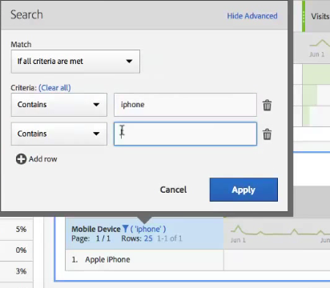

# Sidnumrering, filtrering och sortering av tabeller

Om du klickar på filterikonen och sedan på Visa avancerat bredvid en dimension i en frihandstabell kan du filtrera enligt följande kriterier:

* Innehåller
* Innehåller inte
* Innehåller alla termer
* Innehåller valfri term
* Innehåller frasen
* Innehåller inga termer
* Innehåller inte frasen
* Är lika med
* Är inte lika med
* Börjar med
* Slutar med

