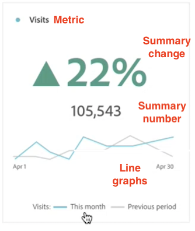

# Sammanfattning av nyckelmått

Med visualiseringen [!UICONTROL Key metric summary] kan du se hur ett viktigt mätresultat trendar inom en enda tidsram. Du kan också jämföra mätprestanda över två tidsramar. Det ger fördelarna med flera visualiseringar i kombination med en visualisering:

* **[!UICONTROL Line]** visualiseringar som visar hur måttet trendar för det primära datumintervallet och jämförelsedatumintervallet

* **[!UICONTROL Summary percent change]** som visar måttökning eller minskning mellan det primära datumintervallet och jämförelsedatumintervallet

* Aktuellt totalt värde ([!UICONTROL **sammanfattningsnummer**]) för måttet

## Användningsexempel

Den här visualiseringen åtgärdar flera vanliga användningsfall, bland annat:

* En analytiker som försöker förstå hur skapandet av nya affärsmöjligheter såg ut den här månaden jämfört med samma tidsram förra året.

* En marknadsförare som visar hur leadgenerering för en viss lead-typ har ändrats från den här månaden till den förra månaden.

* En chefer vill förstå hur nya bokningar ändrades från detta kvartal till förra kvartalet.

## Konfigurera sammanfattningen av nyckelmått

1. Dra visualiseringen **[!UICONTROL Key metric summary]** från menyn **[!UICONTROL Visualizations]** i den vänstra listen till en panel.

   

1. Konfigurera visualiseringen med följande alternativ:

   | Konfigurationsinställning | Definition |
   | --- | --- |
   | **[!UICONTROL Metric]** | Välj det mätvärde som du vill undersöka. Alla mätvärden stöds. |
   | **[!UICONTROL Primary date range]** | Det aktuella datumintervallet för frihandstabellen.
Välj bland tillgängliga datumintervall i rapportsviten.
 
Välj [!UICONTROL **Panelens datumintervall**] om du vill använda samma datumintervall som används på panelen där visualiseringen finns.
 |
   | **[!UICONTROL Comparison date range]** | Datumintervallet som du vill jämföra med det primära datumintervallet. |
   | **[!UICONTROL Segment (optional)]** | Alla segment som du är intresserad av för sammanfattningen. |

   {style="table-layout:auto"}

   >[!NOTE]
   >
   >När fältet [!UICONTROL **Primärt datumintervall**] är inställt på [!UICONTROL **Paneldatumintervall**] kan **[!UICONTROL Comparison date range]** uppdateras automatiskt, beroende på om alternativet **[!UICONTROL Comparison date range]** är relativt till det primära datumintervallet eller fasta.
   >
   >* **Relativ:** Om fältet **[!UICONTROL Comparison date range]** är inställt på ett alternativ som är relativt till det primära datumintervallet (t.ex. [!UICONTROL **Föregående dag**], [!UICONTROL **Samma dag förra veckan**], [!UICONTROL **Samma dag fyra veckor före**] o.s.v.) kommer eventuella uppdateringar av fältet [!UICONTROL **Primärt datumintervall**] automatiskt att uppdatera till perioden som omedelbart kommer efter panelens datumintervall.**[!UICONTROL Comparison date range]**
   >* **Fast:** Om fältet [!UICONTROL **Jämförelsedatumintervall**] är inställt på ett fast datumintervall (t.ex. **3 februari 2023**) har ändringar som gjorts i fältet [!UICONTROL **Primärt datumintervall**] eller panelens datumintervall ingen effekt på [!UICONTROL **Jämförelsedatumintervallet**]. Alla uppdateringar av panelens datumintervall gör dock att [!UICONTROL **primärt datumintervall**] uppdateras automatiskt.

1. Välj **[!UICONTROL Build]**.

## Visa utdata

Utdata ska se ut ungefär så här:

Tänk på följande när du visar utdata:

* Linjediagrammet **[!UICONTROL Previous period]** (visas alltid i grått) motsvarar **[!UICONTROL Comparison date range]** i konfigurationssteget.

* Om ett jämförelsedatumintervall inte anges under konfigurationen eller döljs i visualiseringsinställningarna, visas bara linjediagrammet för det primära datumintervallet. Sammanfattningsändringen är dold.

* Härifrån kan du hovra över linjediagrammen för att se statistik för enskilda dagar:

## Visualiseringsinställningar

Sammanfattningen av nyckeltal erbjuder flera flexibla inställningar för bättre rapportering och kommunikation av viktiga mätvärden. Du kommer åt inställningarna via kugghjulsikonen i det övre högra hörnet av visualiseringen.

| Inställning | Beskrivning |
| --- | --- |
| **[!UICONTROL Emphasize percent change]** | Visa sammanfattningsändring i framträdande fetstil i mitten av visualiseringen |
| **[!UICONTROL Emphasize number value]** | Visa sammanfattningsnummer i framträdande fetstil i mitten av visualiseringen |
| **[!UICONTROL Legend visible]** | Visa eller dölj teckenförklaringen längst ned i visualiseringen |
| **[!UICONTROL Show annotations]** | Visa eller dölj anteckningar som lagts till av en administratör |
| **[!UICONTROL Show sparklines]** | Visa eller dölj linjediagram längst ned i diagrammet. När teckenförklaringen är dold ändras den inte längre till att visa en referens till raderna |
| **[!UICONTROL Show min and max on sparklines]** | Visa eller dölj lägsta och högsta värden i primära och jämförande raddiagram |
| **[!UICONTROL Show comparison]** | Visa eller dölj jämförelsedata. När det är dolt döljs både jämförelsetabellen och de sammanfattande ändringsobjekten. |
| **[!UICONTROL Show total number]** | Visa eller dölj sammanfattningsnummer |
| **[!UICONTROL Show raw difference]** | Visa eller dölj den obearbetade skillnaden mellan det totala värdet för måttet i det primära datumintervallet och det sekundära datumintervallet |
| **[!UICONTROL Abbreviate value]** | Förkorta talvärdena för att förenkla kommunikationen (till exempel 20 000 -> 20 kB) |

## Redigera visualisering

När du har skapat visualiseringen kan du fortfarande redigera den ursprungliga konfigurationen.

1. Klicka på pennikonen i det övre högra hörnet av visualiseringen (bredvid inställningsikonen).

   

   Du återgår nu till den ursprungliga konfigurationsvyn.

1. Ändra måttet, det primära datumintervallet, jämförelsedatumintervallet eller segmentet.
