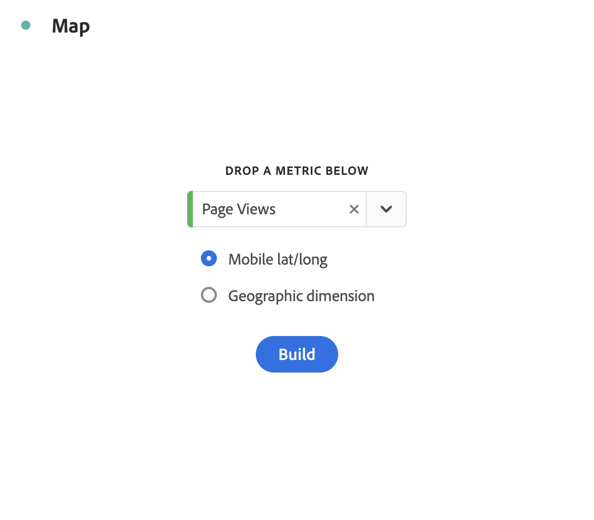

# Karta {#map}

<!-- markdownlint-disable MD034 -->

<!-- markdownlint-disable MD034 -->

>[!CONTEXTUALHELP]
>id="workspace_map_button"
>title="Karta"
>abstract="Den här visualiseringen representerar mätvärden genom att täcka över dem på en karta. Den här visualiseringen är användbar för att identifiera data i olika geografiska regioner."

<!-- markdownlint-enable MD034 -->

<!-- markdownlint-disable MD034 -->

>[!CONTEXTUALHELP]
>id="workspace_map_bubbles"
>title="Bubblor"
>abstract="Rita händelser med bubblor."

<!-- markdownlint-enable MD034 -->

<!-- markdownlint-disable MD034 -->

>[!CONTEXTUALHELP]
>id="workspace_map_heatmap"
>title="Heatmap"
>abstract="Rita händelser med hjälp av en värmekarta."

<!-- markdownlint-enable MD034 -->

>[!BEGINSHADEBOX]

_I den här artikeln beskrivs kartvisualiseringen i_  _&#x200B;**Adobe Analytics**._ _Det finns för närvarande ingen kartvisualisering tillgänglig i_  _&#x200B;**Customer Journey Analytics**._

>[!ENDSHADEBOX]

 **[!UICONTROL Map]**-visualisering i Analysis Workspace

* gör att du kan skapa en visuell karta över alla mätvärden (inklusive beräknade värden),
* är användbart för att identifiera och jämföra mätdata för olika geografiska regioner,
* har stöd för två datakällor: latitud/longitud från mobilanvändning eller geografisk dimension för webbanvändning,
* stöder export från PDF, och
* använder WebGL för bildvisning. Om grafikdrivrutinerna inte har stöd för WebGL-återgivning kan du behöva uppdatera drivrutinerna.

>[!BEGINSHADEBOX]

Se  [Mappningsvisualisering i Analysis Workspace](https://video.tv.adobe.com/v/23559/?quality=12){target=&#34;_blank&#34;} för en demonstrationsvideo.

>[!ENDSHADEBOX]

## Använd

1. Lägg till en  [!UICONTROL Map]. Se [Lägga till en visualisering på en panel](freeform-analysis-visualizations.md#add-visualizations-to-a-panel). Du kan bara dra en kartvisualisering över en frihandstabell.

   {width="50%"}

1. Välj ett mätvärde i listrutan. Eller dra ett mätvärde från listan med mätvärden (inklusive beräknade värden).
1. Ange datakällan som du vill rita från. Den här dialogrutan visas bara om du har platsspårning aktiverad för mobilappsdata.

   | Source | Beskrivning |
   | --- | --- |
   | **[!UICONTROL Mobile Lat/Long]** | Det här alternativet representerar mobilappsdata. Det här alternativet visas bara om du har aktiverat det för din rapportserie i [!UICONTROL Analytics] > [!UICONTROL Admin] > [!UICONTROL Report Suites] > (välj rapportserie) > [!UICONTROL Edit Settings] > [!UICONTROL Mobile Management] > [!UICONTROL Enable Location Tracking]. Det här är standardinställningen (om platsspårning är aktiverat). |
   | **[!UICONTROL Geographic Dimension]** | Det här alternativet representerar geosegmenteringsdata om besökarens plats baserat på besökarens IP-adress. Dessa data omvandlas till [!UICONTROL Country], [!UICONTROL Region] och [!UICONTROL City]. Observera att det inte går till DMA- eller Zip-kodnivån. Nästan alla rapportsviter har den här dimensionen aktiverad. Om du inte har det kontaktar du Adobe kundtjänst för att aktivera geografiska rapporter. |

1. Välj **[!UICONTROL Build]**.

   En världskarta med bubblor genereras.

   

1. Nu kan du:

   * **Zooma** in på kartan om du vill förstora vissa områden genom att dubbelklicka på kartan eller använda rullningshjulet. Kartan zoomas enligt var du har placerat markören. Genom zoominteraktion uppdateras den nödvändiga dimensionen (land > stat > stad) automatiskt utifrån zoomnivån.
   * **Jämför** två eller flera mappningsvisualiseringar i samma projekt genom att placera dem sida vid sida.
   * **Visa jämförelser mellan period och period (till exempel år över år)**:

      * Visa negativa tal: Om du till exempel ritar ett årligt mått kan kartan visa -33 % över New York.
      * Med mätvärden som är av typen *percent*, genereras medelvärden för procentsatserna tillsammans.
      * Ett grönt/rött färgschema: positiv/negativ

   * **Rotera** kartan i 2D eller 3D genom att hålla ned tangenten [!UICONTROL Ctrl] och flytta kartan.

   * **Växla** till en annan vy, till exempel värmekartan, med [inställningarna](/help/analyze/analysis-workspace/visualizations/map-visualization.md#section_5F89C620A6AA42BC8E0955478B3A427E) som beskrivs nedan. Observera att bubbelvyn är standardinställningen.

1. **Spara** projektet om du vill spara alla kartinställningar (koordinater, zoomning, rotation).
1. Tabellen på frihand, nedanför visualiseringen, kan fyllas med genom att du drar i platsdimensioner och mått från den vänstra listen.

## Konfigurera

Om du vill konfigurera om kartvisualiseringen väljer du .

## Inställningar

Om du vill definiera inställningar för visualiseringen väljer du .

| Inställning | Beskrivning |
|--- |--- |
| **[!UICONTROL Map type]** | |
| **[!UICONTROL Bubbles] | Ritar händelser med bubblor. Ett bubbeldiagram är ett diagram med flera variabler och som är ett kors mellan ett punktdiagram och ett proportionellt ytdiagram. Den här vyn är standard. |
| [!UICONTROL Heatmap] | Ritar händelser med hjälp av en heatmap. En heatmap är en grafisk representation av data där de enskilda värdena i en matris representeras som färger. |
| **[!UICONTROL Styles]** | |
| [!UICONTROL Color theme] | Visar färgschemat för värmekartan och bubblorna. Du kan välja mellan Coral, Reds, Green eller Blues. Standardvärdet är Coral. |
| [!UICONTROL Map style] | Du kan välja mellan Basic, Streets, Bright, Light, Dark och Satellite. |
| **[!UICONTROL Cluster Radius]** | Grupperar datapunkter som ligger inom det angivna antalet pixlar. Standardvärdet är 50. |
| **[!UICONTROL Custom Max Value]** | Gör att du kan ändra tröskelvärdet för det högsta värdet för kartan. Om du justerar det här värdet justeras skalan för värdena för bubblor/heatmap (färg och storlek) i förhållande till det anpassade maxvärdet. |

<!--
## Build a time-parting heatmap

Here is a video on the topic:

>[!VIDEO](https://video.tv.adobe.com/v/26991/?quality=12)

-->

