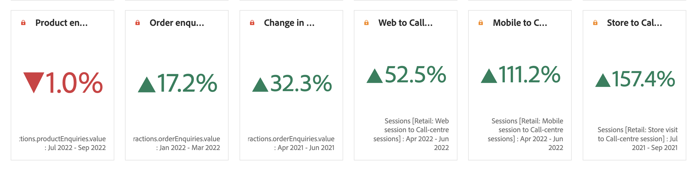

# Sammanfattning av antal och förändring

## Visualisering av sammanfattningsnummer {#summary-number}

Använd visualisering av sammanfattningsnummer för att markera ett stort tal som är viktigt i ett projekt. Den här visualiseringen fungerar på följande sätt:

* Markerar kolumnsumman om ingen cell är markerad.
* Om en enskild cell är markerad visas sammanfattningen för den cellen.
* Om flera celler är markerade visas den första cellen som är markerad.
* Om kolumnen är markerad väljs det första cellvärdet i kolumnen.

Klicka på **Visualiseringsinställningarna** i det övre högra hörnet för att konfigurera inställningarna för Sammanfattningsnummer:

| Inställning | Definition |
|--- |--- |
| Procenttal | Visa procenttal i stället för råa tal. |
| Förklaring synlig | Visa information om måttet som visas. |
| Förkortningsvärde | Välj om du vill förkorta värden och visa upp till tre decimaler. |
| Summera värdet efter | Välj om du vill visa max, min, medelvärde, median eller summan för ett dataurval. |

Klicka på **Visualiseringsinställningarna** i det övre högra hörnet för att konfigurera inställningarna för Sammanfattningsnummer:

| Inställning | Definition |
|--- |--- |
| Procenttal | Visa procenttal i stället för råa tal. |
| Förklaring synlig | Visa information om måttet som visas. |
| Förkortningsvärde | Välj om du vill förkorta värden och visa upp till tre decimaler. |
| Summera värdet efter | Välj om du vill visa max, min, medelvärde, median eller summan för ett dataurval. |

## Visualisering av sammanfattning {#summary-change}

Använd visualisering av sammanfattningsändring för att visa delta (ändring) mellan två tal. Den gröna och röda färgen i Sammanfattningsändring kan styras med [anpassad händelsepolaritet](https://docs.adobe.com/content/help/en/analytics/admin/admin-tools/success-events/success-event.html) eller [alternativet Visa uppåttrend som](https://docs.adobe.com/content/help/en/analytics/components/calculated-metrics/calcmetric-workflow/cm-build-metrics.html) för ett beräknat mått.

Den här visualiseringen fungerar på följande sätt:

* Om ingen cell är markerad jämförs de två första cellvärdena i kolumnen.
* Om en cell är markerad visas 0, eftersom cellvärdet jämförs med sig själv.
* Om två celler är markerade tas den första markerade cellen som täljare och den andra som nämnare.
* Om fler än två celler är markerade kommer endast de första två att användas för jämförelse.
* Om ett cellintervall är markerat jämförs den första med den sista cellen i intervallet.
* Om kolumnen är markerad jämförs det första värdet med sig självt, vilket innebär en ändring på 0.

Klicka på **Visualiseringsinställningarna** i det övre högra hörnet för att konfigurera inställningarna för Sammanfattningsändring:

| Inställning | Definition |
|--- |--- |
| Procenttal | Visa procenttal i stället för råa tal. |
| Förklaring synlig | Visa information om måttet som visas. |
| Visa procentuell ändring | Visar procentändringen mellan de två talen. |
| Visa råskillnad | Visar den obearbetade skillnaden mellan de två talen. Med det här alternativet kan du även förkorta värden och visa upp till tre decimaler. |
