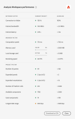

# Analysis Workspace prestandafaktorer och optimering

Olika faktorer kan påverka prestanda i ett projekt inom Analysis Workspace. Det är viktigt att du vet vad dessa medarbetare är innan du börjar bygga ett projekt, så att du kan planera och bygga projektet på det optimala sättet. Den här sidan innehåller en lista med faktorer som påverkar prestandan och rekommenderade optimeringar som du kan göra för att säkerställa topprestanda i Analysis Workspace.

>[!IMPORTANT]
>
>Prestandasidan i Analysis Workspace är i begränsad version. [Läs mer](https://docs.adobe.com/content/help/sv-SE/analytics/landing/an-releases.html)

## Hjälp > Prestanda i Analysis Workspace

Under **[!UICONTROL Analysis Workspace > Help > Performance]** kan du se faktorer som påverkar projektets prestanda, t.ex. nätverk, webbläsare och projektfaktorer. Du får bäst resultat om du tillåter att projektet läses in fullständigt innan du öppnar sidan Prestanda. Dessutom kan du **hämta prestandainnehållet som CSV** och enkelt dela det med Adobe kundtjänst eller dina interna IT-team.

>[!NOTE]
>
>Informationen på sidan Prestanda varierar varje gång som modalen öppnas, eftersom faktorerna kan ändras. Dessutom kommer Adobe att fortsätta att förfina de rekommenderade tröskelvärdena när fler data blir tillgängliga.

## Nätverksfaktorer

**[!UICONTROL Help > Performance]** nätverksfaktorer:

| Faktor | Definition | Berörd av | Optimering |
|---|---|---|---|
| Anslutning till Adobe | Adobe skickar in 10 testanrop när prestandasidan öppnas. Detta motsvarar den procentandel av anropet till Adobe som lyckas. | Problem med lokala nätverk eller Adobe kommer att påverka den här faktorn. | Kontrollera status.adobe.com för att kontrollera om det finns några kända serviceproblem. Validera sedan din lokala nätverksanslutning. |
| Internetbandbredd | Din webbläsares uppskattning av bandbredden på din plats, endast testad för Google Chrome. Det rekommenderade tröskelvärdet är 2,0 MB/s. | Din lokala nätverksanslutning kommer att påverka den här faktorn. | Verifiera din lokala nätverksanslutning. |
| Internetfördröjning | Adobe skickar in 10 testanrop när prestandasidan öppnas. Detta anger den tid det i genomsnitt tar för varje begäran att åka till Adobe och returneras. Enklare uttryckt är det ett mått på hur snabbt Internet är mellan er plats och Adobe. Rekommenderat tröskelvärde är &lt; 1 sekund. | Problem med lokala nätverk, många öppna webbläsarflikar eller problem med Adobe påverkar detta. | Kontrollera status.adobe.com för att kontrollera om det finns några kända serviceproblem. Validera sedan den lokala nätverksanslutningen och stäng webbläsarflikar som inte används. |

## Webbläsarfaktorer

**[!UICONTROL Help > Performance]** bland annat följande faktorer:

| Faktor | Definition | Berörd av | Optimering |
|---|---|---|---|
| Beräkningshastighet | Hur snabbt datorn utför ett behandlingstest. Det rekommenderade tröskelvärdet är &lt; 750 ms. | Din maskinvara och samtidiga program kommer att påverka detta. | Öppna Aktivitetshanteraren (PC) eller Aktivitetsövervakaren (Mac) för att avgöra om några program kan stängas. Stäng sedan webbläsarflikarna eller andra program som inte används.   Om dessa åtgärder inte hjälper dig, diskutera maskinvaruinformation med IT-teamet. |
| Minne som används | Alla arbetsyteflikar i en Google Chrome-webbläsare delar totalt 4 GB minne (Firefox har ett högre tröskelvärde). Detta motsvarar den procentandel av minnestilldelningen som används av det aktuella projektet. Det rekommenderade tröskelvärdet är 3 500 MB, vilket är den punkt där Workspace börjar få minnesfel. | Att arbeta på flera flikar eller hämta 50000 rader data bidrar till ökad minnesanvändning. | Om du får ett minnesfel rekommenderar vi att andra Workspace-flikar stängs och/eller att 50000-radhämtningar körs en i taget. |
| Lokalt lagringsutrymme används | Data som lagras lokalt på datorn för användning i webbläsaren. Varje ursprung (t.ex. experience.adobe.com) har en tolerans på 10 MB. | Analysis Workspace använder lokal lagring för flera funktioner, bland annat för att lagra automatiskt sparade (befintliga) projekt, användarinställningar och funktionsflaggor. | För att säkerställa att Analysis Workspace funktioner inte störs bör du rensa den lokala lagringen för domänen experience.adobe.com. |
| Återgivningshastighet | FPS står för bildrutor per sekund, vilket är hur många gånger per sekund webbläsaren ritar sidan på skärmen. 24 FPS är det som det mänskliga ögat kan observera. Om antalet bildrutor/s är lägre än så kan du upptäcka återgivningsproblem i arbetsytan. | FPS påverkas av multikörning i många arbetsyteprojekt samtidigt och storleken på det projekt som visas är större. Andra program som körs på datorn kan ha en effekt, t.ex. direktuppspelning, bakgrundsskannrar m.m. Dessutom påverkar maskinvaran den här faktorn. | Öppna Aktivitetshanteraren (PC) eller Aktivitetsövervakaren (Mac) för att avgöra om några program kan stängas. Stäng sedan webbläsarflikarna eller andra program som inte används.   Om dessa åtgärder inte hjälper dig, diskutera maskinvaruinformation med IT-teamet. |

## Projektfaktorer

**[!UICONTROL Help > Performance]** projektfaktorer:

| Faktor | Definition | Optimering |
|---|---|---|
| Antal frågor | Det totala antalet frågor (begäranden) som gjorts till Adobe för att hämta data som visas i projektet. Frågorna innehåller rankade begäranden om tabeller, avvikelseidentifiering, miniatyrbilder, komponenter som visas i den vänstra listen med mera. Exkluderar komprimerade paneler och visualiseringar. Rekommenderat tröskelvärde är 100. | Förenkla projektet där det är möjligt genom att dela upp data i flera projekt som har ett specifikt syfte eller en grupp intressenter. Använd taggar för att ordna projekt i teman och använd [direktlänkar](https://docs.adobe.com/content/help/en/analytics/analyze/analysis-workspace/curate-share/shareable-links.html) för att skapa en intern innehållsförteckning så att intressenter enklare kan hitta det de behöver. |
| Utökade paneler (av totalt antal paneler) | Antalet expanderade paneler av det totala antalet paneler i projektet. Rekommenderat tröskelvärde är 5. | När du har vidtagit åtgärder för att förenkla ditt projekt kan du komprimera paneler i projektet som inte behöver visas vid inläsning. När projektet öppnas bearbetas bara expanderade paneler. Komprimerade paneler bearbetas inte förrän användaren expanderar dem. |
| Utökade visualiseringar (av totalt antal visualiseringar) | Antalet utökade tabeller och visualiseringar av den totala mängden i projektet. Utesluter dolda datakällor. Rekommenderat tröskelvärde är 15. | När du har vidtagit åtgärder för att förenkla ditt projekt kan du komprimera visualiseringar i ditt projekt som inte behöver visas vid inläsning. Prioritera de bilder som är viktigast för konsumenten av rapporten och dela upp stödet till bilder i en separat, mer detaljerad panel eller projekt vid behov. |
| Antal frihandsceller | Det totala antalet frihandstabellceller i projektet, beräknat med rader * kolumner i alla tabeller. Utesluter dolda datakällor. Rekommenderad tröskel är 4000. | Minska antalet kolumner i tabellen till de mest relevanta datapunkterna. Minska antalet rader i tabellen genom att justera antalet rader som visas, använda ett tabellfilter eller använda ett segment. |
| Tillgängliga komponenter | Det totala antalet komponenter som har hämtats i projektets vänstra del i alla rapportsviter i projektet. Rekommenderad tröskel är 2000. | Tala med produktadministratören om hur du skapar en välstrukturerad virtuell rapportsvit med en mer skräddarsydd uppsättning komponenter. |
| Använda komponenter | Det totala antalet komponenter som används i projektet. Rekommenderat tröskelvärde är 100. | Antalet använda komponenter påverkar inte prestandan direkt. Komplexiteten hos dessa komponenter kommer dock att bidra till projektets prestanda. Se rekommenderade optimeringar i avsnittet &quot;Ytterligare faktorer&quot; nedan. |
| Senaste datumintervall | Den här faktorn visar det längsta datumintervallet som används i projektet. Rekommenderad tröskel är 1 år. | Dra inte in mer data än du behöver när det är möjligt. Begränsa panelkalendern till relevanta datum för analysen eller använd datumintervallkomponenter (lila komponenter) i frihandstabellerna. Datumintervall som används i en tabell åsidosätter panelens datumintervall. Du kan till exempel lägga till sista månaden, sista veckan och igår i tabellkolumnerna för att begära dessa specifika dataintervall. Titta på [den här videon](https://docs.adobe.com/content/help/en/analytics-learn/tutorials/analysis-workspace/calendar-and-date-ranges/date-ranges-and-calendar-in-analysis-workspace.html)om du vill ha mer information om hur du arbetar med datumintervall i Analysis Workspace.   Dessutom bör du minimera antalet jämförelser mellan åren som används i projektet. När en jämförelse mellan år och år beräknas, utförs en genomgång av alla 13 månaders data mellan de givna månaderna. Detta har samma effekt som att ändra panelens datumintervall till de senaste 13 månaderna. |

## Ytterligare faktorer

Ytterligare faktorer som inte finns med i Hjälp > Prestanda är:

| Faktor | Definition | Berörd av | Optimering |
|---|---|---|---|
| Segmentkomplexitet | Integrerade segment kan ha en betydande inverkan på projektresultatet. | Faktorer som ökar komplexiteten i ett segment (i fallande effektordning) är bland annat: <ul><li>Operatorer för &quot;contains&quot;, &quot;contains any of&quot;, &quot;match&quot;, &quot;starting with&quot; eller &quot;ends with&quot; </li><li>Sekventiell segmentering, särskilt när dimensionsbegränsningar (inom/efter) används </li><li>Antal unika dimensionsobjekt inom dimensioner som används i segmentet (t.ex. Sida = &#39;A&#39; när sidan har 10 unika objekt blir snabbare än Sida = &#39;A&#39; när sidan har 100000 unika objekt) </li><li>Antal olika dimensioner som används (t.ex. Page = &#39;Home&#39; och Page = &#39;Search results&#39; är snabbare än eVar 1 = &#39;red&#39; och eVar 2 = &#39;blue&#39;)</li><li>Många OR-operatorer (i stället för AND)</li><li>Kapslade behållare som varierar i omfång (t.ex. &quot;Träff&quot; inuti &quot;Besök&quot; inuti &quot;Besök&quot;)</li></ul> | Vissa av komplexitetsfaktorerna kan inte förhindras, men leta efter möjligheter att minska komplexiteten i era segment. Ju mer specifik du kan vara med dina segmentkriterier, desto bättre. Exempel:<ul><li>Med behållare blir det snabbare att använda en enda behållare högst upp i segmentet än en serie kapslade behållare.</li><li>Med operatorer blir&quot;lika&quot; snabbare än&quot;innehåller&quot;, och&quot;är lika med&quot; är snabbare än&quot;innehåller något av&quot;.</li><li>Med många kriterier blir AND-operatorer snabbare än en serie OR-operatorer.</li></ul> Leta efter möjligheter att reducera många OR-satser till en enda &quot;motsvarar&quot;-programsats.  [Klassifikationer](/help/components/classifications/c-classifications.md) kan också bidra till att konsolidera många värden till koncisa grupper som du sedan kan skapa segment från. Segmentering i klassificeringsgrupper ger prestandafördelar jämfört med segment som innehåller många OR-satser eller&quot;contains&quot;-kriterier. |
| Visualiseringskomplexitet (segment, mätvärden, filter) | Den typ av visualisering (t.ex. bortfall jämfört med frihandstabell) som läggs till i ett projekt påverkar inte projektets prestanda särskilt mycket. Det är komplexiteten i den visualisering som kommer att öka bearbetningstiden. | Faktorer som gör en visualisering mer komplicerad:<ul><li>Intervall med begärda data</li><li>Antal segment som används. till exempel segment som används som rader i en frihandstabell</li><li>Användning av komplexa segment</li><li>[Statiska objektrader](https://docs.adobe.com/content/help/en/analytics/analyze/analysis-workspace/build-workspace-project/column-row-settings/manual-vs-dynamic-rows.html) eller kolumner i frihandstabeller</li><li>Filter som används på rader i frihandstabeller</li><li>Antal mätvärden som ingår, särskilt beräknade mätvärden som använder segment</li></ul> | Om du märker att dina projekt inte läses in så snabbt du vill kan du ersätta vissa segment med eVars och Filter där det är möjligt.  Om ni kontinuerligt använder segment och beräknade värden för datapunkter som är viktiga för ert företag bör ni förbättra er implementering för att hämta in dessa datapunkter mer direkt. Om du använder tagghanterare som Adobe Experience Platform Launch och Adobe kan implementeringsändringarna göras snabbt och enkelt. |
| Rapportsvitens storlek | Mängden data som samlas in i rapportsviten. Rapportsvitens storlek spelar en liten roll i projektresultatet på grund av hur Adobe hanterar databearbetningen. | Ej tillämpligt | Kontakta ditt implementeringsteam eller en Adobe-expert för att ta reda på om det finns implementeringsförbättringar som kan göras för att förbättra den övergripande upplevelsen i Adobe Analytics. |

## Vanliga felmeddelanden

Det kan uppstå fel vid interaktion med Analysis Workspace som också påverkar prestandan. Nedan visas de vanligaste feltyperna, varför de inträffar och optimeringar som kan göras.

| Felmeddelande | Varför inträffar detta? | Optimering |
| --- | --- | --- |
| [!UICONTROL The report suite is experiencing unusually heavy reporting. Please try again later.] | Din organisation försöker köra för många samtidiga begäranden mot en viss rapportserie. Medarbetare till det här felet är API-begäranden, schemalagda projekt, schemalagda rapporter, schemalagda aviseringar och samtidiga användare som gör rapporteringsförfrågningar. | Sprid era förfrågningar och scheman för rapportsviten jämnare under hela dagen. |
| [!UICONTROL A system error has occurred. Please log a Customer Care request under Help > Submit Support Ticket and include your error code.] | Adobe har ett problem som måste lösas. | Skicka felkoden till kundtjänst. |
| [!UICONTROL The request is too complex.] | Din rapporteringsbegäran är för stor och kan inte utföras. Medarbetare till det här felet är timeout på grund av begärans storlek, för många matchade objekt i ett segment eller sökfilter, för många mätvärden, inkompatibla mått- och mätkombinationer osv. | Förenkla begäran genom att ta bort vissa kolumner eller rader i tabellen, eller dela upp tabellen i separata begäranden. |
| [!UICONTROL One of the segments or the search in this visualization contains a text search that returned too many results.] | Segmentkriterierna eller rapportfiltret är för brett. | Begränsa sökvillkoren och försök igen. |
| [!UICONTROL This dimension does not currently support non-default attribution models.] | Attribuering som inte är standard stöds inte för den dimension som du använder. | Ersätt dimensionen i tabellen med en som är kompatibel med [Attribution IQ](../attribution/overview.md). |
| [!UICONTROL Your request failed as a result of too many columns or pre-configured rows.] | Tabellen innehåller för många frihandsceller (rad * kolumner). | Ta bort kolumner eller rader i tabellen eller dela upp tabellen i separata begäranden. |
