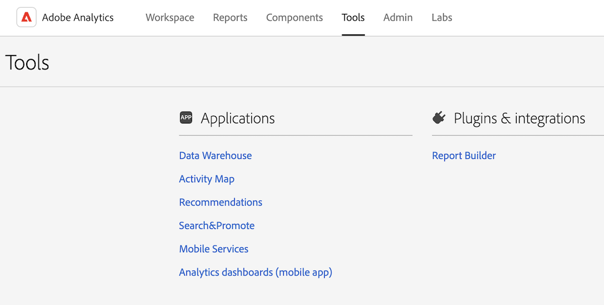

# Förstå analysgränssnittet

Adobe Analytics-gränssnittet består av följande nyckelområden, bland annat flikar för att hantera projekt i Analysis Workspace, hantera komponenter, verktyg och administratörsfunktioner.

I följande avsnitt beskrivs de olika områdena i Analysis Workspace:

## Workspace tab

På fliken [!UICONTROL Workspace] visas området [!UICONTROL Projects] som standard, vilket visar företagsmappen, eventuella personliga mappar som du har skapat, dina projekt och Mobile Scorecards.

1. I Adobe Analytics väljer du fliken [!UICONTROL **Workspace**].

   

Mer information om funktioner på fliken [!UICONTROL Workspace] finns på [Adobe Analytics startsida](/help/analyze/landing.md).

## Fliken Rapport

Använd området [!UICONTROL **Rapporter**] i den vänstra listen på fliken [!UICONTROL **Workspace**]. Mer information finns i *Navigera på fliken Rapporter* på [Adobe Analytics startsida](/help/analyze/landing.md).

## Fliken Komponenter

Fliken [!UICONTROL Components] innehåller funktioner som hjälper dig att finjustera och förbättra dataanalysen.

1. I Adobe Analytics väljer du fliken [!UICONTROL **Komponenter**] och sedan [!UICONTROL **Alla komponenter**].

   

2. Välj någon av följande produktfunktioner för att konfigurera den:

   | Funktioner | Funktion | Mer information |
   |---------|----------|----------|
   | Segment | Med Adobe Analytics kan ni skapa, hantera, dela och tillämpa kraftfulla, fokuserade målgruppssegment i era rapporter med Analytics-funktioner, Adobe Experience Cloud, Adobe Target och andra integrerade Adobe-produkter. | [Analytics-segmentering](/help/components/segmentation/seg-home.md) |
   | Beräknade mått | Beräknade och avancerade beräknade (eller härledda) mått är anpassade mått som du kan skapa utifrån befintliga mätvärden.  Med dem kan marknadsförare, produktchefer och analytiker ställa frågor om data utan att behöva ändra implementeringen av Analytics. | [Beräknade och avancerade beräknade mått](/help/components/calculated-metrics/cm-overview.md) |
   | Datumintervall | Analysis Workspace innehåller en lista med standarddatumintervall som användare kan använda när de skapar analyser. Dessutom kan du skapa anpassade datumintervall och göra dem tillgängliga för användare i Analysis Workspace. | [Skapa anpassade datumintervall](/help/analyze/analysis-workspace/components/calendar-date-ranges/custom-date-ranges.md) <!-- should create an article in the Components Guide for managing/creating date ranges. This article in the Tools Guide needs updating. --> |
   | Virtuella rapportsviter | Virtuella rapportsviter segmenterar era Adobe Analytics-data så att ni kan styra åtkomsten till varje segment. | [Översikt över Virtual Report Suites](/help/components/vrs/vrs-about.md) |
   | Aviseringar | Med larm får du mer detaljerad kontroll över varningar och integrerar avvikelseidentifiering med varningssystemet. | [Aviseringar - översikt](/help/components/alerts/alerts-overview.md) |
   | Anteckningar | Anteckningar i Workspace gör att ni effektivt kan kommunicera kontextuella datanunkter och insikter till er organisation. De gör att du kan koppla kalenderhändelser till specifika dimensioner och mätvärden. | [Hantera anteckningar](/help/analyze/analysis-workspace/components/annotations/manage-annotations.md) |
   | Klassificeringsuppsättningar | Klassificeringsuppsättningar har ett enda gränssnitt för att hantera klassificeringar och regler. 
En klassificering är ett sätt att kategorisera Analytics-variabeldata och sedan visa data på olika sätt när du genererar rapporter. Du upprättar en relation mellan ett variabelvärde och metadata som är relaterade till det värdet. Klassificeringar kan användas för de flesta anpassade dimensioner, som spårningskod, props och eVars.
 | [Översikt över klassificeringsuppsättningar](/help/components/classifications/sets/overview.md) |
   | Platser | För att kunna importera Adobe Analytics-klassificeringsdata från ett molnmål måste du först lägga till och konfigurera platsen där du vill att klassificeringsdata ska samlas in. Du kan skapa, redigera och ta bort platser. | [Platshanteraren](/help/components/locations/locations-manager.md) |
   | Schemalagda projekt | När du hanterar schemalagda projekt kan du redigera och ta bort återkommande projektscheman, söka efter ett schema i sökfältet eller med filteralternativen i den vänstra listen och filtrera efter tagg, godkända scheman, ägare med mera. | [Schemalagda projekt](/help/components/scheduled-projects-manager.md) |
   | Schemalagda rapporter | Administratörsnivåanvändare kan se och hantera schemalagda rapporter i hela organisationen. | [Schemalagd rapportkö](/help/components/scheduled-reports-admin.md) |
   | Rapportinställningar | Dessa inställningar avser äldre Adobe Analytics-produkter, som inte innehåller Analysis Workspace och dess tillhörande komponenter. Gå till Komponenter > Inställningar om du vill göra ändringar i Analysis Workspace-inställningarna. |  |
   | Inställningar | Hantera inställningar för Analysis Workspace och dess tillhörande komponenter för alla nya projekt eller paneler som du skapar. Befintliga projekt och paneler påverkas inte. | [Inställningar](/help/analyze/analysis-workspace/user-preferences.md) |

   {style="table-layout:auto"}

## Fliken Verktyg

<!-- The Tools tab ... -->

1. I Adobe Analytics väljer du fliken [!UICONTROL **Verktyg**] och sedan [!UICONTROL **Alla verktyg**].

   

2. Välj någon av följande produktfunktioner för att konfigurera den:

   | Funktioner | Funktion | Mer information |
   |---------|----------|----------|
   | Data Warehouse | Data Warehouse avser kopian av Analytics-data för lagring och anpassade rapporter, som du kan köra genom att filtrera data. 
Med Hanteraren för begäran kan du visa, duplicera och prioritera om begäranden.
 | [Hantera Data Warehouse-förfrågningar](/help/export/data-warehouse/data-warehouse-requests-manage.md) |
   | Activity Map | Activity Map är utformat för att rangordna länkaktivitet med hjälp av visuella överlägg och tillhandahålla en instrumentpanel med realtidsanalyser för att övervaka målgruppernas engagemang på era webbsidor. Ni kan skapa olika vyer för att visuellt identifiera kundaktivitetens acceleration, kvantifiera marknadsföringssatsningar och agera utifrån målgruppens behov och beteenden. | [Översikt över Activity Map](/help/analyze/activity-map/overview.md) |
   | Klassiska rekommendationer | Rekommendationer är en Adobe Target-funktion som automatiskt visar produkter, tjänster eller innehåll som kan intressera besökarna baserat på tidigare användaraktivitet, önskemål eller andra kriterier. | [Rekommendationer](https://experienceleague.adobe.com/docs/target/using/recommendations/recommendations.html?lang=sv-SE) |
   | Sök och marknadsför | Den här funktionen stöds inte längre. |  |
   | Mobiltjänster | Den här funktionen stöds inte längre. |  |
   | Kontrollpaneler för analyser (mobilapp) | Appen Adobe Analytics dashboards ger dig alltid insikter från Adobe Analytics. Via appen kan användarna visa intuitiva styrkort som du skapar med hjälp av Adobe Analytics datorgränssnitt. | Adobe Analytics-appen för kontrollpaneler i iOS App Store eller Google Play Store |
   | Report Builder | Adobe Report Builder är ett tillägg för Microsoft Excel. Här kan du skapa anpassade förfrågningar från Adobe Analytics-data, som du kan infoga i dina Excel-kalkylblad. Begäranden kan referera till celler dynamiskt i kalkylbladet, och du kan uppdatera och anpassa hur Report Builder visar data. | [Vad är Report Builder?](/help/analyze/report-builder/rb-overview.md) |

   {style="table-layout:auto"}

## Fliken Admin

På fliken Admin finns funktioner och konfigurationsalternativ för att administrera Adobe Analytics.

1. I Adobe Analytics väljer du fliken [!UICONTROL **Admin**] och sedan [!UICONTROL **All admin**].

   

2. Välj någon av följande produktfunktioner för att konfigurera den:

   | Funktioner | Funktion | Mer information |
   |---------|----------|----------|
   | Analysanvändare och -resurser | De flesta funktionerna för användar- och produkthantering är nu bara tillgängliga i [Adobe Admin Console](https://helpx.adobe.com/se/enterprise/using/admin-console.html), men de administrativa funktionerna för överföring av resurser från en användare till en annan, samt för att ange ett förfallodatum för ett användarkonto, är bara tillgängliga i området Adobe Analytics Admin. | [Överför användarresurser eller ange utgångsdatum för kontot](/help/admin/tools/user-management/users-assets.md) |
   | Migrering av användar-ID | Med migreringen av användar-ID:n i Analytics kan administratörer enkelt migrera användarkonton i Analytics-användarhantering till Adobe Admin Console. | [Migrering av analysanvändare till Adobe Admin Console](/help/admin/tools/user-management/user-migration/c-migration-tool.md) |
   | Startsida för användarhantering (äldre) | Användar- och produkthantering har flyttats till Adobe Admin Console. Använd Adobe Admin Console för att börja hantera användarbehörigheter för Adobe Analytics-användare. | [Analyser i Adobe Admin Console](/help/admin/admin-console/home.md) |
   | Grupper (äldre) | Grupphanteringen har flyttat till Adobe Admin Console. Använd Adobe Admin Console för att komma igång med att hantera grupper för Adobe Analytics. | [Analyser i Adobe Admin Console](/help/admin/admin-console/home.md) |
   | Rapportera åtkomst till programsvit | Metoden för att bevilja åtkomst till rapportsvitens verktyg har flyttats till Adobe Admin Console. Använd Adobe Admin Console för att ge Adobe Analytics-användare åtkomst till rapportsviten. | [Produktprofilbehörigheter för Report Suite-verktyg](/help/admin/admin-console/permissions/report-suite-tools.md) |
   | Administratörsverktyg - startsida | Området med administrationsverktyg för Analytics är huvudområdet för att hantera din Adobe Analytics-instans. Det är där de flesta administrativa åtgärder kan utföras. | [Översikt över administrationsverktyg](/help/admin/tools/c-admin-tools.md) |
   | Rapportsviter | Här kan du definiera regler som styr hur data bearbetas i en rapportserie. | [Report Suite-hanterare](/help/admin/tools/manage-rs/report-suites-admin.md) |
   | Analysanvändare och -resurser | Hantering av användare och resurser har flyttats till Adobe Admin Console. Använd Adobe Admin Console för att börja hantera användarbehörigheter för Adobe Analytics-användare. | [Analyser i Adobe Admin Console](/help/admin/admin-console/home.md) |
   | Klassificeringsimportör | Använd importverktyget för att överföra klassificeringar till Adobe Analytics. Du kan också exportera data för uppdatering före en import. | [Översikt över klassificeringsimporteraren](/help/components/classifications/importer/c-working-with-saint.md) |
   | Skapa klassificeringsregel | I stället för att underhålla och överföra klassificeringar varje gång spårningskoderna ändras kan du skapa automatiska, regelbaserade klassificeringar och använda dem i flera rapportsviter. | [Arbetsflöde för Classification Rule Builder](/help/components/classifications/crb/classification-rule-builder.md) |
   | Datakällor | Använd datakällhanteraren för att skapa, redigera eller inaktivera datakällor. Du kan också använda det här gränssnittet för att spåra status för filer som överförts till FTP-platser för datakällor. | [Hantera datakällor](/help/import/data-sources/manage.md) |
   | Kodhanteraren | Med kodhanteraren kan du hämta datainsamlingskod för webb- och mobilplattformar | [Kodhanteraren](/help/admin/tools/code-manager-admin.md) |
   | Trafikhantering | På sidan Traffic Management kan du ange förväntade ändringar av trafikvolymen. Med dessa inställningar kan Adobe tilldela lämpliga resurser för att säkerställa att trafiken kan spåras och behandlas i tid. | [Trafikhanteringsöversikt](/help/admin/tools/manage-rs/edit-settings/c-traffic-management/traffic-management.md) |
   | Serversamtalsanvändning | Ett serveranrop, även kallat &quot;träff&quot; eller &quot;bildbegäran&quot;, är en instans där data skickas till Adobe-servrar för bearbetning. Det finns en kontrollpanel för användning av serversamtal som spårar dina förbrukningsdata för serversamtal och jämför dem med din avtalsgräns. Du kan ställa in varningsmeddelanden för att förhindra övertäckning. | [Översikt över användningen av serversamtal](/help/admin/tools/server-call-usage/overage-overview.md) |
   | Loggar | Logga filer som hjälper dig att se när användare loggar in, deras användning, åtkomst, rapportsviter och administratörsändringar. | [Loggar](/help/admin/tools/logs.md) |
   | Advertising Analytics | Konfigurera Adobe Analytics för att visa alla era Google Ads och Microsoft Advertising betalda sökdata sida vid sida. | [Konfigurera Advertising Analytics](/help/admin/tools/manage-rs/edit-settings/advertising-analytics-config.md) |
   | Dataflöden | Dataflöden är ett kraftfullt sätt att få ut rådata från Adobe Analytics. Dessa rådata kan användas på andra plattformar utanför Adobe efter eget gottfinnande. | [Översikt över dataflöden i analyser](/help/export/analytics-data-feed/data-feed-overview.md) |
   | Exkludera efter IP | Du kan undanta data från specifika IP-adresser, som interna webbplatsaktiviteter, platstestning och personalanvändning, från dina rapporter. Om du exkluderar data förbättras rapportens exakthet genom att IP-adressdata utesluts. Dessutom kan du ta bort data från denial of service eller andra skadliga händelser som kan förvränga rapportdata. Du kan konfigurera undantag eller använda brandväggen. | [Exkludera efter IP-adress](/help/admin/tools/exclude-ip.md) |
   | Rapporteringsaktivitetshanteraren | Med Rapporteringsaktivitetshanteraren kan du se rapporteringskapaciteten för varje rapportsvit i organisationen. Den ger detaljerad insyn i hur man rapporterar förbrukning och hjälper er att enkelt diagnostisera och åtgärda kapacitetsproblem under perioder med hög rapporteringsnivå. | [Rapporteringsaktivitetshanteraren](/help/admin/tools/reporting-activity-manager/reporting-activity.md) |
   | Etikettering av integritetsskydd för datahantering | Med hjälp av etikettrapportsvitdata kan du tilldela identiteter, känslighet och datastyrningsetiketter till varje variabel i en viss rapportserie. | [Sekretessetikett](/help/admin/tools/privacy-labeling/labeling-overview.md) |
   | Startsida för företagsinställningar | På sidan Företagsinställningar kan du konfigurera inställningar som gäller för alla rapportsviter som hanteras av din organisation. | [Översikt över företagsinställningar](/help/admin/tools/company/c-company-settings.md) |
   | Säkerhetshanteraren | Med Säkerhetshanteraren kan du styra åtkomsten till rapportdata. Du kan välja starka lösenord, lösenord, IP-inloggningsbegränsningar och e-postdomänbegränsningar. | [Säkerhetshanteraren](/help/admin/tools/company/security-manager.md) |
   | Webbtjänster | Webbtjänstens API:er ger programmatisk åtkomst till marknadsföringsrapporter och andra Suite-tjänster som gör att du kan duplicera och förstärka funktioner som är tillgängliga via Analytics-gränssnittet. | [Webbtjänster](/help/admin/tools/company/web-services-admin.md) |
   | Report Builder-rapporter | Hantera licenser som tilldelats Report Builder-användare. | [Report Builder-rapporter](/help/admin/tools/company/report-builder-reports-admin.md) |
   | Tjänsten för enkel inloggning | Enkel inloggning i Adobe Experience Cloud implementeras via Admin Console. | [Analyser i Adobe Admin Console](/help/admin/admin-console/home.md) |
   | Dölj rapportsviter | Gör att du kan dölja rapportsviter i Adobe Analytics användargränssnitt om du inte längre vill att en rapportserie ska vara tillgänglig för dig och dina användare. | [Dölj rapportsviter](/help/admin/tools/company/c-hide-report-suites.md) |

   {style="table-layout:auto"}

## Analysis Workspace

Med Analysis Workspace kan ni snabbt skapa analyser för att samla in insikter och sedan dela dessa insikter med andra. Med dra-och-släpp-gränssnittet i webbläsaren kan du utforma analyser, lägga till visualiseringar för att ge liv åt data, strukturera en datauppsättning samt dela och schemalägga projekt med vem du vill.

I följande bild och tabell förklaras några av huvudområdena i Analysis Workspace.

Mer information om Analysis Workspace finns i [Analysis Workspace - översikt](/help/analyze/analysis-workspace/home.md).

| Plats i bild | Namn och funktion |
|---------|----------|
| A | **Längst till vänster:** Innehåller flikar för att lägga till paneler, visualiseringar och komponenter i Analysis Workspace. Innehåller även ikonen för datamordlista som används för att öppna datamappningslistan. |
| B | **Vänster räl:** Beroende på vilken flik som är markerad i det yttersta vänstra fältet innehåller det här området individuella paneler, visualiseringar eller komponenter. |
| C | **Arbetsyta:** Det här är huvudområdet där du drar innehåll från vänster spår för att skapa projektet. Projektet uppdateras dynamiskt när du lägger till paneler, visualiseringar och komponenter på arbetsytan. |
| D | **Listrutan Rapporteringsserie:** För varje panel i Analysis Workspace kan du välja den rapportserie som du vill använda som datakälla i den nedrullningsbara menyn för rapportsviten. |
