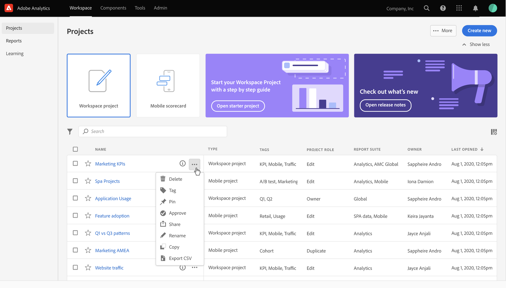
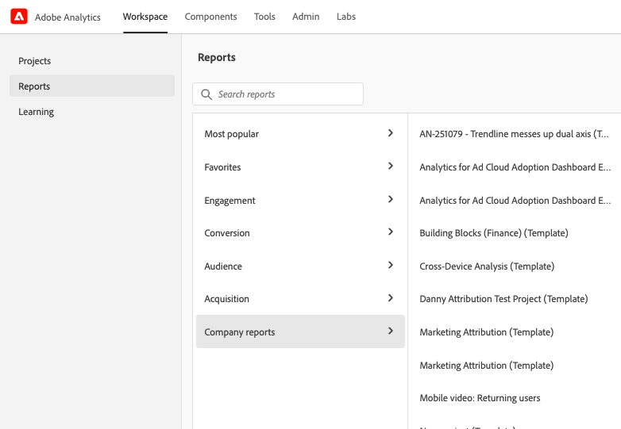

# Adobe Analytics landningssida

Startsidan för Adobe Analytics samlar både Analysis Workspace och Rapporter och analyser i ett enda gränssnitt och en enda åtkomstpunkt under paraplyet Workspace. Här finns en startsida för projektledare, en uppdaterad rapportmeny, uppdaterade rapporter och en utbildningssektion som hjälper dig att komma igång på ett effektivare sätt.

>[!IMPORTANT]
>
>Den här landningssidan kommer att vara i Open Beta från och med 21 juli 2021. Det är en valfri startpunkt. Om du vill kan du använda din befintliga landningssida, oavsett om det är Workspace eller Reports. Om du vill delta i betaprogrammet öppnar du sidan och klickar på **[!UICONTROL Provide feedback]** överst på skärmen för att logga din feedback och eventuella buggar. Du kan när som helst avanmäla dig från och gå tillbaka till betaprogrammet. Allt arbete som görs i betaanvändargränssnittet överförs till den befintliga/aktuella arbetsytan.

>[!VIDEO](https://video.tv.adobe.com/v/334278/?quality=12)

## Åtkomst till landningssidan {#access-landing}

Aktivera växlingsknappen [!UICONTROL New landing page - Beta] i det nedre vänstra hörnet när du har loggat in på Adobe Experience Cloud och Analytics. Åtkomsten till växlingsknappen är användarspecifik per organisation, inte företagsspecifik.

## Menystruktur

* Top Analytics-menyn: De flesta rapporter finns nu på menyn [!UICONTROL Reports] i den vänstra listen.
* Den vänstra listen har tre flikar: [!UICONTROL Projects], [!UICONTROL Reports] och [!UICONTROL Learning].

### Terminologi

* **[!UICONTROL Projects]** är saker som du har skapat eller som någon annan har byggt och delat med dig. [!UICONTROL Projects] hänvisar också till tomma projekt och tomma mobilstyrkort.
* **[!UICONTROL Reports]** hänvisar till allt som är färdigbyggt av Adobe, till exempel rapporter i rapporter och analyser och mallar i Workspace. [!UICONTROL Reports] är också rapportmallar som ditt företag har skapat åt dig.
* **[!UICONTROL Templates]** används inte längre som en term för Adobe färdigbyggda Workspace-projekt. De är nu under [!UICONTROL Reports].

## Navigera på fliken [!UICONTROL Projects] {#navigate-projects}

[!UICONTROL Projects] fungerar som  [!UICONTROL Workspace] startsida. Alla arbetsyteprojekt visas här, inklusive Mobile Scorecards.

>[!NOTE]
>
>Flera av följande inställningar finns kvar (sparas) både under sessionen och mellan sessionerna. Exempel: Vilken flik du är på, vilka filter som har markerats, vilka kolumner som har markerats och kolumnsorteringsriktningen. Sökresultaten sparas dock inte.

| UI-element | Definition |
| --- | --- |
| ... Mer | Gör att du kan [!UICONTROL View Tutorials] och [redigera användarinställningar](/help/analyze/analysis-workspace/user-preferences.md). |
| Skapa projekt | Med den nedrullningsbara menyn kan du skapa en [!UICONTROL Workspace project] eller en [!UICONTROL Mobile project]. |
| Visa mindre/mer | Växlar mellan att inte visa och visa banderollen:  |
| Tomt projekt | Skapar ett tomt [arbetsyteprojekt](https://experienceleague.adobe.com/docs/analytics/analyze/analysis-workspace/home.html?lang=en) som du kan fylla i. |
| Tomt mobilstyrkort | Skapar ett tomt [mobilstyrkort](https://experienceleague.adobe.com/docs/analytics/analyze/mobapp/curator.html?lang=en) som du kan fylla i. |
| Öppna självstudiekurs om utbildning | Öppnar självstudiekursen om arbetsytan där du kan vägleda nya användare genom att bygga ett projekt steg för steg. |
| Öppna versionsinformation | Öppnar Adobe Analytics-delen av den senaste versionsinformationen för Adobe Experience Cloud. |
| Filterikon | Du kan filtrera på taggar, rapportsviter, ägare, typer och andra filter (Min, Delad med mig, Favoriter och Godkänd) |
| Sökfältet | Sökningen innehåller nu alla kolumner i tabellen. |
| Markeringsruta | Om du klickar i den här rutan bredvid ett eller flera projekt visas de projekthanteringsåtgärder du kan utföra: Ta bort, tagga, fästa, godkänn, dela, byta namn, kopiera och exportera till CSV. Du kanske inte har behörighet att utföra alla dessa åtgärder. |
| Favoriter | Om du väljer att Favoritera ett projekt placeras en stjärna bredvid sig och taggas som en favorit som du kan filtrera på. |
| Namn | Projektets namn. |
| Fäst ikon | Du kan fästa objekt och de *visas alltid* högst upp i listan. |
| Info (i), ikon | Om du klickar på informationsikonen visas följande information om det här projektet: Typ, Projektroll, Ägare, Beskrivning och vem det delas med. Det anger också vem som kan [redigera eller duplicera](https://experienceleague.adobe.com/docs/analytics/analyze/analysis-workspace/curate-share/share-projects.html) det här projektet. |
| Ellips (..) | När du klickar på ellipsen bredvid ett projekt visas de projekthanteringsåtgärder du kan utföra: Ta bort, tagga, fästa, godkänn, dela, byta namn, kopiera och exportera till CSV. Observera att du kanske inte har behörighet att utföra alla dessa åtgärder. |
| Typ | Anger om den här typen är ett Workspace-projekt eller ett Mobile-styrkort. |
| Taggar | Du kan tagga rapporter för att ordna dem i grupper. |
| Projektroll | Projektroller avser om du är projektägare och om du har behörighet att redigera eller duplicera projektet. |
| Report Suite | Tabeller och visualiseringar i en panel hämtar data från rapportsviten som valts i panelens övre högra hörn. Rapportsviten avgör också vilka komponenter som är tillgängliga i den vänstra listen. Inom ett projekt kan du använda en eller flera rapportsviter beroende på dina analysexempel. Listan med rapportsviter sorteras efter relevans. Adobe definierar relevansen baserat på hur nyligen och ofta sviten har använts av den aktuella användaren och hur ofta sviten används i organisationen. |
| Ägare | Personen som skapade projektet. |
| Senast öppnad | När det här projektet senast öppnades av dig. |
| Kolumnväljare | Om du vill lägga till eller ta bort kolumner från listan med projekt kan du göra det genom att markera eller avmarkera dem. |
| &lt;> | Den här knappen i ett Workspace-projekt eller en rapport tar dig tillbaka till den senaste konfigurationen för landningssidan. Vilken sidkonfiguration du än hade när du lämnade landningssidan kommer att finnas kvar när du kommer tillbaka. |

## Navigera på fliken [!UICONTROL Reports] {#navigate-reports}

Fliken [!UICONTROL Reports] konsoliderar tre uppsättningar rapporter:

* De fördefinierade [!UICONTROL Workspace]-mallarna som tidigare fanns under [!UICONTROL Workspace] > [!UICONTROL Project] > [!UICONTROL New]. Adobe använder inte längre ordet&quot;mall&quot; i det här sammanhanget.
* De flesta av de färdiga rapporterna på den tidigare toppmenyn i Adobe Analytics [!UICONTROL Reports]. Rapporterna visas nu i [Analysis Workspace](https://experienceleague.adobe.com/docs/analytics/analyze/analysis-workspace/home.html?lang=en).
* Allt ditt företag har byggt åt dig.

>[!IMPORTANT]
>
>Under Rapporter visas en Favoriter-mapp bara om du har markerat en ny rapport som favorit. Inga tidigare favoriter för Rapporter och analyser överförs.

Som tidigare nämnts finns endast de mest använda rapporterna som tidigare grupperats i Rapporter och analyser här. En handfull sällan använda eller inte längre relevanta rapporter migrerades inte över. Se Frågor och svar nedan för mer information.

### Menyer och undermenyer

Här är menyerna och deras undermenyer. Om du inte kan hitta en viss rapport kan du söka efter den genom att välja Sök på sida.

| Menyalternativ | Rapporter under det här menyobjektet |
| --- | --- |
| **[!UICONTROL Most Popular]** | <ul><li>Självstudiekurs (befintlig mall för arbetsyta)</li><li>Sidor (Vad är mina översta sidor?)</li><li>Sidvyer (hur många sidvyer skapar jag?)</li><li>Besök (hur många besök får jag?)</li><li>Besökare (hur många besökare får jag?)</li><li>Viktiga mätvärden (Hur fungerar mina viktigaste mätvärden?)</li><li>Webbplatsavsnitt (Vilka avsnitt på min webbplats genererade de flesta sidvyerna?</li><li>Nästa sida (Vilka är de nästa sidor som besökarna går till?)</li><li>Föregående sida (Vilka är de föregående sidorna som mina besökare gick till?)</li><li>Kampanjer (Vilka kampanjer driver på min nyckelstatistik?)</li><li>Produkter (Vilka produkter driver på min nyckelstatistik?)</li><li>Senaste beröringskanal (Vilken senaste beröringskanal fungerar bäst?)</li><li>Senaste beröringskanaldetalj (Vilken specifik sista beröringskanal presterar bättre än andra?)</li><li>Intäkter (hur fungerar mina intäkter?)</li><li>Beställningar (Hur fungerar mina order?)</li><li>Enheter (hur många enheter säljer jag?)</li></ul> |
| **[!UICONTROL Engagement]** | <ul><li>Viktiga mätvärden (Hur fungerar mina viktigaste mätvärden?)</li><li>Sidvyer (hur många sidvyer skapar jag?)</li><li>Sidor (Vad är mina översta sidor?)</li><li>Besök (hur många besök får jag?)</li><li>Besökare (hur många besökare får jag?)</li><li>Tid per besök (hur mycket tid tillbringar mina användare per besök?)</li><li>Tid före händelse (Hur mycket tid tillbringar mina användare före en lyckad händelse?)</li><li>Webbplatsavsnitt (Vilka avsnitt på min webbplats genererade de flesta sidvyerna?</li><li>Konsumtion av webbinnehåll (Vilket innehåll konsumeras mest och engagerar användarna)?</li><li>Förbrukning av mediematerial (vilket innehåll konsumeras mest och engagerar användarna)?</li><li>Nästa och föregående sidflöde (Vilka är/var nästa/föregående sökvägar som mina besökare tar/tog?)</li><li>Utfall (Var ser jag utfall från mina digitala resurser?)</li><li>Enhetsövergripande analys (Använda enhetsövergripande analys i Analysis Workspace)</li><li>Webbbevarande (Vilka är mina lojala användare och vad gör de?)</li><li>Medieljudförbrukning (Vad är trender och de viktigaste mätvärdena för ljudförbrukning?)</li><li>Media Recency, frequency, loyalty (Vilka är mina lojala läsare?)</li><li>Sidanalys > Läs in igen (vilka sidor genererar de mest laddade)?</li><li>Sidanalys > Tidsåtgång för sidan (hur mycket tid lägger mina användare på mina sidor?)</li><li>Poster och utträde > Startsidor (Vad är mina övre startsidor?)</li><li>Poster och utträden > Ursprungliga startsidor (Vilken sida angav min besökare ursprungligen från?)</li><li>Poster och avslutningar > Enkelsidiga besök (Vilka sidor genererade de mest enkelsidiga besöken?)</li><li>Poster och avslutningar > Avsluta sidor (Vad är mina översta avslutssidor?)</li></ul> |
| **[!UICONTROL Conversion]** | <ul><li>Produkter > Produkter (Vilka produkter påverkar min nyckelstatistik?)</li><li>Produkter > Produktprestanda (Vilka produkter fungerar bäst?)</li><li>Produkter > Kategorier (Vilka är mina mest framgångsrika produktkategorier?</li><li>Kundvagn > Korgar (hur många användare har lagt till en produkt i kundvagnen?</li><li>Kundvagn > Vyer av kundvagn (hur många gånger såg mina besökare sina kundvagnar?)</li><li>Kundvagn > Tillägg av kundvagn (Hur ofta lägger användare till en produkt i kundvagnen?)</li><li>Kundvagn > Ta bort kundvagn (Hur ofta tar användarna bort en produkt från kundvagnen?)</li><li>Inköp > Inkomster (hur fungerar mina intäkter?)</li><li>Inköp > Beställningar (hur fungerar mina order?)</li><li>Inköp > Enheter (hur många enheter säljer jag?)</li><li>[Magento: marknadsföring och handel](https://experienceleague.adobe.com/docs/analytics/analyze/analysis-workspace/build-workspace-project/starter-projects.html?lang=en#commerce)</li></ul> |
| **[!UICONTROL Audience]** | <ul><li>Personmätvärden (hur många interagerar med mitt varumärke?)</li><li>Besökarprofil > Platsöversikt (vilka platser som används mest av användarna)</li><li>Besökarprofil > Geosegmentering > Geo Counties, Geo US States, Geo Regions, Geo Cities, Geo US DMA (Vilka platser besöker mina användare?)</li><li>Besökarprofil > Språk (vilket språk föredrar mina användare?)</li><li>Besökarprofil > Tidszoner (vilka tidszoner besöker mina användare?)</li><li>Besökarprofil > Domäner (Vilka internetleverantörer använder mina besökare för att komma åt min webbplats?)</li><li>Besökarprofil > Domäner på översta nivån (Vilka domäner kör trafik till min webbplats?)</li><li>Besöksprofil > Teknik > Teknik - översikt (Vilka tekniker använder människor för att komma åt min webbplats?)</li><li>Besökarprofil > Teknik > Webbläsare, webbläsartyp, webbläsarbredd, webbläsarhöjd (vilket företags webbläsare, webbläsarversion och dess bredd och höjd använder någon för att komma åt min webbplats?)</li><li>Besökarprofil > Teknik > Operativsystem, operativsystemtyper (vilket operativsystem och vilken version använder mina besökare?)</li><li>Besöksprofil > Teknik > Mobiloperatör (Vilka mobiloperatörer använder mina besökare för att besöka min webbplats?)</li><li>Bevarande av besökare > Returfrekvens (hur lång tid går det mellan min användares aktuella besök och tidigare besök?)</li><li>Bevarande av besökare > Returbesök (hur många av mina besök returnerar användare?)</li><li>Bevarande av besökare > Besök nummer (som besöks av sifferhaken styr de flesta av mina nyckeltal)</li><li>Besökarlojalitet > Försäljningscykel > Kundlojalitet (vilket lojalitetssegment tillhör mina användare?)</li><li>Bevarande av besökare > Försäljningscykel > Dagar före första köp (hur många dagar gick det mellan mitt användares första besök och deras första inköp?)</li><li>Bevarande av besökare > Försäljningscykel > Dagar sedan senaste köp (hur många dagar har gått mellan mitt användarbesök och det senaste köpet? )</li><li>Bevarande av besökare > Mobil > Enheter och enhetstyper (vilka enheter och enhetstyper använder mina besökare?)</li><li>Bevarande av besökare > Mobil > Tillverkare (Vilken mobilenhetstillverkare använder mina besökare?)</li><li>Bevarande av besökare > Mobil > Skärmstorlek, Skärmhöjd, Skärmbredd (Vilken mobilskärmstorlek/-höjd/bredd har mina besökare?)</li><li>Bevarande av besökare > Mobil > [Användning av mobilapp](https://experienceleague.adobe.com/docs/analytics/analyze/analysis-workspace/build-workspace-project/starter-projects.html?lang=en#mobile)</li><li>Bevarande av besökare > Mobil > [Mobilappsresor](https://experienceleague.adobe.com/docs/analytics/analyze/analysis-workspace/build-workspace-project/starter-projects.html?lang=en#mobile)</li><li>Behålla besökare > Mobil > [Mätvärden för mobilappar](https://experienceleague.adobe.com/docs/analytics/analyze/analysis-workspace/build-workspace-project/starter-projects.html?lang=en#mobile)</li><li>Behålla besökare > Mobil > [Meddelanden om mobilappar](https://experienceleague.adobe.com/docs/analytics/analyze/analysis-workspace/build-workspace-project/starter-projects.html?lang=en#mobile)</li><li>Behålla besökare > Mobil > [Mobilappsprestanda](https://experienceleague.adobe.com/docs/analytics/analyze/analysis-workspace/build-workspace-project/starter-projects.html?lang=en#mobile)</li><li>Bevarande av besökare > Mobil > [Bevarande av mobilapp](https://experienceleague.adobe.com/docs/analytics/analyze/analysis-workspace/build-workspace-project/starter-projects.html?lang=en#mobile)</li></ul> |
| **[!UICONTROL Acquisition]** | <ul><li>Marknadskanaler > Första beröringskanalen, Första beröringskanalen (Vilken första beröringskanal och vilken specifik första beröringskanal fungerar bäst?)</li><li>Marknadsföringskanaler > Första sista kanalen, Första sista kanalinformationen (Vilken sista beröringskanal och vilken specifik sista beröringskanal fungerar bäst?)</li><li>Campaigns > Campaigns (Vilka kampanjer driver min nyckelstatistik?)</li><li>Kampanjer > Kampanjresultat (Vilka kampanjer genererar störst intäkter?)</li><li>Kampanjer > Spårningskod (Vilka kampanjspårningskoder fungerar bäst?)</li><li>[Webbförvärv](https://experienceleague.adobe.com/docs/analytics/analyze/analysis-workspace/build-workspace-project/starter-projects.html?lang=en#web)</li><li>[Mobilförvärv](https://experienceleague.adobe.com/docs/analytics/analyze/analysis-workspace/build-workspace-project/starter-projects.html?lang=en#mobile)</li><li>[Advertising Analytics: betalsökningar](https://experienceleague.adobe.com/docs/analytics/analyze/analysis-workspace/build-workspace-project/starter-projects.html?lang=en#advertising)</li><li>Söknyckelord - alla, betalda, naturliga (vilka söknyckelord och betalda/naturliga söknyckelord ger bäst nyckeltal?)</li><li>Sökmotorer - alla, betalda, naturliga (vilka sökmotorer och betalsökmotorer/naturliga sökmotorer ger mina nyckeltal bäst resultat?)</li><li>All rankning av söksidor (Vilken söksida besöker mina användare?)</li><li>Referensdomäner (Vilka domäner driver trafik till min plats?)</li><li>Ursprungliga refererande domäner (Vad var de första domänanvändarna var på innan de besökte min webbplats?)</li><li>Referenter (Vilka URL:er var mina användare på innan de klickade igenom till min webbplats?)</li><li>Refererartyper (vilken kategori tillhör mina refererande URL:er?)</li></ul> |
| **[!UICONTROL Company reports]** | Rapporterar att ditt företag har skapat för din användning. Se&quot;Skapa en företagsrapport&quot; nedan. |

### Plats för mallar (kallas nu rapporter)

| Namn på rapport (mall) | Rapportplats |
| --- | --- |
| Utbildning - självstudiekurs | Populäraste > Utbildning |
| Webbinnehållskonsumtion | Engagemang > Webbinnehållsförbrukning |
| Förbrukning av mediainnehåll | Engagement > Media Content Consumer |
| Enhetsövergripande analys | Engagement > Cross-Device Analysis |
| Webblagring | Engagemang > Web Retention |
| Medieljudförbrukning | Engagemang > Medieljudförbrukning |
| Medieåtergivning, frekvens, lojalitet | Engagement > Media Recency, Frequency, Loyalty |
| ITP-effekt | Engagemang > ITP Impact |
| Produktprestanda | Conversion > Products > Product Performance |
| Magento: Marknadsföring och handel | Konvertering > Magento: Marknadsföring och handel |
| Personmått | Audience > People Metric |
| Platsöversikt | Målgrupp > Besöksprofil > Platsöversikt |
| Tekniköversikt | Målgrupp > Besöksprofil > Teknik > Tekniköversikt |
| Användning av mobilappar | Målgrupp > Mobil > Användning av mobilappar |
| Mobila appresor | Målgrupp > Mobil > Mobila appresor |
| Mobilappsmått | Audience > Mobile > Mobile App Messaging |
| Mobilappsprestanda | Målgrupp > Mobiler > Mobilappsprestanda |
| Behåll mobilappar | Målgrupp > Mobil > Behåll mobilappar |
| Kampanjprestanda | Anskaffning > Kampanjer > Kampanjresultat |
| Mobilförvärv | Förvärv > Mobilvärvning |
| Webbförvärv | Anskaffning > Webbförvärv |
| Advertising Analytics: Betalsökning | Anskaffning > Advertising Analytics: Betalsökning |

### Använda fliken Rapporter

Här är en kort beskrivning av hur du använder rapporter och analyser som du är van vid och som nu visas på arbetsytan. Rapporterna fungerar som befintliga mallar: Om du gör ändringar i dem uppmanas du att spara/ignorera dina ändringar när du navigerar bort eller till en annan rapport. Om du vill spara ändringarna sparar den rapporten som ett nytt projekt.

1. Gå till fliken [!UICONTROL Reports].
1. Markera den rapport som du vill visa, till exempel, under [!UICONTROL Most popular], markera [!UICONTROL Pages]-rapporten.
1. Klicka på **[!UICONTROL Open report]** till höger.

   

1. Sidrapporten, som den visas i Analysis Workspace, visar två [visualiseringar](/help/analyze/analysis-workspace/visualizations/freeform-analysis-visualizations.md) ([stapeldiagram](/help/analyze/analysis-workspace/visualizations/bar.md) och [Sammanfattningsnummer](/help/analyze/analysis-workspace/visualizations/summary-number-change.md)) och en [frihandstabell](/help/analyze/analysis-workspace/visualizations/freeform-table/freeform-table.md). Det mätvärde som används är förekomster.
1. Härifrån har du flera alternativ. Här är några av dessa alternativ:

   * Du kan använda rapporten som den är.
   * Du kan dra ett eller flera segment till segmentsläppzonen längst upp. Dra till exempel segmentet [!UICONTROL Mobile Customers] och se resultatet ändras.
   * Du kan ändra datumintervallet genom att gå till kalendern längst upp till höger.
   * Du kan lägga till dimensionsuppdelningar, dra in andra mätvärden och vanligtvis anpassa rapporten som du vill.

### Skapa en (anpassad) företagsrapport

Anpassade rapporter kallas företagsrapporter och finns på menyn Företagsrapporter (se nedan). Alla tidigare skapade och nya listor visas här.

Om du vill skapa en ny företagsrapport

1. Bygg arbetsytan till önskat läge.
1. Öppna menyn [!UICONTROL Project] och klicka på **[!UICONTROL Save as company report…]**.

   

1. Lägg till alla önskade fält i modal-filen och spara den.

   Rapporten läggs till i listan Företagsrapporter och är tillgänglig för dem i ditt inloggningsföretag.

Fler utbildningsalternativ:

* Observera att du har tillgång till en 20-minuters videoöversikt över Analysis Workspace längst upp till vänster i alla rapporter du öppnar.
* För nya användare rekommenderar vi videon [Training Tutorial](https://www.youtube.com/watch?v=lCH1Kl1q9Wk) som hjälper dig att skapa ett nytt projekt.
* Här är en länk till [den fullständiga Analysis Workspace-dokumentationen](/help/analyze/analysis-workspace/home.md).
* Här är den fullständiga [YouTube-spellistan för Analysis Workspace](https://www.youtube.com/playlist?list=PL2tCx83mn7GuNnQdYGOtlyCu0V5mEZ8sS).

## Navigera på fliken Utbildning {#navigate-learning}

Utbildningssidan innehåller praktiska videoutgångar och självstudiekurser samt länkar till dokumentation.

* I [!UICONTROL Workspace Fundamentals] Tour får du tillgång till arbetsytan där du kan hitta och utföra de vanligaste åtgärderna. Du kan när som helst starta om den här demon direkt i Workspace via verktygstipset i panelhuvudet.
* Om du klickar på en video/demo läggs en **[!UICONTROL Viewed]**-tagg till. Den här taggen hjälper dig att spåra dina framsteg med utbildningsinnehållet. Du kan klicka på taggen så försvinner den om du inte har slutfört innehållet än.
* Knappen **[!UICONTROL Learn more]** på videomodalen tar dig till en Adobe Experience League-dokumentationssida med mer hjälpinnehåll för videon du just tittade på.  **[!UICONTROL View more videos]** tar dig till hela spelningslistan för Analysis Workspace YouTube.

## Vanliga frågor om landningssidan {#landing-faq}

| Fråga | Svar |
| --- | --- |
| Var är mallarna jag är van vid att se i Workspace? | Mallarna grupperas under fliken [!UICONTROL Reports]. |
| Kan jag välja bort betaversionen? | Du kan när som helst välja bort betaversionen. |
| Överför jag arbetet jag gör i betaprogrammets användargränssnitt till arbetsytan i produktionen? | Ja, allt arbete som görs i betaversionen överförs till den gamla/aktuella arbetsytan. |
| Överförs mina nuvarande favoriter i Rapporter och analyser? | Nej, de förs INTE vidare. Alla projektfavoriter för arbetsytan överförs dock. |
| Finns det ett maximalt antal projekt jag kan fästa? | Nej, det finns ingen gräns för hur många projekt du kan fästa. |
| Kan administratörer ange den här landningssidan för sina användare? | Nej, administratörer kan inte utse landningssidan för användarnas räkning. Enskilda användare måste aktivera växeln själva. |
| Är alla rapporter som för närvarande finns i Rapporter och analyser fortfarande tillgängliga? | Nej, följande rapporter har fasats ut baserat på övergripande användningsdata: <ul><li>Anpassade eVars/props/events/classifications<li>Mina rekommenderade rapporter</li><li>unika besökare varje timme/dag/vecka/månad/kvartal/år</li><li>unika kunder varje vecka/månad/kvartal/år</li><li>Åtgärdsnamn - djup</li><li>Sammanfattning av åtgärdsnamn</li><li>Lägg till instrumentpanel</li><li>Ålder</li><li>Stöd för ljud</li><li>Faktureringsinformation</li><li>Klicka på sidan</li><li>Färgdjup</li><li>Cookie-stöd</li><li>Cookies</li><li>Anslutningstyper</li><li>Kreativa element</li><li>Kreditkortstyp</li><li>Korsförsäljning</li><li>Anpassade händelsegrupper</li><li>Egna länkar</li><li>Kund-ID</li><li>Veckodag</li><li>Åtgärdsnamn för registrering</li><li>Avsluta åtgärdsnamn</li><li>Avsluta länkar</li><li>Utfall</li><li>Filnedladdningar</li><li>Sök i butik</li><li>Fullständiga banor</li><li>Kön</li><li>Träffype-VISTA-regel</li><li>Bildstöd</li><li>Java</li><li>JavaScript</li><li>JavaScript-version</li><li>Hantera bokmärken</li><li>Hantera instrumentpaneler</li><li>Skärmfärgdjup</li><li>Övervaka upplösningar</li><li>Nyhetsbrev - registreringar</li><li>Nästa åtgärdsnamn</li><li>Nästa åtgärdsnamnflöde</li><li>Null-sökningar</li><li>Operativsystem</li><li>Ordergranskning</li><li>Dagens sida</li><li>Sidorna hittades inte</li><li>Banhanteraren</li><li>Banlängd</li><li>Föregående åtgärdsnamn</li><li>Namnflöde för föregående åtgärd</li><li>Produktaktivitet</li><li>Produktkostnad</li><li>Produktavdelning</li><li>Produktlagerkategori</li><li>Produktnamn</li><li>Produktrecensioner</li><li>Produktsäsong</li><li>Produktdelningar</li><li>Produktzoomningar</li><li>Läs in igen</li><li>Sökningar</li><li>Servrar</li><li>Besök enstaka sidor</li><li>Leveransinformation</li><li>Platshierarki</li><li>Sociala omnämnanden</li><li>Tid på dagen</li><li>Tid som använts för åtgärdsnamn</li><li>Stöd för video</li><li>Besökarläge</li></ul> |
