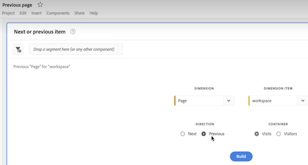

# Adobe Analytics landningssida

Adobe Analytics landningssida sammanför båda [!DNL Analysis Workspace] och [!DNL Reports & Analytics] i ett enda gränssnitt och en enda åtkomstpunkt under [!DNL Workspace] paraply. Här finns en startsida för projektledare, en uppdaterad rapportmeny, uppdaterade rapporter och en utbildningssektion som hjälper dig att komma igång på ett effektivare sätt. Här är en videoöversikt:

>[!VIDEO](https://video.tv.adobe.com/v/334278/?quality=12)

## Nya funktioner på landningssidan {#new-features}

| Funktion | Beskrivning | Skärmbild |
| --- | --- | --- |
| Expandera [!UICONTROL Projects] tabell till helskärm | Om du vill expandera tabellen klickar du bara på menyikonen för hamburgaren. Den här åtgärden komprimerar flikarna till vänster. |  |
| Anpassa kolumnbredd | Tidigare var kolumnbredden fast. Nu kan du justera den genom att dra kolumnavgränsaren. |  |
| Ändra ordning på fästa objekt | Om du vill flytta fasta objekt uppåt och nedåt klickar du på ellipsen bredvid det fästa objektet och väljer **[!UICONTROL Move up]** eller **[!UICONTROL Move down]**. |  |
| Nya tabellkolumner | Klicka på [!UICONTROL Customize table] ikonen längst upp till höger i tabellen. Nya tabellkolumner innehåller: <ul><li>**[!UICONTROL Scheduled]**: Ange till [!UICONTROL On] när ett projekt är schemalagt eller [!UICONTROL Off] när det inte är det. Klicka på [!UICONTROL On] -länken kan du visa information om det schemalagda projektet. Du kan också [redigera projektschemat](/help/analyze/analysis-workspace/curate-share/t-schedule-report.md) om du är projektägare.</li><li>**[!UICONTROL Project ID]**: Projekt-ID kan användas för felsökningsprojekt.</li><li>**[!UICONTROL Longest Date Range]**: Längre datumintervall ökar projektets komplexitet och kan öka bearbetnings- och inläsningstiderna. </li><li>**[!UICONTROL Number of Queries]**: Det totala antalet begäranden som görs till Analytics när projektet läses in. Ett högre antal projektfrågor ökar projektets komplexitet och kan öka bearbetnings- och inläsningstiden. Dessa data är bara tillgängliga när ett projekt har lästs in eller när ett schemalagt projekt har skickats. </li></ul> |  |
| Klicka en gång för att öppna en rapport | Tidigare var du tvungen att dubbelklicka. |  |
| Nya länkar till **[!UICONTROL Reports & Analytics]** rapporter | <ul><li>**[!UICONTROL Reports]** > **[!UICONTROL Audience]** > **[!UICONTROL Bots]**</li><li>**[!UICONTROL Reports]** > **[!UICONTROL Audience]** > **[!UICONTROL Bot Pages]**<li>**[!UICONTROL Reports]** > **[!UICONTROL Engagement]** > **[!UICONTROL Real-Time]**</li></ul> |  |
| Nya färdiga rapporter | <ul><li>**[!UICONTROL Reports]** > **[!UICONTROL Most popular]** > **[!UICONTROL Next page]**</li><li>**[!UICONTROL Reports]** > **[!UICONTROL Most popular]** > **[!UICONTROL Previous page]**</li><li>**[!UICONTROL Reports]** > **[!UICONTROL Engagement]** > **[!UICONTROL Page analysis]** > **[!UICONTROL Page summary]**</li></ul>Observera att dessa rapporter finns i [!UICONTROL Workspace] -format och kräver konfiguration och bygge. Resultatet består av en panel med högnivåstatistik, trenddata, [!UICONTROL Flow] visualisering med mera. Du kan ändra de här rapporterna och ändra dimensioner, dimensionsobjekt osv. Dessa rapporter finns också som paneler under arbetsytepaneler. |  |
| **[!UICONTROL Create Project]** modal är tillbaka | När du klickar **[!UICONTROL Create Project]** i arbetsytan får du ännu en gång möjlighet att välja mellan [!UICONTROL Blank project] och [!UICONTROL Blank mobile scorecard]. Du kan också välja bland de mallar som företaget har skapat. |  |
| Finns även i Customer Journey Analytics | Denna landningssida, i ändrad form, finns också tillgänglig i Customer Journey Analytics. |  |

{style="table-layout:auto"}

## Övre menystruktur {#top-menu}

* Top Analytics menu: Most reports are now in the [!UICONTROL Reports] menyn i den vänstra listen.
* Den vänstra listen har tre flikar: [!UICONTROL Projects], [!UICONTROL Reports]och [!UICONTROL Learning].

### Terminologi

* **[!UICONTROL Projects]** är anpassade designer som kombinerar datakomponenter, tabeller och visualiseringar som du har skapat eller som någon annan har skapat och delat med dig. [!UICONTROL Projects] hänvisar också till tomma projekt och tomma mobilstyrkort.
* **[!UICONTROL Reports]** hänvisar till allt som är färdigbyggt av Adobe, till exempel mallar i Workspace.
* **[!UICONTROL Templates]** används inte längre som en term för Adobe färdigbyggda Workspace-projekt. De är nu under [!UICONTROL Reports]. Termen [!UICONTROL Templates] används fortfarande för mallar som ditt företag har skapat.

## Navigera i [!UICONTROL Projects] tab {#navigate-projects}

[!UICONTROL Projects] fungerar som [!UICONTROL Workspace] hemsida. Fliken Projekt visar företagsmappen, eventuella personliga mappar som du har skapat, dina projekt och Mobile Scorecards. Använd den här sidan om du vill visa, skapa och ändra mappar, projekt och mobila styrkort. Mer information finns i [Om mappar i Analytics](/help/analyze/analysis-workspace/build-workspace-project/workspace-folders/about-folders.md).

>[!NOTE]
>
>Flera av följande inställningar finns kvar under sessionen och mellan sessionerna. Till exempel den flik du har markerat, de markerade filtren, de markerade kolumnerna och kolumnsorteringsriktningen. Sökresultaten är inte beständiga.

| UI-element | Definition |
| --- | --- |
| Redigera inställningar | Låter dig [!UICONTROL View Tutorials]och [Redigera användarinställningar](/help/analyze/analysis-workspace/user-preferences.md). |
| [!UICONTROL Create new] | Öppnar det modala projektet där du kan skapa ett Workspace-projekt eller ett Mobile-styrkort eller öppna en företagsmall. |
| [!UICONTROL Show less  Visa mer] | Växlar mellan att inte visa och visa banderollen:  |
| [!UICONTROL Workspace project] | Skapar en tom [Arbetsyteprojekt](https://experienceleague.adobe.com/docs/analytics/analyze/analysis-workspace/home.html) så att du kan designa och bygga. |
| [!UICONTROL Mobile scorecard] | Skapar en tom [mobilstyrkort](https://experienceleague.adobe.com/docs/analytics/analyze/mobapp/curator.html) så att du kan designa och bygga. |
| [!UICONTROL Open Training Tutorial] | Öppnar självstudiekursen om arbetsytan där du får hjälp med att skapa ett nytt startprojekt i en stegvis självstudiekurs. |
| [!UICONTROL Open release notes] | Öppnar Adobe Analytics-delen av den senaste versionsinformationen för Adobe Experience Cloud. |
| Filterikon | Filter efter taggar, rapportsviter, ägare, typer och andra filter (Min, Delad med mig, Favoriter och Godkänd) |
| Sökfältet | Söker igenom alla kolumner i tabellen. |
| Markeringsruta | Väljer ett eller flera projekt för att visa de projekthanteringsåtgärder du kan utföra: **Ta bort**, **Dela**, **Byt namn**, **Kopiera**, **Ta bort**, **Flytta uppåt**, **Flytta nedåt**, **Tagg**, **Godkänn**, **Exportera CSV** och **Flytta till**. Du kanske inte har behörighet att utföra alla listade åtgärder. |
| [!UICONTROL Favorites] | Lägger till en stjärna bredvid ett favoritprojekt eller en mapp som kan användas som filter. |
| [!UICONTROL Name] | Identifierar namnet på projektet. |
| Fäst ikon | Fäster objekt så att de alltid visas högst upp i listan, men du kan ändra ordningen genom att flytta dem uppåt eller nedåt i den ordning som de visas. Använd ellipsalternativmenyn och välj **Flytta uppåt** eller **Flytta nedåt** i listan. |
| Info (i), ikon | Visar följande information om ett projekt: Typ, Projektroll, Ägare, Beskrivning och vem det delas med. Det anger också vem som kan [redigera eller duplicera](https://experienceleague.adobe.com/docs/analytics/analyze/analysis-workspace/curate-share/share-projects.html) det här projektet. |
| Ellips (...) | Visar de projekthanteringsåtgärder du kan utföra: **Ta bort**, **Dela**, **Byt namn**, **Kopiera**, **Ta bort**, **Flytta uppåt**, **Flytta nedåt**, **Tagg**, **Godkänn**, **Exportera CSV** och **Flytta till**. Du kanske inte har behörighet att utföra alla listade åtgärder. |
| [!UICONTROL Type] | Anger om den här typen är ett Workspace-projekt, ett Mobile-styrkort eller en mapp. |
| [!UICONTROL Tags] | Taggar projekt för att ordna dem i grupper. |
| [!UICONTROL Project Role] | Identifierar projektrollerna: om du är projektägare och om du har behörighet att redigera eller duplicera projektet. |
| [!UICONTROL Report Suite] | Identifierar de rapportsviter som är kopplade till projektet. Tabeller och visualiseringar i en panel hämtar data från rapportsviten som valts i panelens övre högra hörn. Rapportsviten avgör också vilka komponenter som är tillgängliga i den vänstra listen. Inom ett projekt kan du använda en eller flera rapportsviter beroende på dina analysexempel. Listan med rapportsviter sorteras efter relevans. Adobe definierar relevansen baserat på hur nyligen och ofta sviten har använts av den aktuella användaren och hur ofta sviten används i organisationen. |
| [!UICONTROL Owner] | Identifierar den person som skapade projektet. |
| [!UICONTROL Last opened] | Identifierar det datum du senast öppnade projektet. |
| Anpassa tabellikon | Väljer vilka kolumner som ska visas i tabellen. Om du vill lägga till eller ta bort kolumner från listan med projekt klickar du på kolumnikonen ( ) i det övre högra hörnet och markera eller avmarkera sedan kolumnrubriker. |
| VISA: Mappar och projekt eller alla projekt | Ändrar visningsinställningen för tabellen så att mappar och projekt visas enligt mappordningen **eller** visa alla dina projekt i en oordnad lista. |
| &lt; (Bakåt-knappen) | Returnerar dig till den senaste konfigurationen av landningssidan i ett Workspace-projekt eller en rapport. Sidkonfigurationen som du hade när du lämnade landningssidan kommer att finnas kvar när du kommer tillbaka. |

### Borttagning av Project Manager-sidan {#deprecate-pm-page}

I och med lanseringen av den nya landningssidan har vi ersatt Project Manager som listats under Components Manager. Den nya landningssidan hanterar alla funktioner på den gamla Project Manager-sidan med mera.

Ett vanligt användningsexempel för Project Manager-sidan var att visa alla dina projekt.

Om du vill visa alla dina projekt på den nya landningssidan med filterspåret väljer du **ANDRA FILTER** och sedan **Visa alla**.

Om du arbetar i vyn &quot;Mappar och projekt&quot; visas ett modalt popup-fönster där du får frågan om du vill växla till vyn &quot;Alla projekt&quot;, vilket gör det enklare att visa alla dina projekt utanför de mappar där de är organiserade.   Välj **Växla till vyn Alla projekt** för att bättre visa alla projekt du har tillgång till.

Ett annat användningssätt för administratörer är att hantera företagsrapporter för att ta bort, byta namn på, tagga eller godkänna rapporter. Mer information om hur du hanterar rapporter finns i [Hantera företagsrapporter](#manage-company-reports).

## Navigera i [!UICONTROL Reports] tab {#navigate-reports}

The [!UICONTROL Reports] -fliken konsoliderar följande uppsättningar rapporter:

* Den färdiga [!UICONTROL Workspace] mallar som tidigare fanns under [!UICONTROL Workspace] > [!UICONTROL Project] > [!UICONTROL New]. Adobe använder inte längre ordet&quot;mall&quot; i det här sammanhanget.
* De flesta färdigbyggda rapporterna från tidigare Adobe Analytics [!UICONTROL Reports] översta menyn. Dessa rapporter visas nu i [Analysis Workspace](https://experienceleague.adobe.com/docs/analytics/analyze/analysis-workspace/home.html).

>[!NOTE]
>
>Tänk på följande när du använder rapporter:
>* Under Rapporter visas en Favoriter-mapp bara om du har markerat en ny rapport som favorit. Inga tidigare favoriter för Rapporter och analyser överförs.
>* Endast de mest använda rapporterna som tidigare grupperats i Rapporter och analyser är tillgängliga. En handfull sällan använda eller inte längre relevanta rapporter finns inte längre tillgängliga. Se [Vanliga frågor om landningssidan](#landing-page-faq) nedan om du vill ha mer information.

Mer information om fliken Rapporter i Analysis Workspace, inklusive hur du visar och sparar rapporter, finns i [Använd färdiga rapporter](/help/analyze/analysis-workspace/reports/use-reports.md).

Mer information om hur du skapar och hanterar anpassade företagsrapporter finns i [Skapa och hantera företagsrapporter](/help/analyze/analysis-workspace/reports/create-company-reports.md).

## Använda fliken Utbildning {#navigate-learning}

Utbildningssidan innehåller praktiska videoutgångar, självstudiekurser och länkar till dokumentation.

På sidan Lär dig mer om nybörjare, mellanfunktioner och avancerade funktioner i Adobe Analytics.

### Gå till sidan Utbildning

1. I Adobe Analytics: [!UICONTROL **Arbetsyta**] > [!UICONTROL **Utbildning**].

### Funktioner för utbildningssidor

* **Filterinnehåll:** Med ikonen Filter i den vänstra listen kan du filtrera utbildningsinnehåll efter erfarenhetsnivå (Nybörjare, Mellan eller Avancerat) och efter innehållstyp (Dokument, Video eller Tours och självstudiekurser).
* **Spåra förlopp:** När du har markerat en del av innehållet **[!UICONTROL Viewed]** -taggen visas. Den här taggen hjälper dig att spåra dina framsteg med utbildningsinnehållet. Du kan välja **[!UICONTROL Viewed]** för att ta bort den från ett visst innehåll.
* **Visa ytterligare innehåll:** När du visar en video väljer du **[!UICONTROL Learn more]** för att visa relaterat dokumentationsinnehåll på Experience League. Du kan också välja något av följande alternativ på sidan Lär dig mer om du vill visa ytterligare innehåll:
   * **[!UICONTROL Visit YouTube]:** Se hela spellistan för Analysis Workspace YouTube.
   * [!UICONTROL **Besök Experience League**]: Se hela uppsättningen Adobe Analytics-dokumentation för Experience League.
* **Grundläggande för nya användare:** The [!UICONTROL Workspace Fundamentals] vi rekommenderar för nya användare. Den här demon tar dig direkt till Workspace och leder dig igenom de vanligaste åtgärderna. Den här demon kan också öppnas igen när som helst i Workspace via verktygstipset i panelhuvudet.

## Ange landningssida {#set-landing}

Användare kan ange sin favoritlandningssida.

1. Gå till Analytics > [!UICONTROL Components] > [!UICONTROL Preferences] > [!UICONTROL General].
1. Kontrollera vilken landningssida du vill använda:

   

## Dölj fliken Rapport {#hide-reports}

Administratörer kan dölja fliken Rapporter för alla användare i organisationen.

1. Gå till [!UICONTROL Analytics] > [!UICONTROL Components] > [!UICONTROL Preferences] > [!UICONTROL Company].
1. Kontrollera **[!UICONTROL Hide Reports Tab]**.

## Vanliga frågor om landningssidan {#landing-faq}

| Fråga | Svar |
| --- | --- |
| Var är mallarna som jag är van vid att se i [!UICONTROL Workspace]? | Mallarna är grupperade under [!UICONTROL Reports] -fliken. |
| Överför mitt arbete i betaprogrammets användargränssnitt till produktionen [!UICONTROL Workspace] upplevelse? | Ja, allt arbete som görs i betan överförs till den gamla/aktuella [!UICONTROL Workspace] upplevelse. |
| Överförs mina tidigare favoriter i Rapporter och analyser? | Nej, de förs INTE vidare. Men om [!UICONTROL Workspace] projektfavoriter överförs. |
| Finns det ett maximalt antal projekt jag kan fästa? | Nej, det finns ingen gräns för hur många projekt du kan fästa. |
| Kan administratörer ange den här landningssidan för sina användare? | Nej, administratörer kan inte ange landningssidan för användarnas räkning. Enskilda användare måste aktivera växeln själva. |
| Är alla rapporter som fanns i [!DNL Reports & Analytics] fortfarande tillgängliga? | Nej, följande rapporter har fasats ut baserat på övergripande användningsdata: <ul><li>Anpassade eVars/props/events/classifications<li>Mina rekommenderade rapporter</li><li>unika besökare varje timme/dag/vecka/månad/kvartal/år</li><li>unika kunder varje vecka/månad/kvartal/år</li><li>Åtgärdsnamn - djup</li><li>Sammanfattning av åtgärdsnamn</li><li>Lägg till instrumentpanel</li><li>Ålder</li><li>Stöd för ljud</li><li>Faktureringsinformation</li><li>Klicka på sidan</li><li>Färgdjup</li><li>Cookie-stöd</li><li>Cookies</li><li>Anslutningstyper</li><li>Kreativa element</li><li>Kreditkortstyp</li><li>Korsförsäljning</li><li>Anpassade händelsegrupper</li><li>Egna länkar</li><li>Kund-ID</li><li>Veckodag</li><li>Åtgärdsnamn för registrering</li><li>Avsluta åtgärdsnamn</li><li>Avsluta länkar</li><li>Utfall</li><li>Filnedladdningar</li><li>Sök i butik</li><li>Fullständiga banor</li><li>Kön</li><li>Träfftypens VISTA-regel</li><li>Bildstöd</li><li>Java</li><li>JavaScript</li><li>JavaScript-version</li><li>Hantera bokmärken</li><li>Hantera instrumentpaneler</li><li>Skärmfärgdjup</li><li>Övervaka upplösningar</li><li>Nyhetsbrev - registreringar</li><li>Nästa åtgärdsnamn</li><li>Nästa åtgärdsnamnflöde</li><li>Inga sökningar</li><li>Operativsystem</li><li>Ordergranskning</li><li>Dagens sida</li><li>Sidorna hittades inte</li><li>Banhanteraren</li><li>Banlängd</li><li>Namn på föregående åtgärd</li><li>Namnflöde för föregående åtgärd</li><li>Produktaktivitet</li><li>Produktkostnad</li><li>Produktavdelning</li><li>Produktlagerkategori</li><li>Produktnamn</li><li>Produktrecensioner</li><li>Produktsäsong</li><li>Produktdelningar</li><li>Produktzoomningar</li><li>Läs in igen</li><li>Sökningar</li><li>Servrar</li><li>Besök enstaka sidor</li><li>Leveransinformation</li><li>Platshierarki</li><li>Sociala omnämnanden</li><li>Tid på dagen</li><li>Tid som använts för åtgärdsnamn</li><li>Stöd för video</li><li>Besökarläge</li></ul> |
