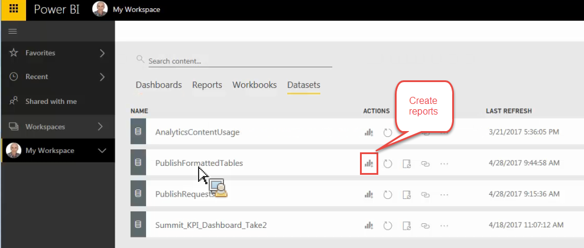
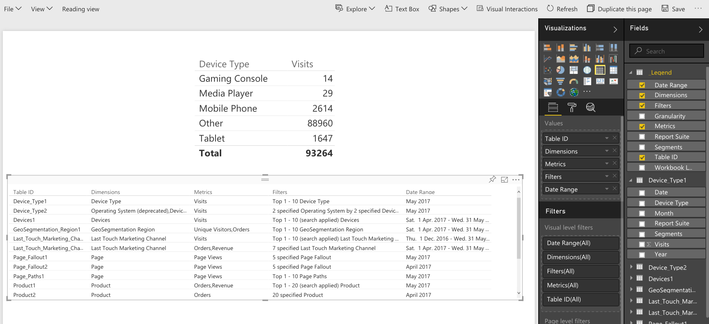

# Publish till Power BI - översikt

{{legacy-arb}}

Microsoft Power BI är en serie kontrollpaneler för affärsanalys som används för att analysera data och dela insikter. Tack vare Adobe Analytics-integreringen med Power BI kan du visualisera analysdata från Report Builder i Microsoft Power BI och enkelt dela dem i hela organisationen.

Som analytiker skulle du tidigare schemalägga Report Builder arbetsboksdistribution via e-post eller ftp. Nu kan ni ge era affärsintressenter tillgång inifrån deras Power BI-konton till korrekta och aktuella data i en webbaserad miljö som är tillgänglig över olika plattformar och enheter.

Genom att kombinera rapportgenereringsfunktionen i Report Builder med visualiseringsfunktionerna i Power BI blir informationen mer tillgänglig för alla i organisationen. Med Power BI kan ni även integrera Adobe Analytics med andra datakällor, till exempel försäljningsplatser eller CRM-källor, för att identifiera unika kundinsikter, associationer och möjligheter.

## Systemkrav {#section_0B71092D853446F38FA36447DAC0D32B}

* Adobe Report Builder 5.5 [installerat](/help/analyze/legacy-report-builder/setup/t-install-arb.md)
* Active Microsoft account that enable you to sign in to Power BI

## Publish arbetsbok till Power BI {#section_21CA66229EC240D49594A9A7D3FBA687}

Schemalagda arbetsböcker är formaterade Excel-kalkylblad som innehåller data från Adobe Analytics som distribueras regelbundet enligt schema.

**Publish-arbetsbok i Report Builder**

1. Generera och spara en arbetsbok i Report Builder.
1. Klicka på **[!UICONTROL Schedule]** > **[!UICONTROL New]** i verktygsfältet Report Builder.

1. Markera rutan intill **[!UICONTROL Publish Workbook to Microsoft Power BI]** i guiden Grundläggande schemaläggning.

   

1. Ange din e-postadress och skicka omedelbart eller ange schemaläggningsfrekvens (timme, dag, osv.).
1. Klicka på **[!UICONTROL OK]** för att publicera.
1. Du ombeds nu logga in på ditt Microsoft-konto. Ange dina autentiseringsuppgifter.
1. Report Builder-arbetsboken schemaläggs och publiceras på Power BI.

   För varje schemalagd instans och när schemaläggningsprocessen i Report Builder har uppdaterat arbetsboken med uppdaterade analysdata publiceras arbetsboken till Microsoft Power BI.

**Visa Report Builder-arbetsboksdata i Power BI**

1. Dubbelklicka på arbetsboken på menyn [!UICONTROL Workbooks] i Power BI.

   

1. Nu kan du visa arbetsbokens kontrollpanelsdata.  

1. Du kan sedan fästa ett område i den här arbetsboken så att du kan ta med det på dina Power BI-kontrollpaneler.

## Publish alla formaterade tabeller i arbetsboken som Power BI-datauppsättningstabeller {#section_7C54A54E75184DD6BAEF4ACCE241239A}

>[!NOTE]
>
>Om arbetsboken innehåller ett makro inaktiveras&quot;Publish Alla formaterade tabeller i arbetsboken som Power BI-datauppsättningstabeller&quot;.

I stället för att importera hela arbetsboken kan du bara importera innehållet i alla formaterade tabeller i arbetsboken.

**Använd skiftläge**: Du har en Excel-arbetsbok som hämtar data från flera Report Builder-begäranden och skapar en sammanfattningstabell med många formler. Du kan bara importera sammanfattningstabellen till Power BI och skapa en visualisering för den.

**Publish en formaterad tabell i Report Builder**

1. Generera en datatabell med en rubrikrad, följt av en datarad i Report Builder.
1. Markera tabellen och välj **[!UICONTROL Format as Table]** på menyn [!UICONTROL Home]. Tabellen namnges som standard (Tabell 1, Tabell 2 osv.), men du kan ändra namnet på menyn [!UICONTROL Design].

1. Klicka på **[!UICONTROL Schedule]** > **[!UICONTROL New]** i verktygsfältet Report Builder.

1. Klicka på **[!UICONTROL Advanced Scheduling Options]** i guiden Grundläggande schemaläggning.
1. Markera kryssrutan intill **[!UICONTROL Publish all Formatted Tables as Power BI dataset tables]** på fliken **[!UICONTROL Publishing Options]** i [!UICONTROL Scheduling Wizard - Advanced].

   

1. (Valfritt) Du kan anpassa namnet på den publicerade resursen i Power BI. Detta kan vara användbart om du använder versionshantering som en del av arbetsbokens namn (t.ex. minworkbook_v1.1.xlsx) och du inte vill att versionsnumret ska visas i det publicerade Power BIET-resursens namn. Den har en fördel som den publicerade resursen inte kommer att ändras om versionsnumret ändras. (Visa [specifikationer](/help/analyze/legacy-report-builder/c-publish-power-bi/specifications-limits.md) här.)

**Visa tabelldata i Power BI**

1. Gå till menyn **[!UICONTROL Workspaces]** > **[!UICONTROL Datasets]** i Power BI.

   

1. Markera den datauppsättning som du publicerade och klicka på ikonen [!UICONTROL Create report] bredvid den. Observera att tabellerna kommer att visas som fält.

   

1. Markera en tabell och dess associerade kolumner.

   

1. På menyn [!UICONTROL Visualizations] kan du välja hur en tabell ska visas i Power BI. Du kan till exempel välja att presentera data som ett linjediagram:

   

1. Härifrån kan du skapa visualiseringar från den här datauppsättningstabellen.

## Publish alla Report Builder begär som Power BI DataSet-tabeller {#section_0C26057C7DBB4068A643FDD688F6E463}

Ni kan förvandla alla era förfrågningar till datauppsättningstabeller och skapa visualiseringar ovanpå dem.

>[!IMPORTANT]
>
>Om arbetsboken innehåller fler än 100 begäranden publiceras endast de första 100 begäranden i Power BI. För varje begäran som publiceras på Power BI publiceras dessutom bara de 10 000 första dataraderna. Så även om dessa förfrågningar kan levereras genom schemaläggning är publiceringsmöjligheterna för Power BI begränsade.

1. Öppna eller skapa en arbetsbok med förfrågningar från Report Builder i Report Builder.
1. Klicka på **[!UICONTROL Schedule]** > **[!UICONTROL New]** i verktygsfältet Report Builder.

1. Klicka på **[!UICONTROL Advanced Scheduling Options]** i guiden Grundläggande schemaläggning.
1. I [!UICONTROL Scheduling Wizard - Advanced], på fliken **[!UICONTROL Publishing Options]**, markerar du kryssrutan intill **[!UICONTROL Publish all Report Builder Requests as Power BI Dataset Tables]** 

1. Klicka på **[!UICONTROL OK]**.

**Visa data för begäran i Power BI**

Varje begäran som schemalagts Report Builder kommer att publiceras som en tabell i datauppsättningen. Varje begärandetabell namnges efter den primära dimensionen i begäran och har en [!UICONTROL Report Suite]- och en [!UICONTROL Segments]-kolumn.

1. Gå till menyn **[!UICONTROL Workspaces]** > **[!UICONTROL Datasets]** i Power BI.

1. Markera den begäran som du publicerade och klicka på ikonen [!UICONTROL Create report] bredvid den.

   Observera att förfrågningarna visas som tabeller på menyn [!UICONTROL Fields].

   

   >[!NOTE]
   >
   >Oavsett hur du konfigurerade din Report Builder-förfrågan att läggas ut på kalkylbladet (pivotlayout, anpassad layout, vissa osynliga kolumner) kommer Report Builder alltid att publicera din begäran i samma tvådimensionella radformat: Datum, Dimensioner, Metrisk, Rapportsviter, Segment.

1. Observera också att det finns en annan tabell med namnet **[!UICONTROL Legend]**. Om du tar en begäran ur Report Builder-kontexten kan det vara svårt att komma ihåg vad varje begäran står för. Syftet med förklaringstabellen är till exempel att visa namnet på varje begäran under Tabell-ID. Du kan också lägga till de andra förklaringskolumnerna för att få en fullständig vy över begäran.

   
