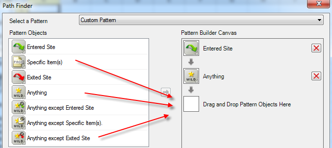
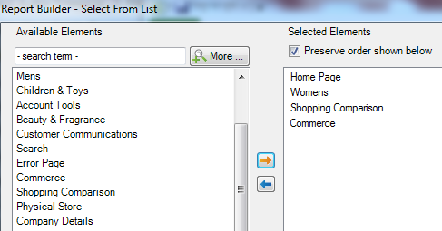

# Filtrera en sökvägsrapport med hjälp av guiden Begäran

Beskriver stegen som ingår i att tillämpa filter på en målningsrapport.

I det här exemplet används platsavsnittssökvägar.

1. Öppna begärandeguiden genom att klicka på **[!UICONTROL Create]** i Adobe Report Builder.
1. Välj rätt rapportsvit.
1. I trädvyn till vänster väljer du **[!UICONTROL Paths]** > **[!UICONTROL Site Sections]** > **[!UICONTROL Site Section Paths]**.

   

1. Ange lämpligt datum/datum.

1. Klicka på **[!UICONTROL Next]**.

1. Klicka på länken **[!UICONTROL Top 1-10 (pattern applied)]** under **[!UICONTROL Row Labels]** i steg 2 av guiden. I en sökvägsrapport används ett mönster som standard.

   

1. Välj alternativet **[!UICONTROL Filter]**.

   

1. I dialogrutan **[!UICONTROL Define 'Site Section Paths' Path Pattern]** kan du ange
   * Den första rapportens inledande rankning.
   * Antalet poster som du vill visa i den här rapporten.
1. Klicka på **[!UICONTROL Edit]** för att definiera ett banmönster.

1. Om du vill ha ett eget mönster drar och släpper du **[!UICONTROL Pattern Objects]** från listan till vänster i **[!UICONTROL Pattern Build Canvas]** till höger.

   

1. Du kan också välja ett fördefinierat mönster i listrutan **[!UICONTROL Select a Pattern]** och ändra det. Här är de tillgängliga mönstren:

   

   Vissa av dessa mönster är specifika för Report Builder: Nästa objektmönster för startsökvägen, Avsluta banans tidigare objektmönster och Nästa objektmönster.

## Redigera ett fördefinierat mönster

Du kan redigera ett fördefinierat mönster när du har valt ett mönster.

1. Välj mönstret genom att fortsätta från stegen ovan. Välj till exempel **[!UICONTROL Exited Site Pattern]**:

   

1. Definiera sökvägen till webbplatsavsnittet som användaren följer innan han/hon avslutar. Klicka på **[!UICONTROL Specific Item(s): 0 selected]**. Du kan definiera den här sökvägen genom att välja bland ett cellintervall om du redigerar en befintlig begäran eller genom att välja i en lista med avsnitt.

1. Om du vill välja från ett cellintervall från en tidigare begäran markerar du **[!UICONTROL From range of cells]** och klickar på ikonen för cellväljaren. Välj sedan cellerna från rapporten.

   

1. Om du vill välja från en lista med webbplatsavsnitt väljer du **[!UICONTROL From list]** och klickar på **[!UICONTROL Add]**.

1. Flytta element från kolumnen **[!UICONTROL Available Elements]** till kolumnen **[!UICONTROL Selected Elements]** genom att markera dem och klicka på den orangefärgade pilen. Klicka på **[!UICONTROL OK]**.

   

1. Klicka på **[!UICONTROL Save]** om du vill spara mönstret som du just skapade.

1. Klicka **[!UICONTROL OK]** tre gånger och sedan på **[!UICONTROL Finish]** för att generera den filtrerade sökvägen.
