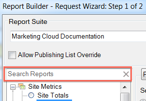

# Översikt över rapporttyper

{{legacy-arb}}

Du kan välja bastapportyp för din databegäran, till exempel Webbplatsmått, Webbplatsinnehåll och Video.

Du kan bara välja en basrapporttyp för ett intervall av kalkylbladsceller. Om du redigerar en tidigare skapad begäran kan du ändra rapporttypen i fönstret [!UICONTROL Request Wizard: Step 1] utan att konfigurera om andra inställningar i begäran.

Du kan söka efter rapporter med hjälp av det automatiska sökfältet. När du har valt en rapport från den här kontrollen väljer trädvyn automatiskt den matchande noden.

