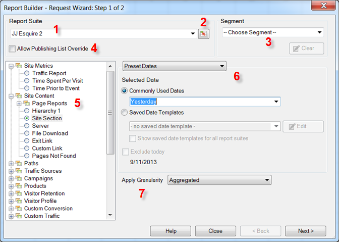

# Databegäranden - Guiden Begär begäran, steg 1

{{legacy-arb}}

I begärandeguiden: Steg 1 väljer du rapportsviten, rapporttyp, segment och konfigureringsdatum.

1. **[!UICONTROL Report Suite]**: Listan med rapportsviter som är tillgängliga för dig baserat på dina inloggningsuppgifter. Se [Välj rapportsviter](/help/analyze/legacy-report-builder/data-requests/selecting-report-suites/t-select-report-suites.md).

1. **Intervallväljare**: Gör att du kan välja ett rapportpaket-ID från en cell i Excel. Se [Välj rapportsviter](/help/analyze/legacy-report-builder/data-requests/selecting-report-suites/t-select-report-suites.md).

1. **Segment**: Segment är anpassade delmängder av data eller data som filtreras efter regler som du skapar. Segmenten baseras på träffar, besök och besökare. Mer information om segment finns i [segmenteringshandboken för analyser](https://experienceleague.adobe.com/docs/analytics/components/segmentation/seg-home.html?lang=sv-SE).

   Du kan till exempel köra [!UICONTROL Pages Report] och sedan använda ett segment för förstagångsbesök.

1. **Tillåt åsidosättning av publiceringslista**: Publiceringslistor var en funktion i Rapporter och analyser, som har [slutat gälla](https://new.express.adobe.com/webpage/WFCyq7w8kijmB?).

1. **Rapporttyp**: Anger den basrapport som du vill köra i din databegäran. Du kör en rapport per begäran och den rapporten kan ha en-till-många-dimensioner och en-till-många-mått. Mätvärden och dimensioner för en rapporttyp visas i gränssnittet [!UICONTROL Request Wizard; Step 2]. Se [Välj rapporttyper](/help/analyze/legacy-report-builder/data-requests/c-report-types/select-report-types.md).

1. **Datumintervall**: Definierar den tidsperiod som omfattas av begäran. Flera typer av begärandetidsperioder är tillgängliga, till exempel förinställning, fast och rullande. Det högsta antalet perioder är 366. Du kan också välja ett datumintervall som anges av en cell och spara datumintervall som mallar för senare bruk.  Se [Konfigurera rapportdatum](/help/analyze/legacy-report-builder/data-requests/configuring-report-dates/custom-calendar.md)

1. **Använd granularitet**: Anger nivån för tidsbaserad information som inkluderas i rapporten. Se [Kornighet](/help/analyze/legacy-report-builder/data-requests/configuring-report-dates/granularity.md).

## Felsökning

Ibland visas begärandeguiden utanför skärmen, särskilt för användare som växlar mellan skärminställningarna. Du kan till exempel använda en dockningsstation på jobbet och en skärm på din bärbara dator hemma. Om du klickar på Skapa igen när en begärandeguide redan är öppen visas följande fel:

&quot;Du måste först slutföra begärandeguiden innan du påbörjar en ny.&quot;

Problemet åtgärdas genom att begärandeguiden flyttas tillbaka till skärmen.

1. Öppna Microsoft Excel och logga in på Report Builder.
2. Klicka på [!UICONTROL Create], som öppnar begärandeguiden utanför skärmen.
3. Tryck på `[Alt]` + `[Space]`.
4. Tryck på `[M]`.
5. Tryck på någon av piltangenterna.
6. Flytta musen som kopplar begärandeguiden till markören
7. Klicka med musen för att släppa begärandeguiden på skärmen.
