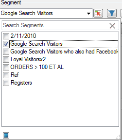

# Hantera segment

{{legacy-arb}}

Lägga till, redigera, använda och filtrera Adobe Analytics-segment i Report Builder.

Report Builder har en segmenteringspanel i steg 1 i begärandeguiden där du kan skapa och hantera segment.

## Lägga till eller redigera segment {#section_B2BC136F9A53498D90C7C2ECC5DB892B}

>[!NOTE]
>
>Report Builder segmentgränssnitt startar segmentverktyget Analytics (segmentbyggare) i ett Microsoft Internet Explorer-fönster om du vill lägga till eller redigera segment. Din Report Builder-session förblir aktiv. Andra webbläsare än Internet Explorer stöds inte för den här åtgärden.

1. Klicka på **[!UICONTROL Add]** på segmentpanelen i steg 1 i begärandeguiden.
1. Ett Internet Explorer-fönster öppnas som öppnar gränssnittet i segmentbyggaren i Analytics. Mer information om hur du skapar segment finns i [Analyssegmentering](/help/components/segmentation/seg-home.md).
1. När du har definierat och sparat segmentet går du tillbaka till Begärandeguiden.
1. Klicka på ikonen Uppdatera för att uppdatera segmentlistan.

>[!IMPORTANT]
>
>Den här listan cachelagras och det segment du skapade visas inte om du inte uppdaterar.

## Skapa sammanhangsberoende segment {#section_6DD2C663B2854469AA1075438F907678}

Du kan ha specifika kombinationer av rapportdimensioner som du vill omvandla till ett segment. Du kan skapa dessa segment från Report Builder gränssnitt. Välj till exempel några sidor från en sidförfrågan och skapa ett segment baserat på dessa värden.

1. Markera de rapportutdataobjekt som du vill omvandla till ett segment.
1. Högerklicka för att markera **[!UICONTROL Create In-Context Segment in]** och ange rätt behållare (träffar-behållare, besöksbehållare, besöksbehållare).

   

   Mer information om behållare finns i [Segmenteringshandboken](/help/components/segmentation/seg-home.md).

1. Segment Builder-gränssnittet kommer nu att startas i Internet Explorer. Användargränssnittet för segmentbyggaren initieras med den behållare och det filter som du angav.
1. När du har lagt till ett namn och en beskrivning i segmentet sparar du det.
1. Gå tillbaka till Report Builder och klicka på ikonen Uppdatera för att uppdatera listan med segment.
1. Du kan nu använda det här segmentet.

## Söka efter och använda segment

Alla segment som har skapats i Rapporter och analyser (som nu slutar gälla), Report Builder eller Data Warehouse visas i den här segmentlistan. Om du vill uppdatera listan klickar du på ikonen Uppdatera .

Du kan tillämpa ett eller flera segment på en viss begäran. Detta inkluderar sekventiella segment.

1. Gå till listrutan **[!UICONTROL Segment]** och klicka på den lilla nedåtpilen i rutan **[!UICONTROL Choose Segment]** för att visa alla segment.

1. Kontrollera vilka segment du vill använda.

   

>[!NOTE]
>
>Oavsett om du är administratör eller icke-administratör kan du i Report Builder bara se de segment som du äger och de som har delats med dig.

## Filtrera segment {#filter}

**Filtrera** segment genom att klicka på filterikonen: 

Tillgängliga filter:

| Filternamn | Beskrivning |
|---|---|
| Taggar | Gör att du kan filtrera segment med specifika taggar. Observera att taggfilter använder operatorn AND. Om du markerar två taggar visar den högra rutan segment som har taggats med **båda** taggar. |
| Ägare | Gör att du kan filtrera segment efter ägare. Observera att ägarfilter använder operatorn OR. Om du markerar två ägare visas segment som ägs av **endera**-ägaren i den högra rutan. |
| Andra filter > Endast *rapportsvitens namn* | Om du använder filtret&quot;Endast *rapportsvitens namn*&quot; i segmentbyggaren i Adobe Analytics och sedan visar det avancerade filtret i [!DNL Report Builder], visas bara segmentet för den valda rapportsviten i filtret Avancerat. |
| Andra filter > Mitt | Visar alla segment som du äger. |
| Andra filter > Delat med mig | Visar alla segment som andra delar med dig. |
| Andra filter > Favoriter | Visar alla segment som du har markerat som Favoriter. |
| Andra filter > Godkänt | Visar alla officiellt godkända segment. |

## Lägga till en segmentkontroll i en arbetsbok {#segment-control}

Genom att lägga till en segmentkontroll kan du växla segment från en arbetsbok i stället för att behöva gå till Begärandeguiden.

1. Klicka på kontrollikonen  bredvid segmentlistrutan.

1. Markera alla segment som du vill ska visas i segmentkontrollen eller markera **[!UICONTROL Select All]**.

   

1. Observera alternativet **[!UICONTROL Automatically refresh linked requests upon item selection]**.

   * Om det här alternativet är markerat uppdateras alla begäranden som använder den här kontrollen.
   * Om den inte är markerad uppdateras de associerade parametrarna för begäran, men förfrågningarna uppdateras inte.

1. Ange segmentkontrollens övre vänstra cellplacering.

1. Klicka på **[!UICONTROL OK]** så visas segmentkontrollen på den angivna platsen.

   

## Uppdatera listan med segment {#refresh}

När du lägger till ett nytt segment eller redigerar ett befintligt bör du klicka på uppdateringsikonen  för att uppdatera den cachelagrade listan med segment.

## Hantera segment över förfrågningar {#manage}

Före v5.4 kan Report Builder låta användare ändra segment vid flera förfrågningar. Den här processen ersätter dock alltid de befintliga segmenten. Användare som vill lägga till ett nytt segment i varje begäran kunde inte göra detta eftersom den tidigare uppsättningen segment som redan tilldelats varje begäran skulle tas bort om segmentet lades till.

Med Report Builder 5.4 kan du lägga till, ta bort, ersätta och ersätta alla segment i flera begäranden:

1. Markera flera begäranden i en arbetsbok.
1. Högerklicka och välj **[!UICONTROL Edit Requests]** > **[!UICONTROL By Segment]**.

   

1. I dialogrutan Redigera grupp väljer du ett av de fyra alternativen:

   | Alternativ | Beskrivning |
   |---|---|
   | Lägg till segment | Gör att du kan välja ett eller flera segment att lägga till i listan över aktuella segment. |
   | Ersätt segment | Här kan du välja vilka segment som ska ersättas med ett eller flera segment. |
   | Ersätt alla segment med | Gör att du kan välja ett eller flera segment att ersätta det aktuella segmentet/de aktuella segmenten med. |
   | Ta bort segment | Gör att du kan ta bort segment från begäranden. |
