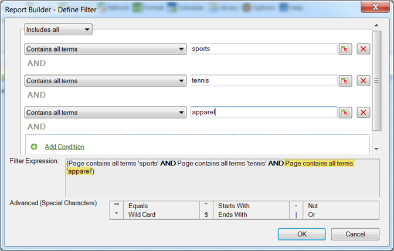

# Mest populära filtrering

{{legacy-arb}}

Ranknings- och villkorsstyrda filter som du konfigurerar med hjälp av boolesk logik med OCH/ELLER-sökuttryck.

De flesta populära filter är uttrycksfilter som du konfigurerar med hjälp av boolesk logik med AND/OR-villkor, som [!UICONTROL Page does not contain]*`<product name>`*med villkor eller grupper med villkor som [!UICONTROL Includes All], [!UICONTROL Includes Any] eller [!UICONTROL Excludes All]. Du kan [spara](/help/analyze/legacy-report-builder/layout/c-filter-dimensions/saved-filters.md) dessa uttryck för andra förfrågningar i den här arbetsboken eller i andra arbetsböcker.

**Så här skapar du ett mest populärt filter**

1. Skapa eller redigera en begäran och fortsätt till [!UICONTROL Request Wizard: Step 2].

1. Klicka på länken bredvid dimensionen i rutnätet på [!UICONTROL Request Wizard: Step 2] och välj sedan **[!UICONTROL Filter]**.

   

1. Aktivera **[!UICONTROL Most Popular]** i formuläret [!UICONTROL Choose Page] och konfigurera sedan följande alternativ:

   **Startrangordning:** Startrangordningen för en dimension. En standardrangordning på 1 anger den översta posten i listan över rapporterade data. För dimensionen [!UICONTROL Page] anger till exempel ett startmärke på 1 den mest begärda sidan på din plats. Du kan ange 10 eller ett annat värde som inledande rankningscell, vilket skapar en rapport som börjar med 10 som högst. Måtten ordnas i fallande ordning, så att radobjekt med störst aktivitet rapporteras först i listan. Om du behöver fler än 50 000 sidnamn i en begäran, men har tusentals sidor att rapportera på, kan du kopiera begäran och ändra startordningen för att hämta rätt data i block om 50 000.

   **Antal poster:** ( endast [!UICONTROL Pivot Layout]) Definierar hur många objekt som rapporteras för ett visst mätvärde över ett datumintervall. Vissa mätvärden kan visa hundra poster för ett mätresultat medan andra bara kan visa några få. För dimensionen [!UICONTROL Site Section] visar till exempel ett antal poster på 25 att rapporten visar de 25 mest besökta sidorna.

   Med pilar kan du ändra [!UICONTROL Starting Rank] och [!UICONTROL Number of Entries] för bladets första datapunkt. Som standard är [!UICONTROL Starting Rank] inställd på 1 och [!UICONTROL Number of Entries] på 10. Dessa värden kan justeras från minst ett till högst 50 000 för vissa mätvärden. Varje mätvärde har ett eget tak på [!UICONTROL Number of Entries]. Inga negativa värden eller noll tillåts i dessa fält. Om du väljer [!UICONTROL Starting Rank] som 15 och [!UICONTROL Number of Entries] som 10 returnerar dataförfrågningar för måttet de tio mest besökta sidorna, där den första besökta sidan är nummer 15 i listan för det angivna datumintervallet. Alla de mest önskade sidorna, rankade 15 till 25, listas i fallande ordning.

   >[!NOTE]
   >
   >Om du använder filter på befintliga begäranden ändras de data som visas. Anta att du har mappat de tio översta [!UICONTROL Pages] till cellerna $A$1 till $A$10, med 1 för [!UICONTROL Starting Rank] och 10 för [!UICONTROL Number of Entries]. Om du ändrar dessa värden så att de visar 1 för [!UICONTROL Starting Rank] och endast 3 för [!UICONTROL Number of Entries] visas inte längre de data som tidigare fyller i cellerna $A$4 till $A$10.

1. Om du vill skapa ett sökuttryck klickar du på **[!UICONTROL Add]**.

1. Konfigurera lämpliga villkor för dina behov i formuläret [!UICONTROL Define Filter].

   

   Med cellmarkeringsikonen kan du hitta ett villkor som definieras i värdet för en cell. 

   Med länken **Lägg till villkor** kan du lägga till ett villkor i uttrycket. Det finns ingen gräns för hur många villkor du kan lägga till.

1. Klicka på **[!UICONTROL OK]**.

   

1. Klicka på **[!UICONTROL Save]** i formuläret [!UICONTROL Choose Page] för att spara uttrycket.
1. Klicka på **[!UICONTROL OK]**.
