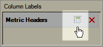

# Dölj eller visa rubriker

I den här proceduren beskrivs hur du döljer eller visar rubriker.

Klicka på **[!UICONTROL Hide/Show]** i [!UICONTROL Pivot Layout]- eller [!UICONTROL Custom Layout]-utdata i formuläret [!UICONTROL Request Wizard: Step 2].

