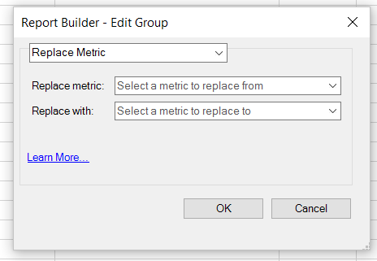

# Redigera mätvärden över flera begäranden

Lägg till, ta bort eller ersätta mätvärden i en befintlig begäran eller i en grupp med förfrågningar.

## Lägg till mått {#section_3FBDA9668039404895059618D70FCBCD}

Tänk på följande när du lägger till mätvärden:

* Det går bara att lägga till mått i begäranden om pivotlayout.
Om några av de valda förfrågningarna är anpassade layouter går det inte att lägga till mått. Om layouten är anpassad vet inte Report Builder var i kalkylbladet det nya måttet ska placeras.
* Om du bara väljer anpassade layoutbegäranden är alternativet **[!UICONTROL Add Metrics]** inte tillgängligt.
* Om du lägger till mätvärden ökar storleken på en begäran och kan göra att den överlappar en annan begäran. Se till att din begäran har tillräckligt med utrymme för att lägga till mätvärden.
* Om det tillagda måttet redan finns i en av de valda förfrågningarna läggs det inte till i den förfrågan.

Lägga till ett eller flera mått

1. Markera en eller flera begäranden i Excel och högerklicka för att välja **[!UICONTROL Edit Metrics]**. (Du kan också klicka på **[!UICONTROL Manage]** > **[!UICONTROL Edit Multiple]** > `<choose metric>` > **[!UICONTROL Edit Group]** för att markera gruppen med begäranden som ska ändras.)
1. Välj **[!UICONTROL Add Metric(s)]**och välj de mätvärden som ska läggas till.

   

1. Uppdatera begäran för att se faktiska data. Offlinedata visas tills du uppdaterar data.

## Ersätt mått

När du ersätter mått bör du tänka på följande riktlinjer:

* Endast 1:1-substitutioner tillåts. 1:många eller många:1 tillåts inte.
* Om det valda måttet inte finns i någon av de markerade förfrågningarna ändras inte begäran.
* Det nya måttet placeras på samma plats som det substituerade måttet.

   * **Om en pivotlayoutförfrågan i en pivottabell** ger resultat, besök, besökare, daglig unik och *besökare* ersätts av *intäkt* blir den uppdaterade begärandelayouten: datum, besök, intäkt och daglig unik.
   * **Om måttet ** för** visas i en anpassad layout visas *intäkt* i samma cell F11 i den uppdaterade begärandelayouten .

* Om vissa åtgärder har vidtagits för det ersatta mätvärdet (genomsnittlig, förpended text, post-pended text, microcharting) kommer dessa åtgärder också att tillämpas på det nya mätvärdet.

Ersätta ett mått

1. Markera en eller flera begäranden i Excel och högerklicka för att välja **[!UICONTROL Edit Metrics]**. Du kan också klicka på **[!UICONTROL Manage]** > **[!UICONTROL Edit Multiple]** > **`<choose metric>`** > **[!UICONTROL Edit Group]** för att markera gruppen med begäranden som ska ändras.

1. Välj **[!UICONTROL Replace Metric]**.

   

1. Välj det mätvärde som du vill ersätta och ersättningsmåttet.
1. Uppdatera begäran. Offlinedata visas tills du uppdaterar data.

## Ta bort mått {#section_D3CD5BAC7670416593B633B2B8423C60}

Tänk på följande när du tar bort mätvärden:

* Om någon av de mätvärden som du väljer för borttagning inte finns i någon av de valda förfrågningarna ändras inte begäran.
* Om du tar bort ett mått i en pivotlayout flyttas layouten för mått som finns efter det borttagna måttet. Om en pivotlayoutbegäran till exempel anger ett unikt datum, besök, besökare och dag, och du tar bort *besök*, visas den uppdaterade layouten för begäran: datum, besökare och daglig unik layout.

Ta bort mått

1. Markera en eller flera begäranden i Excel och högerklicka för att välja **[!UICONTROL Edit Metrics]**. Du kan också klicka på **[!UICONTROL Manage]** > **[!UICONTROL Edit Multiple]** > **`<choose metric>`** > **[!UICONTROL Edit Group]** för att markera gruppen med begäranden som ska ändras.

1. Välj **[!UICONTROL Remove Metric(s)]**.

   

1. Välj ett eller flera mått som ska tas bort från begäran.
1. Uppdatera begäran. Du kommer att se offlinedata tills du uppdaterar.
