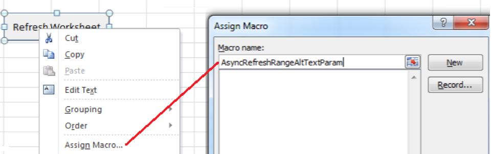

# Använda Report Builder med Microsoft Excel

Du kan använda Report Builder-funktioner för att få åtkomst till funktioner utan att använda användargränssnittet i Report Builder.

Om du till exempel automatiskt vill uppdatera Report Builder-begäranden med indatafilter som baseras på data som hämtas till Excel från andra källor, använder du strängen RefreshRequestsInCellsRange(..) funktion. Alla anrop är asynkrona och returneras omedelbart och väntar inte på att köras helt.

**Krav**

* Report Builder 5.0 (eller senare) krävs.

Följande tabell visar vilka funktioner som visas.

| Funktionsnamn | Typ | Beskrivning |
|:---| --- | ---|
| AsyncRefreshAll() | string | Uppdaterar alla Report Builder-begäranden som finns i en arbetsbok. |
| AsyncRefreshRange(strängintervallAddressInA1Format) | string | Uppdaterar alla Report Builder-begäranden som finns i den angivna cellintervalladressen (ett stränguttryck som representerar ett cellintervall i A1-format, till exempel &quot;Sheet1!A2:A10&quot;). |
| AsyncRefreshRangeAltTextParam() | string | Uppdaterar alla Report Builder-begäranden som finns i det angivna cellintervallet som skickas via den alternativa texten i MS Form Control. |
| AsyncRefreshActiveWorksheet() | string | Uppdaterar alla Report Builder-begäranden som finns i det aktiva kalkylbladet. |
| AsyncRefreshWorksheet(string worksheetName) | string | Uppdaterar alla Report Builder-begäranden som finns i det angivna kalkylbladet (kalkylbladets namn så som det visas på fliken). |
| AsyncRefreshWorksheetAltTextParam(); | string | Uppdaterar alla Report Builder-begäranden som finns i det specifika kalkylbladsnamnet som skickades via den alternativa texten i MS-formulärkontrollen |
| tring GetLastRunStatus() | string | Returnerar en sträng som beskriver statusen för den senaste körningen. |

Gå till **[!UICONTROL Formulas]** > **[!UICONTROL Insert Function]** om du vill komma åt funktionerna i Report Builder. Använd sökfältet för att söka efter en funktion eller välj en kategori för att lista funktionerna i den kategorin.


## Exempel {#section_034311081C8D4D7AA9275C1435A087CD}

I följande exempel visas *Om värdet i cell P5 är text eller tomt uppdaterar du intervallet som finns i cell P9*.

```
=IF(OR(ISTEXT(P5),ISBLANK(P5)),AsyncRefreshRange("P9"),"")
```

## Använda Report Builder-funktioner med formatkontroll {#section_26123090B5BD49748C8D8ED7A1C5ED84}

Du kan tilldela ett makro till en kontroll som du har skapat och den kontrollen kan vara en funktion som uppdaterar en arbetsboksförfrågan. Funktionen AsyncRefreshActiveWorksheet uppdaterar till exempel alla begäranden i ett kalkylblad. Ibland kanske du bara vill uppdatera vissa förfrågningar.

1. Ange makroparametern.
1. Högerklicka på kontrollen och välj **[!UICONTROL Assign Macro]**.
1. Ange funktionsnamnet i Report Builder (inga parametrar eller parenteser).



## Skicka parametrar till Report Builder-funktioner med formatkontroll {#section_ECCA1F4990D244619DFD79138064CEF0}

Två funktioner som tar en parameter kan användas med Formatkontroll. Du måste använda fältet **Alternativ text:**:

* AsyncRefreshRange(strängintervallAddressInA1Format)
* AsyncRefreshWorksheet(string worksheetName)

Skicka parametrar till Report Builder-funktioner med formatkontroll

1. Högerklicka på kontrollen och välj **[!UICONTROL Format Control]**.

   

1. Klicka på fliken **[!UICONTROL Alt Text]**.

   

1. Under **[!UICONTROL Alternative text]** anger du cellområdet som du vill uppdatera.
1. Öppna listan över Report Builder-parametrar under **[!UICONTROL Formulas]** > **[!UICONTROL Insert Function]**> **[!UICONTROL Adobe.ReportBuilder.Bridge]**.

1. Välj en av de två funktionerna som slutar med AltTextParam och klicka på **[!UICONTROL OK]**.
