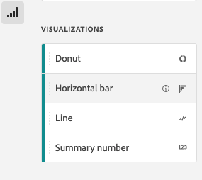

# Skapa ett mobilstyrkort

Följande information instruerar de som arbetar med Adobe Analytics data om hur man konfigurerar och presenterar mobila styrkort för företagsanvändare. Börja med att titta på videon Adobe Analytics dashboards Scorecard Builder:

>[!VIDEO](https://video.tv.adobe.com/v/34544)

Ett Adobe Analytics-styrkort visar viktiga datavisualiseringar för chefsanvändare i en sidindelad layout, vilket visas nedan:

Som kurator för det här styrkortet kan du använda styrkortsverktyget för att konfigurera vilka rutor som ska visas på styrkortet för den verkställande konsumenten. Du kan också konfigurera hur detaljerade vyer, eller delningarna, kan justeras när användaren trycker på plattorna. Gränssnittet i Scorecard Builder visas nedan:

Om du vill skapa styrkortet måste du göra följande:

1. Öppna mallen [!UICONTROL Blank Mobile Scorecard].
2. Konfigurera styrkortet med data och spara det.

## Åtkomst till [!UICONTROL Blank Mobile Scorecard]-mallen

Du kan komma åt mallen [!UICONTROL Blank Mobile Scorecard] antingen genom att skapa ett nytt projekt eller via Verktyg-menyn.

### Skapa ett nytt projekt

1. Öppna Adobe Analytics och klicka på fliken **[!UICONTROL Workspace]**.
1. Klicka på **[!UICONTROL Create project]** och välj projektmallen **[!UICONTROL Blank mobile scorecard]**.
1. Klicka på **[!UICONTROL Create]**.

### Verktyg-menyn

1. From the **[!UICONTROL Tools]** menu, select **[!UICONTROL Analytics dashboards (Mobile App)]**.
1. Klicka på **[!UICONTROL Create new scorecard]** på den följande skärmen.

## Konfigurera styrkortet med data och spara det

Så här implementerar du styrkortsmallen:

1. Under **[!UICONTROL Properties]** (i den högra listen) anger du **[!UICONTROL Project report suite]** från vilken du vill använda data.

   

1. To add a new tile to your Scorecard, drag a metric from the left panel and drop it into the **[!UICONTROL Drag and Drop Metrics Here]** zone. You can also insert a metric between two tiles using a similar workflow.

   

1. Från varje ruta kan du visa en detaljerad vy som visar ytterligare information om måttet, till exempel de översta objekten för en lista med relaterade dimensioner.

## Lägg till mått eller mätvärden

Om du vill lägga till en relaterad dimension till ett mått drar du det från den vänstra panelen och släpper det på en platta.

Du kan till exempel lägga till lämpliga dimensioner (som **[!DNL Marketing Channel]**, i det här exemplet) till **[!UICONTROL Unique Visitors]**-måttet genom att dra och släppa det på plattan. Uppdelningar av Dimensioner visas under [!UICONTROL Drill Ins]-avsnittet (uppdelning) i den rutespecifika **[!UICONTROL Properties]**. Du kan lägga till flera dimensioner till varje platta.

## Använd segment

Om du vill använda segment på enskilda plattor drar du ett segment från den vänstra panelen och släpper det direkt ovanpå plattan.

Om du vill använda segmentet på alla plattor i styrkortet, släpper du rutan ovanpå styrkortet. Du kan också tillämpa segment genom att markera segment på filtermenyn under datumintervallen. Du [konfigurerar och tillämpar filter för styrkort](https://experienceleague.adobe.com/docs/analytics-learn/tutorials/analysis-workspace/using-panels/using-drop-down-filters.html) på samma sätt som i Adobe Analytics Workspace.

## Lägg till datumintervall

Lägg till och ta bort datumintervallkombinationer som kan väljas i styrkortet genom att markera listrutan för datumintervall.

Varje nytt styrkort börjar med 6 kombinationer av datumintervall som fokuserar på data från idag och igår. Du kan ta bort onödiga datumintervall genom att klicka på x eller redigera varje datumintervallkombination genom att klicka på pennan.

Om du vill skapa eller ändra ett primärt datum använder du listrutan för att välja bland tillgängliga datumintervall eller drar och släpper en datumkomponent från den högra listen i släppzonen.

Om du vill skapa ett jämförelsedatum kan du välja bland praktiska förinställningar för vanliga tidsjämförelser i listrutan. Du kan också dra och släppa en datumkomponent från den högra listen.

Om det datumintervall du vill använda inte har skapats ännu kan du skapa ett nytt genom att klicka på kalenderikonen.

Du kommer då till datumintervallsverktyget där du kan skapa och spara en ny datumintervallkomponent.

## Använd visualiseringar

Se en video om visualiseringar för mobilstyrkort:

>[!VIDEO](https://video.tv.adobe.com/v/337570/?quality=12&learn=on)

Kontrollpanelerna för analyser erbjuder fyra visualiseringar som ger er insikt i dimensionsobjekt och mätvärden. Ändra till en annan visualisering genom att ändra [!UICONTROL chart type] för en rutas [!UICONTROL Properties]. Markera bara den högra rutan och ändra sedan diagramtypen.

Du kan också klicka på ikonen [!UICONTROL Visualizations] i den vänstra listen och dra och släppa den högra visualiseringen på plattan:

### [!UICONTROL Summary Number]

Använd visualisering av sammanfattningsnummer för att markera ett stort tal som är viktigt i ett projekt.

### [!UICONTROL Donut]

På samma sätt som ett cirkeldiagram visar den här visualiseringen data som delar eller segment av en helhet. Använd ett mundiagram när du jämför procentandelar av en summa. Låt oss till exempel säga att du vill se vilken annonsplattform som har bidragit till det totala antalet unika besökare:

### [!UICONTROL Line]

Radvisualiseringen representerar mätvärden som använder en rad för att visa hur värden ändras under en tidsperiod. Ett linjediagram visar måtten över tiden men fungerar med alla visualiseringar. Du visualiserar produktkategoridimensionen i det här exemplet.

### [!UICONTROL Horizontal Bar]

Den här visualiseringen visar vågräta staplar som representerar olika värden för ett eller flera mätvärden. Du kan till exempel enkelt se vilka produkter du gillar bäst genom att använda [!UICONTROL Horizontal Bar] som visualisering.

### Ta bort [!UICONTROL Unspecified]-dimensionsobjekt

Om du vill ta bort [!UICONTROL Unspecified]-dimensionsobjekt från dina data gör du följande:

1. Välj rätt platta.
1. I den högra listen, under **[!UICONTROL Drill ins]**, väljer du högerpilen bredvid dimensionsobjektet vars **[!UICONTROL Unspecified]**-objekt du vill ta bort.

   

1. Klicka på ikonen bredvid **[!UICONTROL Unspecified]** för att ta bort ospecificerade data från din rapportering. (Du kan även ta bort andra dimensionsobjekt.)

## Visa och konfigurera egenskaper för paneler

När du klickar på en platta i Styrkortbyggaren visas egenskaperna och egenskaperna för plattan i den högra listen. I den här listen kan du ange en ny **[!UICONTROL Title]** för plattan och alternativt konfigurera plattan genom att ange komponenter i stället för att dra och släppa dem från den vänstra listen.

When you click on tiles, a dynamic pop up displays how the Drill ins (Breakdown) view appears to the executive user in the app. If no dimension has been applied to the tile, the breakdown dimension will be **hour** or **days**, depending on the default date range.

Breakdowns refine your analysis by literally breaking down metrics and dimensions by other metrics and dimensions, such as in this retail example:

* Unika besökarvärden uppdelade efter annonsplattform (AMO-ID)
* Besök uppdelade efter produktkategori (detaljhandel)
* Total intäkt uppdelad efter produktnamn

Varje dimension som läggs till i rutan visas i en nedrullningsbar lista i appens detaljerade vy. Den verkställande användaren kan sedan välja bland alternativen i listrutan.

## Ta bort komponenter

Om du vill ta bort en komponent som har tillämpats på hela styrkortet klickar du var som helst på styrkortet utanför rutorna och tar sedan bort den genom att klicka på **x** som visas när du hovrar över komponenten, så som visas nedan för segmentet **First Time Visits**:

## Namnge ett styrkort

Om du vill namnge styrkortet klickar du på namnutrymmet längst upp till vänster på skärmen och skriver det nya namnet.

## Dela ett styrkort

Så här delar du styrkortet med en verkställande användare:

1. Klicka på menyn **[!UICONTROL Share]** och välj **[!UICONTROL Share scorecard]**.

1. Fyll i fälten i **[!UICONTROL Share mobile scorecard]**-formuläret genom att:

   * Ange namnet på styrkortet
   * Providing a description of the scorecard
   * Lägga till relevanta taggar
   * Ange mottagare för styrkortet

1. Klicka på **[!UICONTROL Share]**.

När du har delat ett styrkort kan mottagarna komma åt det på sina kontrollpaneler i Analytics. Om du gör senare ändringar i styrkortet i Styrkortbyggaren uppdateras de automatiskt i det delade styrkortet. Chefsanvändare ser sedan ändringarna när styrkortet har uppdaterats i sin app.

Om du uppdaterar styrkortet genom att lägga till nya komponenter kanske du vill dela styrkortet igen (och markera alternativet **[!UICONTROL Share embedded components]**) för att se till att chefsanvändarna har tillgång till dessa ändringar.