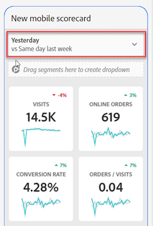

# Skapa ett styrkort

Följande information beskriver för chefer av Adobe Analytics-data hur man konfigurerar och presenterar kontrollpaneler för chefsanvändare. Börja med att titta på videon Adobe Analytics dashboards Scorecard Builder:

>[!VIDEO](https://video.tv.adobe.com/v/34544)

Ett Adobe Analytics-styrkort visar viktiga datavisualiseringar för chefsanvändare i en sidindelad layout, vilket visas nedan:

Som kurator för det här styrkortet kan du använda styrkortsverktyget för att konfigurera vilka rutor som ska visas på styrkortet för den verkställande konsumenten. Du kan också konfigurera hur detaljerade vyer, eller delningarna, kan justeras när användaren trycker på plattorna. Gränssnittet i Scorecard Builder visas nedan:

Om du vill skapa styrkortet måste du göra följande:

1. Öppna mallen [!UICONTROL Blank Mobile Scorecard].
2. Konfigurera styrkortet med data och spara det.

## Åtkomst till [!UICONTROL Blank Mobile Scorecard]-mallen

Du kan komma åt mallen [!UICONTROL Blank Mobile Scorecard] antingen genom att skapa ett nytt projekt eller via Verktyg-menyn.

### Skapa ett nytt projekt

1. Öppna Adobe Analytics och klicka på fliken **[!UICONTROL Workspace]**.
1. Klicka på **[!UICONTROL Create project]** och välj projektmallen **[!UICONTROL Blank mobile scorecard]**.
1. Klicka på **[!UICONTROL Create]**.

### Verktygsmall

1. Välj **[!UICONTROL Analytics dashboards (Mobile App)]** på menyn **[!UICONTROL Tools]**.
1. Klicka på knappen **[!UICONTROL Create new scorecard]** på nästa skärm.

## Konfigurera styrkortet med data och spara det

Så här implementerar du styrkortsmallen:

1. Under **[!UICONTROL Properties]** (i den högra listen) anger du **[!UICONTROL Project report suite]** från vilken du vill använda data.

   

1. Om du vill lägga till en ny platta i styrkortet drar du ett mått från den vänstra panelen och släpper det i **[!UICONTROL Drag and Drop Metrics Here]**-zonen. Du kan också infoga ett mätvärde mellan två rutor med ett liknande arbetsflöde.

   

   *Från varje ruta kan du visa en detaljerad vy som visar ytterligare information om måttet, till exempel de översta objekten för en lista med relaterade dimensioner.*

### Lägg till mått eller mätvärden

Så här lägger du till en relaterad dimension till ett mått:

Dra en dimension från den vänstra panelen och släpp den på en platta.

Du kan till exempel lägga till lämpliga dimensioner (som **[!DNL DMA Region]**, i det här exemplet) till **[!UICONTROL Unique Visitors]**-måttet genom att dra och släppa det på plattan; Dimensionerna som du lägger till visas under detaljavsnittet för den rutspecifikt **[!UICONTROL Properties]**. Du kan lägga till flera dimensioner till varje platta.

### Visa och konfigurera egenskaper för paneler

När du klickar på en platta i Styrkortbyggaren visas egenskaperna och egenskaperna för plattan i den högra listen. I den här listen kan du ange en ny **[!UICONTROL Title]** för plattan och alternativt konfigurera plattan genom att ange komponenter i stället för att dra och släppa dem från den vänstra listen.

Om du klickar på plattor visas även ett dynamiskt popup-fönster hur fördelningsvyn ser ut för den verkställande användaren i appen. Om ingen dimension har tillämpats på plattan är fördelningsdimensionen **timme** eller **dagar**, beroende på standarddatumintervallet.

Varje dimension som läggs till i rutan visas i en nedrullningsbar lista i appens detaljerade vy. Den verkställande användaren kan sedan välja bland alternativen i listrutan.

### Använd segment

Om du vill använda segment på enskilda plattor drar du ett segment från den vänstra panelen och släpper det direkt ovanpå plattan.

Om du vill använda segmentet på alla plattor i styrkortet, släpper du rutan ovanpå styrkortet. Du kan också tillämpa segment genom att markera segment på filtermenyn under datumintervallen. Du [konfigurerar och tillämpar filter för styrkort](https://experienceleague.adobe.com/docs/analytics-learn/tutorials/analysis-workspace/using-panels/using-drop-down-filters.html) på samma sätt som i Adobe Analytics Workspace.

### Ta bort komponenter

Om du vill ta bort en komponent som har tillämpats på hela styrkortet klickar du var som helst på styrkortet utanför rutorna och tar sedan bort den genom att klicka på **x** som visas när du hovrar över komponenten, så som visas nedan för segmentet **First Time Visits**:

### Datumintervall

Lägg till och ta bort datumintervallkombinationer som kan väljas i styrkortet genom att markera listrutan för datumintervall.

Varje nytt styrkort börjar med 6 kombinationer av datumintervall som fokuserar på data från idag och igår. Du kan ta bort onödiga datumintervall genom att klicka på x eller redigera varje datumintervallkombination genom att klicka på pennan.

Om du vill skapa eller ändra ett primärt datum använder du listrutan för att välja bland tillgängliga datumintervall eller drar och släpper en datumkomponent från den högra listen i släppzonen.

Om du vill skapa ett jämförelsedatum kan du välja bland praktiska förinställningar för vanliga tidsjämförelser i listrutan. Du kan också dra och släppa en datumkomponent från den högra listen.

Om det datumintervall du vill använda inte har skapats ännu kan du skapa ett nytt genom att klicka på kalenderikonen.

Du kommer då till datumintervallsverktyget där du kan skapa och spara en ny datumintervallkomponent.

## Namnge ett styrkort

Om du vill namnge styrkortet klickar du på namnutrymmet längst upp till vänster på skärmen och skriver det nya namnet.

## Dela styrkortet

Så här delar du styrkortet med en verkställande användare:

1. Klicka på menyn **[!UICONTROL Share]** och välj **[!UICONTROL Share scorecard]**.

1. Fyll i fälten i **[!UICONTROL Share mobile scorecard]**-formuläret genom att:

   * Ange namnet på styrkortet
   * Ange en beskrivning av styrkortet
   * Lägga till relevanta taggar
   * Ange mottagare för styrkortet

1. Klicka på **[!UICONTROL Share]**.

När du har delat ett styrkort kan mottagarna komma åt det på sina kontrollpaneler i Analytics. Om du gör senare ändringar i styrkortet i Styrkortbyggaren uppdateras de automatiskt i det delade styrkortet. Chefsanvändare ser sedan ändringarna när styrkortet har uppdaterats i sin app.

Om du uppdaterar styrkortet genom att lägga till nya komponenter kanske du vill dela styrkortet igen (och markera alternativet **[!UICONTROL Share embedded components]**) för att se till att dina chefsanvändare har tillgång till dessa ändringar.