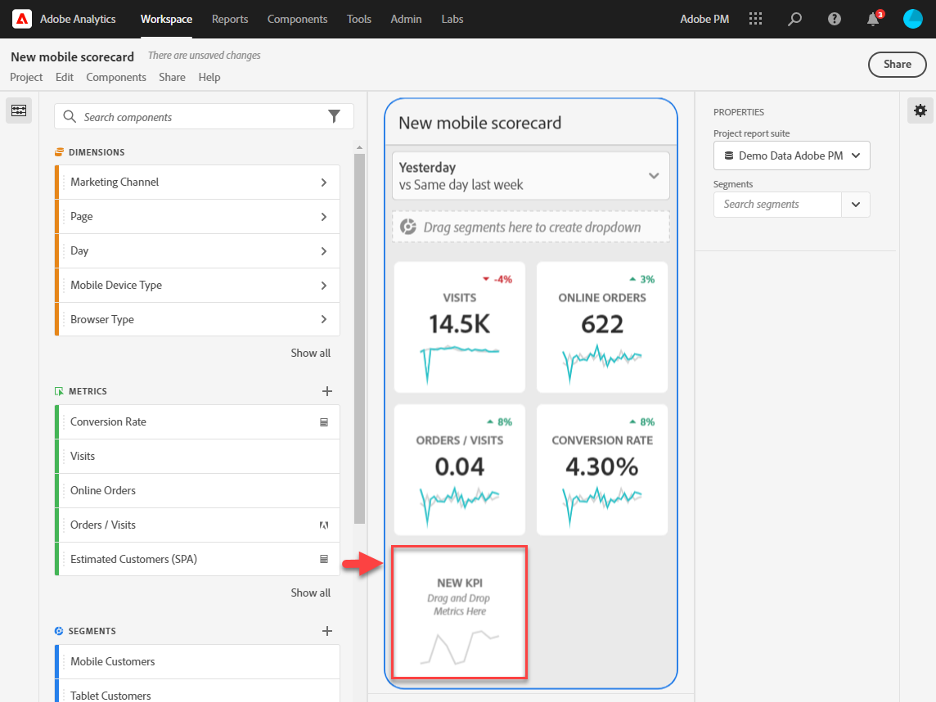
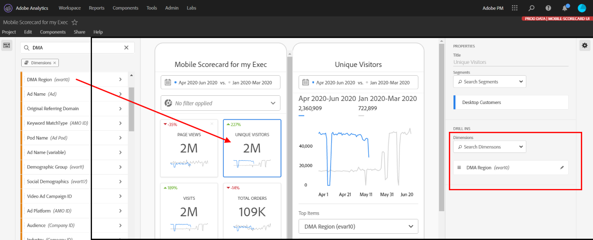
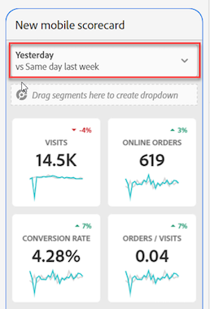
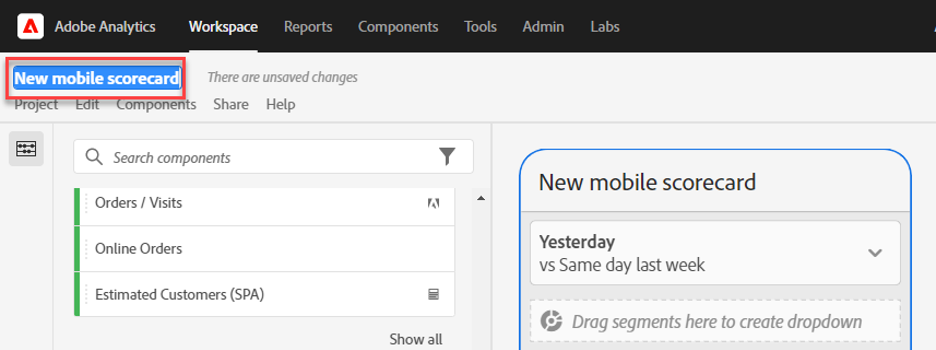
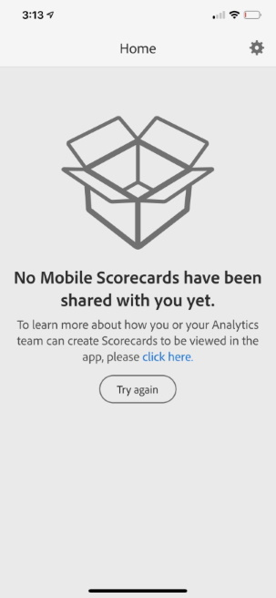
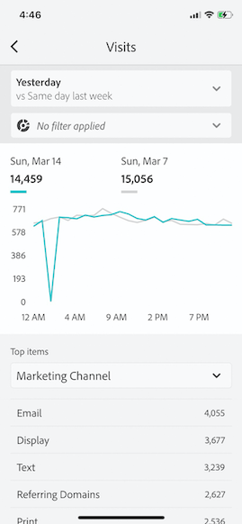

# Curator&#39;s guide for Adobe Analytics dashboards

Följande information beskriver för chefer av Adobe Analytics-data hur man konfigurerar och presenterar kontrollpaneler för chefsanvändare. En video som visar den här informationen finns i videon Adobe Analytics dashboards Scorecard Builder:

>[!VIDEO](https://video.tv.adobe.com/v/34544)

## Introduktion

Adobe Analytics instrumentpaneler ger dig alltid tillgång till insikter från Adobe Analytics. Appen ger användare mobil åtkomst till intuitiva styrkort som du skapar och delar från Adobe Analytics datorgränssnitt. Styrkort är en samling viktiga mätvärden och andra komponenter som presenteras i en sida vid sida-layout som du kan trycka på för mer detaljerade uppdelningar och trendrapporter. Du kan anpassa styrkort efter de data som är viktigast för dig. Kontrollpaneler för analyser stöds på både iOS- och Android-operativsystem.

## Mer om den här guiden

Den här guiden är avsedd att hjälpa chefer för Adobe Analytics-data att konfigurera styrkort för sina chefsanvändare på kontrollpaneler. Lärare kan vara organisationsadministratörer eller personer i andra roller som ansvarar för att skapa styrkort för appar, som gör det möjligt för chefsanvändare att snabbt och enkelt visa en bred återgivning av viktiga sammanfattningsdata på sina egna mobila enheter. Även om chefsanvändare är slutanvändare för kontrollpaneler i Analytics kommer den här guiden att hjälpa datavärdare att konfigurera appen effektivt för dessa användare.

## Ordlista

I följande tabell beskrivs villkoren för att förstå målgruppen, funktionerna och funktionen för kontrollpanelerna i Analytics.

| Term | Definition |
|--- |--- |
| Konsument | Chefspersonalen som tittar på viktiga mätvärden och insikter från Analytics på en mobil enhet |
| Kurator | Datalitterera persona som hittar och distribuerar insikter från Analytics och konfigurerar styrkorten så att de kan ses av konsumenterna |
| Insamling | Att skapa eller redigera ett mobilstyrt styrkort med relevanta mått, dimensioner och andra komponenter för konsumenten |
| Styrkort | En instrumentpanelsvy som innehåller en eller flera paneler |
| Platta | En återgivning för ett mätresultat i en styrkortsvy |
| Uppdelningar | En sekundär vy som du kommer åt genom att trycka på en platta i styrkortet. Den här vyn utökas med det mått som visas på rutan och kan även innehålla rapporter om ytterligare uppdelningsdimensioner. |
| Datumintervall | Det primära datumintervallet för instrumentpanelsrapporter |
| Jämförelsedatumintervall | Datumintervallet som jämförs med det primära datumintervallet |

## Skapa ett styrkort för chefsanvändare

Ett styrkort visar viktiga datavisualiseringar för chefsanvändare i en sidindelad layout, vilket visas nedan:

Som kurator för det här styrkortet kan du använda Styrkortbyggaren för att konfigurera vilka rutor som ska visas på styrkortet för din kund. Du kan också konfigurera hur detaljerade vyer, eller uppdelningar, kan justeras när användaren trycker på rutorna. Gränssnittet i Scorecard Builder visas nedan:

Om du vill skapa styrkortet måste du göra följande:

1. Öppna mallen [!UICONTROL Blank Mobile Scorecard].
2. Konfigurera styrkortet med data och spara det.

### Åtkomst till [!UICONTROL Blank Mobile Scorecard]-mallen

Du kan komma åt [!UICONTROL Blank Mobile Scorecard]-mallen på något av följande sätt:

**Skapa ett nytt projekt**

1. Öppna Adobe Analytics och klicka på fliken **[!UICONTROL Workspace]**.
2. Klicka på knappen **[!UICONTROL Create New Project]** och välj projektmallen **[!UICONTROL Blank Mobile Scorecard]**.
3. Klicka på knappen **[!UICONTROL Create]**.

**Lägg till ett projekt**

På skärmen **[!UICONTROL Projects]**, under fliken **[!UICONTROL Components]**, klickar du på knappen **[!UICONTROL Add]** och väljer **[!UICONTROL Mobile Scorecard]**.

**eller**

Välj **[!UICONTROL Analytics dashboards (Mobile App)]** på menyn **[!UICONTROL Tools]**. Klicka på knappen **[!UICONTROL Create new scorecard]** på nästa skärm.

### Konfigurera styrkortet med data och spara det

Så här implementerar du styrkortsmallen:

1. Under **[!UICONTROL Properties]** (i den högra listen) anger du **[!UICONTROL Project report suite]** från vilken du vill använda data.

   

2. Om du vill lägga till en ny platta i styrkortet drar du ett mått från den vänstra panelen och släpper det i **[!UICONTROL Drag and Drop Metrics Here]**-zonen. Du kan också infoga ett mätvärde mellan två rutor med ett liknande arbetsflöde.

   

   *Från varje ruta kan du visa en detaljerad vy som visar ytterligare information om måttet, till exempel de översta objekten för en lista med relaterade dimensioner.*

3. Om du vill lägga till en relaterad dimension till ett mått drar du det från den vänstra panelen och släpper det på en platta. Du kan till exempel lägga till lämpliga dimensioner (som **[!DNL DMA Region]**, i det här exemplet) till **[!UICONTROL Unique Visitors]**-måttet genom att dra och släppa det på plattan; Dimensionerna som du lägger till visas under detaljavsnittet för den rutspecifikt **[!UICONTROL Properties]**. Du kan lägga till flera dimensioner till varje platta.

   

   När du klickar på en platta i Styrkortbyggaren visas egenskaperna och egenskaperna för plattan i den högra listen. I den här listen kan du ange en ny **[!UICONTROL Title]** för plattan och alternativt konfigurera plattan genom att ange komponenter i stället för att dra och släppa dem från den vänstra listen.

   

   Om du klickar på plattor visas även ett dynamiskt popup-fönster hur fördelningsvyn ser ut för den verkställande användaren i appen. Om ingen dimension har tillämpats på plattan är fördelningsdimensionen **timme** eller **dagar**, beroende på standarddatumintervallet.

   

   Varje dimension som läggs till i rutan visas i en nedrullningsbar lista i appens detaljerade vy. Den verkställande användaren kan sedan välja bland alternativen i listrutan.

4. Om du vill använda segment på enskilda plattor drar du ett segment från den vänstra panelen och släpper det direkt ovanpå plattan. Om du vill använda segmentet på alla plattor i styrkortet, släpper du rutan ovanpå styrkortet. Du kan också tillämpa segment genom att markera segment på filtermenyn under datumintervallen. Du [konfigurerar och tillämpar filter för styrkort](https://experienceleague.adobe.com/docs/analytics-learn/tutorials/analysis-workspace/using-panels/using-drop-down-filters.html) på samma sätt som i Adobe Analytics Workspace.

   

5. Om du vill ta bort en komponent som har tillämpats på hela styrkortet klickar du var som helst på styrkortet utanför rutorna och tar sedan bort den genom att klicka på **x** som visas när du hovrar över komponenten, så som visas nedan för segmentet **First Time Visits**:

   

6. Lägg till och ta bort datumintervallkombinationer som kan väljas i styrkortet genom att markera listrutan för datumintervall.

   

   Varje nytt styrkort börjar med 6 kombinationer av datumintervall som fokuserar på data från idag och igår. Du kan ta bort onödiga datumintervall genom att klicka på x eller redigera varje datumintervallkombination genom att klicka på pennan.

   

   Om du vill skapa eller ändra ett primärt datum använder du listrutan för att välja bland tillgängliga datumintervall eller drar och släpper en datumkomponent från den högra listen i släppzonen.

   

   Om du vill skapa ett jämförelsedatum kan du välja bland praktiska förinställningar för vanliga tidsjämförelser i listrutan. Du kan också dra och släppa en datumkomponent från den högra listen.

   

   Om det datumintervall du vill använda inte har skapats ännu kan du skapa ett nytt genom att klicka på kalenderikonen.

   

7. Du kommer då till datumintervallsverktyget där du kan skapa och spara en ny datumintervallkomponent. Om du vill namnge styrkortet klickar du på namnutrymmet längst upp till vänster på skärmen och skriver det nya namnet.

   

## Dela styrkortet

Så här delar du styrkortet med en verkställande användare:

1. Klicka på menyn **[!UICONTROL Share]** och välj **[!UICONTROL Share scorecard]**.

2. Fyll i fälten i **[!UICONTROL Share mobile scorecard]**-formuläret genom att:

   * Ange namnet på styrkortet
   * Ange en beskrivning av styrkortet
   * Lägga till relevanta taggar
   * Ange mottagare för styrkortet

3. Klicka på **[!UICONTROL Share]**.

När du har delat ett styrkort kan mottagarna komma åt det på sina kontrollpaneler i Analytics. Om du gör senare ändringar i styrkortet i Styrkortbyggaren uppdateras de automatiskt i det delade styrkortet. Chefsanvändare ser sedan ändringarna när styrkortet har uppdaterats i sin app.

Om du uppdaterar styrkortet genom att lägga till nya komponenter kanske du vill dela styrkortet igen (och markera alternativet **[!UICONTROL Share embedded components]**) för att se till att dina chefsanvändare har tillgång till dessa ändringar.

## Konfigurera företagsledare med appen

I vissa fall kan företagsledare behöva lite extra hjälp för att komma åt och använda appen. I det här avsnittet finns information som du kan använda för att få hjälp.

### Hjälp chefer att få åtkomst

För att underlätta för chefsanvändare att komma åt dina styrkort i appen ser du till att:

* De lägsta kraven för mobiloperativsystem på enheterna är iOS version 10 eller senare, eller Android version 4.4 (KitKat) eller senare
* De har en giltig inloggning på Adobe Analytics
* Du har skapat mobila styrkort för dem och delat dessa styrkort med dem
* De har tillgång till Analysis Workspace och rapportsviten som styrkortet bygger på
* De har tillgång till de komponenter som styrkortet innehåller. Observera att du kan välja ett alternativ när du delar styrkort till **[!UICONTROL Share embedded components]**.

### Hjälp chefsanvändare med appen

För chefer:

1. Hjälp dem att hämta och installera programmet. För att göra detta ska du göra på följande sätt för att ge dina chefsanvändare tillgång, beroende på om de använder en iOS- eller Android-enhet.

   **För företagsledare på iOS:**

   * Klicka på följande länk (den är även tillgänglig i Analytics under **[!UICONTROL Tools]** > **[!UICONTROL Analytics dashboards (Mobile App)]**) och följ anvisningarna för att hämta, installera och öppna appen:

      [iOS-länk](https://apple.co/2zXq0aN)
   **För chefsanvändare på Android:**

   * Klicka på följande länk (den är även tillgänglig i Analytics under **[!UICONTROL Tools]** > **[!UICONTROL Analytics dashboards (Mobile App)]**) och följ anvisningarna för att hämta, installera och öppna appen:

      [Android-länk](https://bit.ly/2LM38Oo)
   När de har hämtats och installerats kan företagsanvändare logga in i appen med sina befintliga Adobe Analytics-inloggningsuppgifter. har stöd för både Adobe och Enterprise/Federated ID.

   

2. Hjälp dem komma åt styrkortet. När chefsanvändare har loggat in i appen visas skärmen **[!UICONTROL Choose a company]**. På den här skärmen visas de inloggningsföretag som den verkställande användaren tillhör. Så här hjälper du dem att komma till styrkortet:

   * Tryck på namnet på inloggningsföretaget eller Experience Cloud-organisationen som gäller för styrkortet som du delade. Styrkortslistan visar sedan alla styrkort som har delats med den verkställande direktören under det inloggningsföretaget.
   * Hjälp dem att sortera listan efter **[!UICONTROL Most recently modified]**, om tillämpligt.
   * Tryck på namnet på styrkortet för att visa det.

   

   Om den verkställande användaren loggar in och ser ett meddelande om att inget har delats:

   * Den verkställande användaren kan ha valt fel Analytics-instans

   * Styrkortet kanske inte har delats med den verkställande användaren

      

   * Kontrollera att chefsanvändaren kan logga in på rätt Analytics-instans och att styrkortet har delats.

3. Förklara för den verkställande användaren hur rutor visas i de styrkort du delar (det första styrkortet nedan är i mörkt läge). se **[!UICONTROL Preferences]** nedan om du tror att den verkställande användaren föredrar detta visningsalternativ):

   

   

   Ytterligare information om plattor:

   * Miniatyrdiagrammens granularitet beror på datumintervallets längd:
      * En dag visar en timtrend
      * Mer än en dag och mindre än ett år visar en daglig trend
      * Ett år eller mer visar en vecktrend
   * Formeln för ändring av procentvärde är metrisk summa (aktuellt datumintervall) - metrisk summa (jämförelsedatumintervall) / metrisk summa (jämförelsedatumintervall).
   * Du kan dra ned skärmen för att uppdatera styrkortet.

4. Tryck på en platta för att visa hur en detaljerad uppdelning för plattan fungerar.

   

   * Tryck på en punkt i ett miniatyrdiagram för att se data som hör till den punkten på raden.

   * En tabell inkluderas för att visa data med dimensioner som lagts till i rutan. Tryck på nedpilen för att välja mått. Om ingen dimension har lagts till i rutan visas diagramdata i tabellen.

5. Om du vill ändra datumintervall för styrkortet trycker du på datumhuvudet och väljer den primära kombination och den kombination av datumintervall som du vill visa.

   

6. Lämna feedback om den här appen:

   1. Tryck på inställningsikonen i appskärmens övre högra hörn.
   2. Tryck på alternativet **[!UICONTROL Feedback]** på skärmen **[!UICONTROL Settings]**.
   3. Tryck för att visa alternativen för att lämna feedback.

      

7. Om du vill ändra inställningarna trycker du på **[!UICONTROL Preferences]**-alternativet som visas ovan. I inställningarna kan du aktivera biometrisk inloggning eller ställa in programmet för mörkt läge enligt nedan:

   

**Så här rapporterar du ett fel**:

Tryck på alternativet och välj en underkategori för felet. I formuläret för att rapportera ett fel anger du din e-postadress i det övre fältet och en beskrivning av felet i fältet nedanför. En skärmbild av din kontoinformation bifogas automatiskt till meddelandet, men du kan ta bort den om du vill genom att trycka på **X** i den bifogade bilden. Du kan också göra en skärminspelning, lägga till fler skärmbilder eller bifoga filer. Om du vill skicka rapporten trycker du på pappersplansikonen i formulärets övre högra hörn.

**Så här föreslår du en förbättring**:

Tryck på alternativet och välj en underkategori för förslaget. I förslagsformuläret anger du din e-postadress i det övre fältet och din beskrivning av felet i fältet nedanför. En skärmbild av din kontoinformation bifogas automatiskt till meddelandet, men du kan ta bort den om du vill genom att trycka på **X** i den bifogade bilden. Du kan också göra en skärminspelning, lägga till fler skärmbilder eller bifoga filer. Om du vill skicka förslaget trycker du på pappersplansikonen i formulärets övre högra hörn.

**Så här ställer du en fråga**:

Tryck på alternativet och ange din e-postadress i det övre fältet och din fråga i fältet nedanför. En skärmdump bifogas automatiskt till meddelandet, men du kan ta bort den om du vill genom att trycka på **X** i den bifogade bilden. Du kan också göra en skärminspelning, lägga till fler skärmbilder eller bifoga filer. Om du vill skicka frågan trycker du på pappersplansikonen i formulärets övre högra hörn.

>[!IMPORTANT]
>
>Från och med oktober 2020 kommer Adobe gradvis att lansera en rad förbättringar för att optimera prestandan för appen&quot;Adobe Analytics dashboards&quot;. Dessa förbättringar handlar om att cachelagra historiska analysdata som används för att fylla i styrkort med datum (exklusive den aktuella dagen). Dessa data cachas i upp till 24 timmar i ett säkert Microsoft Azure-molnlagringskonto. Kontakta din CSM om du vill avanmäla dig från dessa prestandaförbättringsfunktioner.
