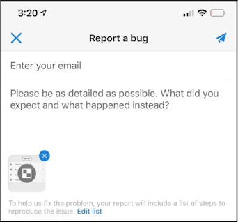

# Kuratorguide för Adobe Analytics-instrumentpaneler

Följande information instruerar chefer för Adobe Analytics-data om hur du konfigurerar och presenterar kontrollpaneler för chefsanvändare. En video som visar den här informationen finns i [Adobe Analytics-instrumentpaneler i appupplevelsen](https://www.youtube.com/watch?v=QXqQ_PkArbA&amp;feature=youtu.be).

## Introduktion

Adobe Analytics-instrumentpaneler ger dig alltid insikter från Adobe Analytics. Appen ger användarna mobil åtkomst till intuitiva styrkort som ni skapar och delar med Adobe Analytics persondatorgränssnitt. Styrkort är en samling viktiga mätvärden och andra komponenter som presenteras i en sida vid sida-layout som du kan trycka på för mer detaljerade uppdelningar och trendrapporter. Du kan anpassa styrkort efter de data som är viktigast för dig. Kontrollpaneler för analyser stöds på både iOS- och Android-operativsystem.

## Mer om den här guiden

Den här guiden är avsedd att hjälpa chefer för Adobe Analytics-data att konfigurera styrkort för sina chefsanvändare på kontrollpanelerna för Analytics. Lärare kan vara organisationsadministratörer eller personer i andra roller som ansvarar för att skapa styrkort för appar, som gör det möjligt för chefsanvändare att snabbt och enkelt visa en bred återgivning av viktiga sammanfattningsdata på sina egna mobila enheter. Även om chefsanvändare är slutanvändare för kontrollpaneler i Analytics kommer den här guiden att hjälpa datavärdare att konfigurera appen effektivt för dessa användare.

## Ordlista

I följande tabell beskrivs villkoren för att förstå målgruppen, funktionerna och funktionen för kontrollpanelerna i Analytics.

| Term | Definition |
|--- |--- |
| Konsument | Chefspersonalen som tittar på viktiga mätvärden och insikter från Analytics på en mobil enhet |
| Kurator | Datalitterera persona som hittar och distribuerar insikter från Analytics och konfigurerar styrkorten så att de kan ses av konsumenterna |
| Insamling | Att skapa eller redigera ett mobilstyrt styrkort med relevanta mått, dimensioner och andra komponenter för konsumenten |
| Styrkort | En instrumentpanelsvy som innehåller en eller flera paneler |
| Platta | En återgivning för ett mätresultat i en styrkortsvy |
| Uppdelning | En sekundär vy som du kommer åt genom att trycka på en platta i styrkortet. Den här vyn utökas med det mått som visas på rutan och kan även innehålla rapporter om ytterligare uppdelningsdimensioner. |
| Datumintervall | Det primära datumintervallet för instrumentpanelsrapporter |
| Jämförelsedatumintervall | Datumintervallet som jämförs med det primära datumintervallet |

 
## Skapa ett styrkort för chefsanvändare

Ett styrkort visar viktiga datavisualiseringar för chefsanvändare i en sidindelad layout, vilket visas nedan:

Som kurator för det här styrkortet kan du använda Styrkortbyggaren för att konfigurera vilka rutor som ska visas på styrkortet för din kund. Du kan också konfigurera hur detaljerade vyer, eller uppdelningar, kan justeras när användaren trycker på rutorna. Gränssnittet i Scorecard Builder visas nedan:

Om du vill skapa styrkortet måste du göra följande:

1. Öppna mallen Tomt Mobile Scorecard.
2. Konfigurera styrkortet med data och spara det.

### Åtkomst till mallen Tomt Mobile-styrkort

Du kommer åt mallen Tomt Mobile Scorecard på något av följande sätt:

**Skapa ett nytt projekt**

1. Öppna Adobe Analytics och klicka på fliken **Arbetsyta** .
2. Klicka på knappen **Skapa nytt projekt** och välj projektmallen **Tomt Mobile Scorecard** .
3. Klicka på knappen **Skapa** .

**Lägg till ett projekt**

På skärmen **Projekt** , under fliken **Komponenter** , klickar du på knappen **Lägg till** och väljer **Mobilstyrkort**.

**Använd analysverktyg**

Klicka på **Verktyg** -menyn i Analytics och välj **Dashboards**. På nästa skärm klickar du på knappen **Skapa styrkort** .

### Konfigurera styrkortet med data och spara det

Så här implementerar du styrkortsmallen:

1. Under **Egenskaper** (till höger) anger du en **Project Report Suite** som du vill använda data från.

   

2. Om du vill lägga till en ny platta i styrkortet drar du ett mått från den vänstra panelen och släpper det i **Dra och släpp mått här** -zonen. Du kan också infoga ett mätvärde mellan två rutor med ett liknande arbetsflöde.

   

   *Från varje ruta kan du visa en detaljerad vy som visar ytterligare information om måttet, till exempel de översta objekten för en lista med relaterade dimensioner.*

3. Om du vill lägga till en relaterad dimension till ett mått drar du det från den vänstra panelen och släpper det på en platta. Du kan till exempel lägga till lämpliga dimensioner (som **DMA-region**, i det här exemplet) till måttet **Unika besökare** genom att dra och släppa det på rutan. De dimensioner som du lägger till visas under avsnittet med uppdelning i de rutespecifika **egenskaperna**. Du kan lägga till flera dimensioner till varje platta.

   

   Du kan också lägga till en dimension till alla plattor genom att släppa den på styrkortets arbetsyta.

   När du klickar på en platta i Styrkortbyggaren visas egenskaperna och egenskaperna för plattan i den högra listen. I det här fältet kan du ange en ny **rubrik** för rutan och alternativt konfigurera rutan genom att ange komponenter i stället för att dra och släppa dem från den vänstra listen.

   Om du klickar på plattor visas även ett dynamiskt popup-fönster hur fördelningsvyn ser ut för den verkställande användaren i appen. Om ingen dimension har tillämpats på plattan, kommer uppdelningsdimensionen att vara **timme** eller **dagar**, beroende på standarddatumintervallet.

   

   Varje dimension som läggs till i rutan visas i en nedrullningsbar lista i appens detaljerade vy. Den verkställande användaren kan sedan välja bland alternativen i listrutan.

4. Om du vill använda segment på enskilda plattor drar du ett segment från den vänstra panelen och släpper det direkt ovanpå plattan. Om du vill använda segmentet på alla plattor i styrkortet, släpper du rutan ovanpå styrkortet. Du kan också tillämpa segment genom att markera segment på filtermenyn under datumintervallen. Du [konfigurerar och tillämpar filter för styrkort](https://docs.adobe.com/content/help/en/analytics-learn/tutorials/analysis-workspace/using-panels/using-drop-down-filters.html) på samma sätt som i Adobe Analytics Workspace.

   

5. Om du vill ta bort en komponent som har tillämpats på hela styrkortet klickar du var som helst på styrkortet utanför rutorna och tar sedan bort den genom att klicka på **x** som visas när du håller muspekaren över komponenten, vilket visas nedan för segmentet **Mobila kunder** :

   

6. Under **Styrkortsegenskaper** kan du även ange följande:

   * Ett **standarddatumintervall**. De intervall som du anger här kommer att vara samma som används för den verkställande användarens första åtkomst till styrkortet i deras app.

   * Ett **jämförelsedatumintervall**

   * Alla **segment** som ska användas i hela styrkortet

7. Om du vill namnge styrkortet klickar du på namnutrymmet längst upp till vänster på skärmen och skriver det nya namnet.

   

## Dela styrkortet

Så här delar du styrkortet med en verkställande användare:

1. Klicka på menyn **Dela** och välj **Dela styrkort**.

2. Fyll i fälten i **Dela** -formuläret genom att:

   * Ange namnet på styrkortet
   * Ange en beskrivning av styrkortet
   * Lägga till relevanta taggar
   * Ange mottagare för styrkortet
   * Välj alternativet att **dela inbäddade komponenter med mottagare** för att se till att den verkställande användaren har åtkomst till alla komponenter i styrkortet.

3. Klicka på **Dela**.

När du har delat ett styrkort kan mottagarna komma åt det på sina kontrollpaneler i Analytics. Om du gör senare ändringar i styrkortet i Styrkortbyggaren uppdateras de automatiskt i det delade styrkortet. Chefsanvändare ser sedan ändringarna när styrkortet har uppdaterats i sin app.

Om du uppdaterar styrkortet genom att lägga till nya komponenter kanske du vill dela styrkortet igen (och markera alternativet **Dela inbäddade komponenter automatiskt med mottagare** ) för att se till att chefsanvändarna har tillgång till dessa ändringar.

## Konfigurera företagsledare med appen

I vissa fall kan företagsledare behöva lite extra hjälp för att komma åt och använda appen. I det här avsnittet finns information som du kan använda för att få hjälp.

### Hjälp chefer att få åtkomst

För att underlätta för chefsanvändare att komma åt dina styrkort i appen ser du till att:

* De lägsta kraven för mobiloperativsystem på enheterna är iOS version 10 eller senare, eller Android version 4.4 (KitKat) eller senare
* De har en giltig inloggning på Adobe Analytics
* Du har skapat mobila styrkort för dem och delat dessa styrkort med dem.
* De har tillgång till Analysis Workspace och rapportsviten som styrkortet baseras på
* De har tillgång till de komponenter som styrkortet innehåller. Obs! Du kan välja ett alternativ när du delar styrkort för att **automatiskt dela inbäddade komponenter med mottagare**.

### Hjälp chefsanvändare med appen

För chefer:

1. Hjälp dem att hämta och installera programmet. För att göra detta ska du göra på följande sätt för att ge dina chefsanvändare tillgång, beroende på om de använder en iOS- eller Android-enhet.

   **För företagsledare på iOS:**

   * Klicka på följande länk (den finns även i Analytics under **Tools** > **dashboards**) och följ anvisningarna för att hämta, installera och öppna appen:

      [iOS-länk](https://apple.co/2zXq0aN)
   **För chefsanvändare på Android:**

   * Klicka på följande länk (den finns även i Analytics under **Tools** > **dashboards**) och följ anvisningarna för att hämta, installera och öppna appen:

      [Android-länk](https://bit.ly/2LM38Oo)
   När de har hämtats och installerats kan företagsanvändare logga in i appen med sina befintliga Adobe Analytics-inloggningsuppgifter. vi stöder både Adobe och Enterprise/Federated ID.

   

2. Hjälp dem komma åt styrkortet. När chefsanvändare har loggat in i appen visas skärmen **Välj ett företag** . På den här skärmen visas de inloggningsföretag som den verkställande användaren tillhör. Så här hjälper du dem att komma till styrkortet:

   * Tryck på namnet på det inloggningsföretag eller den Experience Cloud-organisation som gäller för det styrkort som du delade. Styrkortslistan visar sedan alla styrkort som har delats med den verkställande direktören under det inloggningsföretaget.
   * Hjälp dem att sortera listan efter **Senast ändrad**, om tillämpligt.
   * Tryck på namnet på styrkortet för att visa det.
   

   Om den verkställande användaren loggar in och ser ett meddelande om att inget har delats:

   * Den verkställande användaren kan ha valt fel Analytics-instans
   * Styrkortet kanske inte har delats med den verkställande användaren
   Kontrollera att chefsanvändaren kan logga in på rätt Analytics-instans och att styrkortet har delats.

3. Förklara för den verkställande användaren hur rutor visas i de styrkort som du delar (styrkortet nedan är i mörkt läge, som anges i **Inställningar** , vilket förklaras i ett senare steg):

   

   Ytterligare information om plattor:

   * Miniatyrdiagrammens granularitet beror på datumintervallets längd:
      * En dag visar en timtrend
      * Fler än en dag och mindre än ett år visar en daglig trend
      * Ett år eller mer visar en vecktrend
   * Formeln för ändring av procentvärde är metrisk summa (aktuellt datumintervall) - metrisk summa (jämförelsedatumintervall) / metrisk summa (jämförelsedatumintervall).
   * Du kan dra ned skärmen för att uppdatera styrkortet.

4. Tryck på en platta för att visa hur en detaljerad uppdelning för plattan fungerar.

   

   * Tryck på en punkt i ett miniatyrdiagram för att se data som hör till den punkten på raden.

   * En tabell inkluderas för att visa data med dimensioner som lagts till i rutan. Tryck på nedpilen för att välja mått. Om ingen dimension har lagts till i rutan visas diagramdata i tabellen.

5. Så här ändrar du datumintervall för styrkortet:

   

   Du kan också ändra datumintervallen i den detaljerade vyn som visas ovan på samma sätt.

   Beroende på vilket intervall du knackar på (**Dag**, **Vecka**, **Månad** eller **År**) visas två alternativ för datumintervall, antingen det aktuella tidsintervallet eller det som ligger omedelbart före det. Tryck på något av dessa två alternativ för att markera det första intervallet. Under listan **JÄMFÖR MED** , tryck på ett av alternativen som visas för att jämföra data för den här tidsperioden med det första datumintervallet som du valde. Tryck på **Klar** i skärmens övre högra hörn. Fälten **Datumintervall** och Styrkortsinställningarna uppdateras med nya jämförelsedata från de nya intervall som du har valt.

6. Lämna feedback om den här appen:

   1. Tryck på inställningsikonen i appskärmens övre högra hörn.
   2. Tryck på alternativet **Feedback** på skärmen **Inställningar** .
   3. Tryck för att visa alternativen för att lämna feedback.

      

7. Om du vill ändra inställningarna trycker du på **alternativet Inställningar** ovan. I inställningarna kan du aktivera biometrisk inloggning eller ställa in programmet för mörkt läge enligt nedan:

   

**Så här rapporterar du ett fel**:

Tryck på alternativet och välj en underkategori för felet. I formuläret för att rapportera ett fel anger du din e-postadress i det övre fältet och en beskrivning av felet i fältet nedanför. En skärmbild av din kontoinformation bifogas automatiskt till meddelandet, men du kan ta bort den om du vill genom att trycka på **X** i den bifogade bilden. Du kan också göra en skärminspelning, lägga till fler skärmbilder eller bifoga filer. Om du vill skicka rapporten trycker du på pappersplansikonen i formulärets övre högra hörn.

**Så här föreslår du en förbättring**:

Tryck på alternativet och välj en underkategori för förslaget. I förslagsformuläret anger du din e-postadress i det övre fältet och din beskrivning av felet i fältet nedanför. En skärmbild av din kontoinformation bifogas automatiskt till meddelandet, men du kan ta bort den om du vill genom att trycka på **X** i den bifogade bilden. Du kan också göra en skärminspelning, lägga till fler skärmbilder eller bifoga filer. Om du vill skicka förslaget trycker du på pappersplansikonen i formulärets övre högra hörn.

**Så här ställer du en fråga**:

Tryck på alternativet och ange din e-postadress i det övre fältet och din fråga i fältet nedanför. En skärmdump bifogas automatiskt till meddelandet, men du kan ta bort den om du vill genom att trycka på **X** i den bifogade bilden. Du kan också göra en skärminspelning, lägga till fler skärmbilder eller bifoga filer. Om du vill skicka frågan trycker du på pappersplansikonen i formulärets övre högra hörn.
