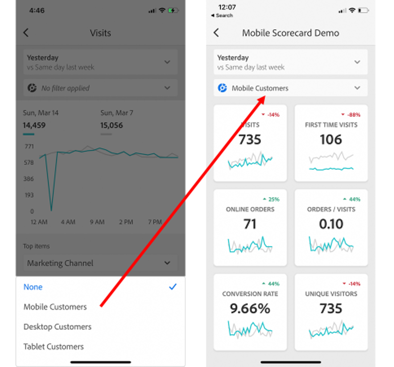

# Adobe Analytics kontrollpaneler: snabbstartsguide för företagsanvändare

Följande information ger chefsanvändare information om de effektivaste strategierna för att använda och visa Adobe Analytics dashboards. En video som visar den här informationen finns i [Adobe Analytics-instrumentpaneler i appupplevelsen](https://youtu.be/QXqQ_PkArbA).

## Introduktion

Adobe Analytics dashboards ger dig insikter från Adobe Analytics när som helst och var som helst.  Appen ger användarna mobil åtkomst till intuitiva styrkort. Styrkort är en samling viktiga mätvärden och andra komponenter som presenteras i en sida vid sida-layout som du kan trycka på för mer detaljerade uppdelningar och trendrapporter. Kontrollpaneler stöds på både iOS- och Android-operativsystem.

## Mer om den här guiden

Den här guiden är avsedd att hjälpa chefsanvändare att läsa och tolka styrkort på kontrollpaneler i Analytics. Med appen kan chefsanvändare snabbt och enkelt visa en bred återgivning av viktiga sammanfattningsdata på sina egna mobila enheter.

## Ordlista

| Term | Definition |
|--- |--- |
| Konsument | Chefspersonalen som tittar på viktiga mätvärden och insikter från Analytics på en mobil enhet |
| Kurator | Datalitterera persona som hittar och distribuerar insikter från Analytics och konfigurerar styrkorten så att de kan ses av konsumenterna |
| Insamling | Att skapa eller redigera ett mobilstyrkort med relevanta mått, dimensioner och andra komponenter för konsumenten |
| Styrkort | En instrumentpanelsvy som innehåller en eller flera paneler |
| Platta | En återgivning för ett mätresultat i en styrkortsvy |
| Uppdelningar | En sekundär vy som du kommer åt genom att trycka på en platta i styrkortet. Den här vyn utökas med det mått som visas på rutan och kan även innehålla rapporter om ytterligare uppdelningsdimensioner. |
| Datumintervall | Det primära datumintervallet för instrumentpanelsrapporter |
| Jämförelsedatumintervall | Datumintervallet som jämförs med det primära datumintervallet |

## Konfigurera instrumentpaneler på din enhet

Om du vill använda kontrollpanelerna effektivt måste du ha styrkortets kurator till hands. I det här avsnittet finns information som hjälper dig att komma igång med hjälp av kuratorn.

### Få åtkomst

Om du vill få åtkomst till styrkort på instrumentpaneler ser du till att:

* Du har en giltig inloggning på Adobe Analytics
* Markören har skapat mobila styrkort korrekt och delat dem med dig

### Hämta och installera kontrollpaneler

Följ stegen i operativsystemet på enheten för att hämta och installera programmet.

**För företagsledare på iOS:**

Klicka på följande länk (den är även tillgänglig i Analytics under **[!UICONTROL Tools]** > **[!UICONTROL Analytics dashboards (Mobile App)]**) och följ anvisningarna för att hämta, installera och öppna appen:

[iOS-länk](https://apple.co/2zXq0aN)

**För chefsanvändare på Android:**

Klicka på följande länk (den är även tillgänglig i Analytics under **[!UICONTROL Tools]** > **[!UICONTROL Analytics dashboards (Mobile App)]**) och följ anvisningarna för att hämta, installera och öppna appen:

[Android-länk](https://bit.ly/2LM38Oo)

När programmet har laddats ned och installerats kan företagsanvändare logga in i det med sina befintliga Adobe Analytics-inloggningsuppgifter.

## Använda instrumentpaneler

Så här använder du kontrollpaneler:

1. Logga in i appen. Inloggningsskärmen visas när du startar instrumentpaneler. Följ instruktionerna med dina befintliga Adobe Analytics-inloggningsuppgifter. Vi stöder både Adobe och Enterprise/Federated ID.

   

2. Välj ett företag. När du har loggat in på kontrollpaneler visas skärmen **[!UICONTROL Choose a company]**. På den här skärmen visas de inloggningsföretag som du tillhör. Tryck på det företagsnamn som är associerat med det styrkort som delas med dig.

3. I styrkortslistan visas sedan alla styrkort som har delats med dig. Tryck på det styrkort du vill visa.

   

   Om du loggar in och ser ett meddelande som säger att inget har delats kontrollerar du följande med markören:

   * Du kan logga in på rätt Analytics-instans
   * Styrkortet har delats med dig

   

4. Granska hur rutorna visas i styrkortet (det första styrkortet visas i mörkt läge). se **[!UICONTROL Preferences]** nedan för mer information).

   

   Ytterligare information om plattor:

   * Miniatyrdiagrammens granularitet beror på datumintervallets längd:

      * En dag visar en timtrend
      * Mer än en dag och mindre än ett år visar en daglig trend
      * Ett år eller mer visar en vecktrend
   * Formeln för ändring av procentvärde är metrisk summa (aktuellt datumintervall) - metrisk summa (jämförelsedatumintervall) / metrisk summa (jämförelsedatumintervall).

   * Du kan dra ned skärmen för att uppdatera styrkortet.

   Följande exempel på Styrkort visas i normalläge:

   

5. Tryck på en platta för att se hur en detaljerad beskrivning av plattan fungerar.

   

6. Så här ändrar du datumintervall för styrkortet:

   

   * Du kan också ändra datumintervallen i den detaljerade vyn som visas ovan på samma sätt.

   * Beroende på vilket intervall du trycker på (**Dag**, **Vecka**, **Månad** eller **År**) visas två alternativ för datumintervall, antingen det aktuella tidsintervallet eller det intervall som omedelbart föregår det. Tryck på något av dessa två alternativ för att markera det första intervallet. I listan **[!UICONTROL COMPARE TO]** trycker du på ett av de alternativ som visas för att jämföra data för den här tidsperioden med det första datumintervallet som du valde. Tryck på **[!UICONTROL Done]** i skärmens övre högra hörn. Fälten **[!UICONTROL Date Ranges]** och styrkortets paneler uppdateras med nya jämförelsedata från de nya intervallen som du valde.

7. Om du vill använda ett segmentfilter på styrkortet trycker du på filterlistrutan och väljer ett segment som har konfigurerats av markören. [Filtren ](https://docs.adobe.com/content/help/en/analytics-learn/tutorials/analysis-workspace/using-panels/using-drop-down-filters.html) i appen fungerar på samma sätt som i arbetsytan för analyser.

   

8. Hämta styrkortsuppdateringar. Om ett styrkort inte innehåller alla mätvärden eller uppdelningar som du kan vara intresserad av kontaktar du analysteamet så att styrkortet uppdateras. När kortet har uppdaterats kan du dra ned det på skärmen för att uppdatera det och läsa in nyligen tillagda data.

9. Lämna feedback om den här appen:

   1. Tryck på inställningsikonen i appskärmens övre högra hörn.
   2. Tryck på alternativet **[!UICONTROL Feedback]** på skärmen **[!UICONTROL Settings]**.
   3. Tryck för att visa alternativen för att lämna feedback.

      

10. Om du vill ändra inställningarna trycker du på **[!UICONTROL Preferences]**-alternativet som visas ovan. I inställningarna kan du aktivera biometrisk inloggning eller ställa in programmet för mörkt läge enligt nedan:

   

**Så här rapporterar du ett fel**:

Tryck på alternativet och välj en underkategori för felet. I formuläret för att rapportera ett fel anger du din e-postadress i det övre fältet och en beskrivning av felet i fältet nedanför. En skärmbild av din kontoinformation bifogas automatiskt till meddelandet, men du kan ta bort den om du vill genom att trycka på **X** i den bifogade bilden. Du kan också göra en skärminspelning, lägga till fler skärmbilder eller bifoga filer. Om du vill skicka rapporten trycker du på pappersplansikonen i formulärets övre högra hörn.

**Så här föreslår du en förbättring**:

Tryck på alternativet och välj en underkategori för förslaget. I förslagsformuläret anger du din e-postadress i det övre fältet och din beskrivning av felet i fältet nedanför. En skärmbild av din kontoinformation bifogas automatiskt till meddelandet, men du kan ta bort den om du vill genom att trycka på **X** i den bifogade bilden. Du kan också göra en skärminspelning, lägga till fler skärmbilder eller bifoga filer. Om du vill skicka förslaget trycker du på pappersplansikonen i formulärets övre högra hörn.

**Så här ställer du en fråga**:

Tryck på alternativet och ange din e-postadress i det övre fältet och din fråga i fältet nedanför. En skärmdump bifogas automatiskt till meddelandet, men du kan ta bort den om du vill genom att trycka på **X** i den bifogade bilden. Du kan också göra en skärminspelning, lägga till fler skärmbilder eller bifoga filer. Om du vill skicka frågan trycker du på pappersplansikonen i formulärets övre högra hörn.
