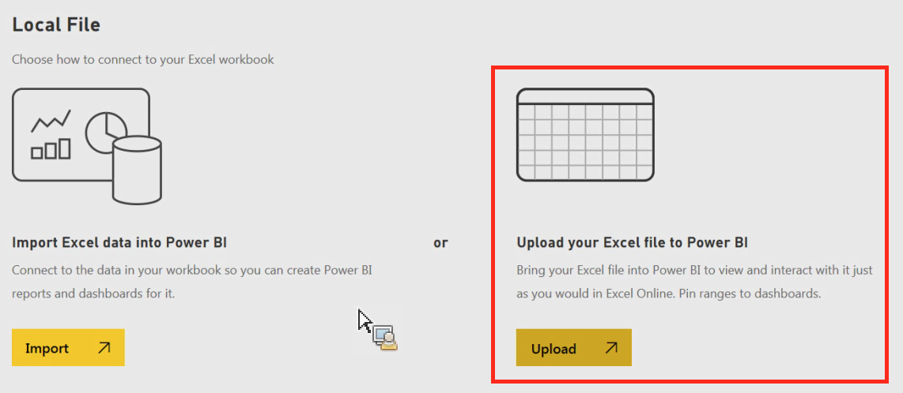

# Importera data manuellt till Power BI

Följ dessa anvisningar om du vill importera Analytics-data manuellt via Power BI.

1. Klicka på **[!UICONTROL Get Data]** i det nedre vänstra Power BIET.
1. Klicka på **[!UICONTROL Get]** under **[!UICONTROL Import or Connect to Data]** > **[!UICONTROL Files]**.

   

1. Klicka på Lokal fil.

   

1. Välj vilken fil som ska överföras och klicka på **[!UICONTROL Open]**.
1. Klicka på **[!UICONTROL Upload]** under **[!UICONTROL Upload your Excel file to Power BI]**.

   

1. Meddelandet&quot;Din fil har överförts&quot; ska visas.

