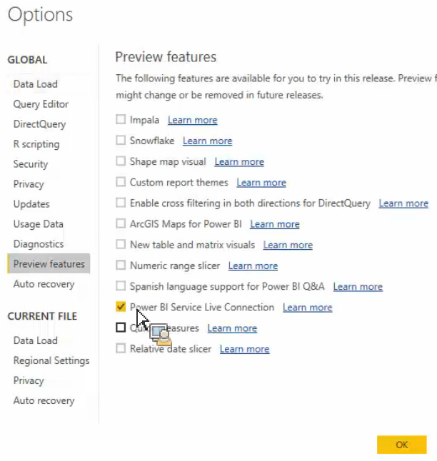

# Hämta publicerade resurser till Power BI Desktop

Beskriver hur du kan hämta Report Builder-publicerade resurser till Power BI Desktop

## Förutsättningar {#section_BDFDAE1E300B429FB6EBCB21AD1383A0}

* Du måste ha den senaste Power BI Desktop-versionen installerad (aprilversion 2017)
* Den här processen förutsätter att du redan har publicerat tabeller eller förfrågningar i Report Builder till Power BI Service.

## Process {#section_CB03E6E1B066457EA0F6FC08FFF5EFDD}

I uppdateringen av Power BI Desktop från april 2017 släppte Microsoft möjligheten att ansluta till datauppsättningar i tjänsten Power BI. Med den här funktionen kan du skapa nya rapporter med befintliga datauppsättningar som du redan har publicerat i molnet. Du kan använda den här funktionen för att samarbeta bättre och minska antalet dubbletter i teamet.

1. I Power BI Desktop går du till **[!UICONTROL File]** > **[!UICONTROL Options and settings]** > **[!UICONTROL Options]** > **[!UICONTROL Preview features.]**
1. Aktivera **[!UICONTROL Power BI Service Live Connection]** och klicka på **[!UICONTROL OK]**. 

1. Starta om Power BI Desktop.
1. När du har startat om skrivbordet går du till **[!UICONTROL Home]** > **[!UICONTROL Get Data]** > **[!UICONTROL More...]**.
1. Sök efter och välj **[!UICONTROL Power BI service]**.
1. Under **[!UICONTROL Microsoft Power BI service]** > **[!UICONTROL My Workspace]** väljer du den datauppsättning som du tidigare har publicerat från Report Builder.

Mer information finns i det här [Microsoft-blogginlägget](https://powerbi.microsoft.com/en-us/blog/connecting-to-datasets-in-the-power-bi-service-from-desktop/).
