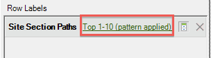

# Filtrera en sökvägsrapport med frågeguiden

Beskriver stegen som ingår i att tillämpa filter på en målningsrapport.

I det här exemplet används platsavsnittssökvägar.

1. I Adobe Report Builder klickar du på **[!UICONTROL Create]** för att öppna begärandeguiden.
1. Välj rätt rapportsvit.
1. I trädvyn till vänster väljer du **[!UICONTROL Paths]** > **[!UICONTROL Site Sections]** > **[!UICONTROL Site Section Paths]**.

   

1. Ange lämpligt datum/datum.
1. Klicka på **[!UICONTROL Next]**.
1. I steg 2 i guiden, under **[!UICONTROL Row Labels]** klickar du på **[!UICONTROL Top 1-10 (pattern applied)]** länk. I en banrapport används ett mönster som standard.

   

1. Välj **[!UICONTROL Filter]** alternativ.

   

1. I **[!UICONTROL Define 'Site Section Paths' Path Pattern]** kan du ange
   1. den första rapportens inledande rankning.
   1. antalet poster som du vill visa i den här rapporten.
1. Klicka **[!UICONTROL Edit]** för att definiera ett banmönster.
1. Om du vill ha ett eget mönster drar och släpper du något av dem **[!UICONTROL Pattern Objects]** från listan till vänster i **[!UICONTROL Pattern Build Canvas]** till höger.

   

1. Du kan också välja ett fördefinierat mönster från **[!UICONTROL Select a Pattern]** nedrullningsbar lista och ändra den. Här är de tillgängliga mönstren:

   

   Vissa av dessa mönster är specifika för Report builder: Inmatningsbanans mönster för nästa objekt, Avsluta banans mönster för föregående objekt, mönstret för nästa objekt.
1. Om du vill redigera ett fördefinierat mönster
   1. Markera den. Välj till exempel **[!UICONTROL Exited Site Pattern]**: 

   1. Nu bör du definiera sökvägen till webbplatsavsnittet som användaren följer innan han/hon avslutar. Klicka på **[!UICONTROL Specific Item(s): 0 selected]**. Du kan definiera den här sökvägen genom att välja från ett cellintervall (om du redigerar en befintlig begäran) eller genom att välja från en lista med avsnitt.
   1. Om du vill välja från ett cellintervall från en tidigare begäran markerar du **[!UICONTROL From range of cells]** och klicka på ikonen för cellväljaren. Välj sedan cellerna från rapporten. 

   1. Om du vill välja från en lista med webbplatsavsnitt väljer du **[!UICONTROL From list]** och klicka **[!UICONTROL Add]**.
   1. Flytta element från **[!UICONTROL Available Elements]** kolumn till **[!UICONTROL Selected Elements]** genom att markera dem och klicka på den orangefärgade pilen. Klicka **[!UICONTROL OK]**. 

   1. Om du vill spara mönstret som du just skapade klickar du på **[!UICONTROL Save]**.
   1. Klicka **[!UICONTROL OK]** tre gånger och sedan klicka **[!UICONTROL Finish]**. Den filtrerade sökvägsbegäran genereras nu.
