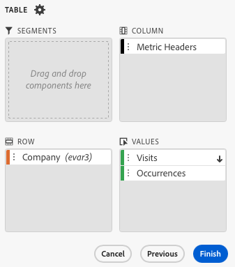
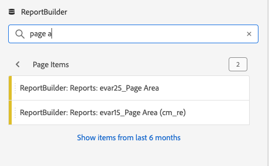

# Filterdimensioner

Som standard returnerar varje dimensionsartikel i tabellen de 10 översta artiklarna för den dimensionen.

Så här ändrar du dimensionsobjekten som returneras för varje dimension:

1. Markera en cell i datablocket.

1. Välj  **[!UICONTROL Edit data block]** på panelen **[!UICONTROL Commands]**.

1. Välj **[!UICONTROL Next]** om du vill visa fliken **[!UICONTROL Dimensions]**.

1. Välj  bredvid ett komponentnamn i tabellen.

   {zoomable="yes"}

1. Välj **[!UICONTROL Filter dimension]** på snabbmenyn för att visa rutan **[!UICONTROL Filter dimension]**.

1. Välj **Mest populära** eller **Specifik** som **[!UICONTROL Type]**.

   {zoomable="yes"}

1. Välj lämpliga alternativ baserat på vald [filtertyp](#filter-type).

1. Välj **[!UICONTROL Apply]** om du vill lägga till filtret.

1. Report Builder visar ett meddelande som bekräftar det tillagda filtret.

Håll pekaren över en dimension om du vill visa använda filter. Dimensioner med använda filter visar en -filterikon bredvid dimensionsnamnet.

## Ändra filter och sorteringsordning

En  eller  visas bredvid mätvärdet som används för att filtrera och sortera datablocket. Pilens riktning anger om måttet är sorterat i stigande eller fallande ordning.

Så här ändrar du sorteringsordningen:

- Välj  eller  bredvid måttet för att växla sorteringsordning.

Så här ändrar du måtten som används för att filtrera och sortera datablocket:

1. Håll pekaren över den önskade måttkomponenten i tabellverktyget för att visa ytterligare alternativ.

2. Välj  för det önskade måttet.

   {zoomable="yes"}

## Filtertyp

Det finns två sätt att filtrera dimensionsobjekt: [Mest populära](#most-popular) och [Specifika](#specific-filtering)

### **[!UICONTROL Most popular]**

Med alternativet **[!UICONTROL Most popular]** kan du dynamiskt filtrera dimensionsobjekt baserat på mätvärden. De vanligaste returnerar de högst rankade dimensionsobjekten baserat på måttvärden. Som standard listas de första 10 dimensionsobjekten, sorterade efter det första mätvärdet som lagts till i datablocket.

{zoomable="yes"}

#### Alternativ för sidor och rader

Använd fälten **[!UICONTROL Page]** och **[!UICONTROL Rows]** för att dela upp data i sekventiella grupper eller sidor. Med den här funktionen kan du hämta andra rankade radvärden än de översta i rapporten. Och är särskilt användbart när du vill hämta data över gränsen på 50 000 rader.

Standardvärdet för sidan är `1` och för rader är `10`. Dessa standardvärden innebär att varje sida har 10 rader med data. Sidan 1 returnerar de 10 översta objekten, sidan 2 returnerar de 10 efterföljande objekten och så vidare.

Tabellen nedan innehåller exempel på sid- och radvärden och resultatet.

| Sida | Rad | Utdata |
|------|--------|----------------------|
| 1 | 10 | De 10 viktigaste objekten |
| 2 | 10 | Objekt 11-20 |
| 1 | 100 | Top 100 items |
| 2 | 100 | Posterna 101-200 |
| 2 | 50 000 | 50 001-100 000 |

Tabellen nedan innehåller minimi- och maximivärden för sidor och rader.

|       | Minimivärden | Maximala värden |
|-------|---------------:|---------------:|
| Startsida | 1 | 50 miljoner |
| Antal rader | 1 | 50 000 |

#### Inkludera &quot;Inget värde&quot;

I Customer Journey Analytics samlar vissa dimensioner in en *Ingen*-post. Med inställningen **[!UICONTROL Include "No value"]** kan du exkludera dessa värden från rapporter. Du kan t.ex. skapa en klassificering som produktnamnsklassificeringen baserat på SKU-nyckeln för produkten. Om en specifik produkt-SKU inte har konfigurerats med den specifika produktnamnsklassificeringen, anges värdet för produktnamnet till *Inget värde*.

**[!UICONTROL Include "No value"]** är markerat som standard. Avmarkera det här alternativet om du vill utesluta poster utan värde.

#### Filtrera efter villkor

Du kan filtrera dimensionsobjekt baserat på om alla villkor är uppfyllda eller om något villkor är uppfyllt.

Så här anger du filtervillkor:

1. Välj en operator i listrutan operator. Som standard är **[!UICONTROL Contains the phrase]** markerat

   {zoomable="yes"}

1. Ange ett sökord.

1. Välj  **[!UICONTROL Add row]** för att bekräfta markeringen och lägga till ett annat villkorsobjekt.

1. Välj  om du vill ta bort ett villkorsobjekt.

Du kan inkludera upp till 10 villkorsobjekt.

### **[!UICONTROL  Specific]**

Med alternativet **[!UICONTROL Specific]** kan du skapa en fast lista med dimensionsobjekt för varje dimension. Använd filtertypen **[!UICONTROL Specific]** för att ange exakt vilka dimensionsobjekt som ska inkluderas i filtret. Du kan markera objekt från en lista eller från ett cellintervall.

{zoomable="yes"}

#### Från lista

1. Välj alternativet **[!UICONTROL From list]** om du vill söka efter och välja dimensionsobjekt.

   När du väljer alternativet **Från lista** fylls listan **[!UICONTROL Dimension items]** med dimensionsobjekt ordnade efter antal händelser.

   {zoomable="yes"}

1. Ange en sökterm i  **[!UICONTROL _Lägg till objekt_]** för att söka i listan.

1. Om du vill söka efter ett objekt som inte ingår i de senaste 90 dagarnas data väljer du **[!UICONTROL Show items for the last 6 months]** för att utöka sökningen. När data från de senaste sex månaderna har lästs in uppdaterar Report Builder länken till **[!UICONTROL Show items for last 18 months]**.

1. Om du vill ta bort ett objekt från listan **[!UICONTROL Selected items]** väljer du .

1. Om du vill flytta ett objekt i listan **[!UICONTROL Selected items]** drar och släpper du objektet eller väljer  för att visa snabbmenyn och väljer bland flyttalternativen.

1. Välj **[!UICONTROL Apply]**.

Report Builder uppdaterar listan så att den specifika filtrering som du tillämpade visas.

#### Från cellintervall

Välj alternativet **Från cellintervall** om du vill välja ett cellintervall som innehåller listan med måttobjekt som ska matchas.

{zoomable="yes"}

När du markerar ett cellintervall bör du tänka på följande begränsningar:

- Intervallet måste innehålla minst en cell.
- Intervallet får inte innehålla fler än 50 000 celler.
- Intervallet måste finnas i en enda oavbruten rad eller kolumn.

Markeringen kan innehålla tomma celler eller celler med värden som inte matchar ett visst dimensionsobjekt.

### Filtrera snabbt en dimension

Så här filtrerar du en dimension som för närvarande inte har något filter:

1. Välj  för en dimension. Exempel: **[!UICONTROL Interaction channel]**.

1. Dubbelmarkera dimensionsobjekt som ska läggas till i filtret. Du kan också markera ett eller flera dimensionsobjekt och dra och släppa markeringen i avsnittet  **[!UICONTROL Row]** .

   {zoomable="yes"}

<!--

By default, each dimension item in the table returns the top 10 items for that dimension.

To change the dimension items returned for each dimension

1. Click **[!UICONTROL Manage]** and select a data block from the list.

   

1. Click **[!UICONTROL Edit data block]** in the COMMANDS panel.

1. Click **[!UICONTROL Next]** to display the Dimensions tab.

1. Click the **...** icon next to a component name in the table.

    

1. Select **[!UICONTROL Filter dimension]** in the pop-up menu to display the **[!UICONTROL Filter dimension]** pane.

1. Select **[!UICONTROL Most popular]** or **[!UICONTROL Specific]**.

    

1. Select appropriate options based on the filter type chosen.

1. Click **[!UICONTROL Apply]** to add the filter.

    Report Builder displays a notification to confirm the added filter.

To display applied filters, hover over a dimension. Dimensions with applied filters display a filter icon to the right of the Dimension name.

## Filter Type

There are two ways to filter dimension items: Most popular and Specific.

## Most popular

The [!UICONTROL Most popular] option allows you to dynamically filter dimension items based on metric values. [!UICONTROL Most popular] filtering returns the highest ranked dimension items based on metric values. By default, the first 10 dimensions items are listed, sorted by the first metric added to the data block.

 

### Page and Rows options

Use the **Page** and **Rows** fields to divide data into sequential groups or pages. This allows you to pull ranked row values other than the top-most values into your report. This feature is especially useful for pulling data beyond the 50,000 row limit.

#### Page and Rows defaults

- Page = 1
- Rows = 10

The Page and Rows default settings identify that each page has 10 rows of data. Page 1 returns the top 10 items, page 2 returns the next 10 items, and so on.

The table below lists examples of page and row values and the resulting output.

| Page | Row    | Output               |
|------|--------|----------------------|
| 1    | 10     | Top 10 items         |
| 2    | 10     | Items 11-20          |
| 1    | 100    | Top 100 items        |
| 2    | 100    | Items 101-200        |
| 2    | 50,000 | Items 50,001-100,000 |

#### Minimum and maximum values

- Starting page: Min = 1, Max: 50 million
- Number of rows: Min = 1, Max: 50,000

### Include "No value"

In Adobe Analytics, some dimensions collect a "no value" entry. This filter allows you to exclude these values from reports. For example, you can create a classification such as the Product Name classification based on the Product SKU key. If a specific product SKU has not been set up with its specific Product Name classification, its Product Name value is set to "no value".

Include "**No value**" is selected by default. Deselect this option to exclude entries with no value.

### Filter by Criteria

You can filter dimension items based on whether all criteria are met or if any criteria are met.

To set filtering criteria

1. Select an operator from the drop-down list.

    

1. Enter a value into the search field.

1. Click **[!UICONTROL Add row]** to confirm the selection and add another criteria item.

1. Click the delete icon to remove a criteria item.

    You can include up to 10 criteria items.

### Change the filter and sort order

An arrow appears next to the metric used to filter and sort the data block. The direction of the arrow indicates whether the metric is sorted greatest to least or least to greatest.

To change the sort direction, click the arrow next to the metric.

To change the metric used to filter and sort the data block,

1. Hover over the desired metric component in the Table builder to display additional options.

2. Click the arrow on the preferred metric.

   

## Specific filtering

The Specific option allows you to create a fixed list of dimension items for each dimension. Use the **[!UICONTROL Specific]** filtering type to specify the exact dimension items to include in your filter. You can select items from a list or from a range of cells.

### From list

1. Select the **[!UICONTROL From list]** option to search for and select dimension items.

    When you select the **[!UICONTROL From list]** option, the list is populated with dimension items with the most events first.

    

    The **[!UICONTROL Available items]** list is ordered from dimension items with the most events to those with the least.

1. Enter a search term in the **[!UICONTROL Add item]** field to search the list.

1. To search for an item not included in the last 90 days of data, click **[!UICONTROL Show items for the last 6 months]** to extend the search.

    

    After data from the past 6 months loads, Report Builder updates the link to **[!UICONTROL Show items for last 18 months]**.

1. Select a dimension item.

    Selected dimension items are automatically added to the **[!UICONTROL Selected items]** list.

    

    To delete an item from the list, click the delete icon to remove the item from the list.

    To move an item in the list, drag and drop the item or click ... to display the move menu.

    

1. Click **[!UICONTROL Apply]**

    Report Builder updates the list to show the specific filtering you applied.

### From range of cells

Select the **[!UICONTROL From range of cells]** option to choose a range of cell that contain the list of dimensions items to match.

 

When you select a range of cells, consider the following restrictions:

- The range must have at least one cell.
- The range can't have more than 50,000 cells.
- The range must be in a single uninterrupted row, or column.

Your selection can contain empty cells or cells with values that don't match with a specific dimension item.

### From the Dimensions tab in the Table builder

From the **[!UICONTROL Dimensions]** tab, click the chevron icon next to a dimension name to view the list of dimension items.

 

You can drag and drop items onto the **[!UICONTROL Table]** or double-click an item name to add it to the **[!UICONTROL Table]** builder.

-->