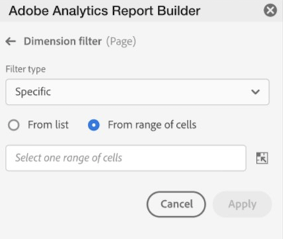

# Filtrera Dimensioner

Som standard returnerar varje dimensionsartikel i tabellen de 10 översta artiklarna för den dimensionen.

Ändra dimensionsobjekten som returneras för varje dimension

1. Markera ett datablock och klicka på **[!UICONTROL Edit data block]** på KOMMANDON-panelen.

1. Klicka på **[!UICONTROL Next]** för att visa fliken Dimensioner.

1. Klicka på ikonen **..** bredvid ett komponentnamn i tabellen.

   

1. Välj **[!UICONTROL Filter dimension]** på snabbmenyn för att visa rutan **[!UICONTROL Filter dimension]**.

1. Välj **[!UICONTROL Most popular]** eller **[!UICONTROL Specific]**.

   

1. Välj lämpliga alternativ baserat på vald filtertyp.

1. Klicka på **[!UICONTROL Apply]** för att lägga till filtret.

   Report Builder visar ett meddelande som bekräftar det tillagda filtret.

Håll pekaren över en dimension om du vill visa använda filter. För Dimensioner med använda filter visas en filterikon till höger om Dimensionens namn.

## Filtertyp

Det finns två sätt att filtrera dimensionsobjekt: De vanligaste och specifika.

## Mest populära

Med alternativet [!UICONTROL Most popular] kan du dynamiskt filtrera dimensionsobjekt baserat på mätvärden. [!UICONTROL Most popular]-filtrering returnerar de högst rankade dimensionsobjekten baserat på måttvärden. Som standard listas de första 10 dimensionsobjekten, sorterade efter det första mätvärdet som lagts till i datablocket.

### Alternativ för sidor och rader

Använd fälten **Sida** och **Rader** för att dela in data i sekventiella grupper eller sidor. På så sätt kan du dra in andra rankade radvärden än de översta i rapporten. Den här funktionen är särskilt användbar när du vill hämta data över gränsen på 50 000 rader.

#### Standardvärden för sidor och rader

- Sida = 1
- Rader = 10

Standardinställningarna för Sida och Rader anger att varje sida har 10 rader med data. Sidan 1 returnerar de 10 översta objekten, sidan 2 returnerar de 10 efterföljande objekten och så vidare.

Tabellen nedan innehåller exempel på sid- och radvärden och resultatet.

| Sida | Rad | Utdata |
|------|--------|----------------------|
| 1 | 10 | De 10 viktigaste objekten |
| 2 | 10 | Objekt 11-20 |
| 1 | 100 | Top 100 items |
| 2 | 100 | Posterna 101-200 |
| 2 | 50 000 | 50 001-100 000 |

#### Minimum- och maximum-värden

- Startsida: Min = 1, Max: 50 miljoner
- Antal rader: Min = 1, Max: 50 000

### Inkludera &quot;Inget värde&quot;

I Adobe Analytics samlar vissa dimensioner in en post utan värde. Med det här filtret kan du exkludera dessa värden från rapporter. Du kan t.ex. skapa en klassificering som produktnamnsklassificeringen baserat på SKU-nyckeln för produkten. Om en specifik produkt-SKU inte har ställts in med sin specifika produktnamnsklassificering, anges värdet för produktnamnet till&quot;inget värde&quot;.

Inkludera **Inget värde** är valt som standard. Avmarkera det här alternativet om du vill utesluta poster utan värde.

### Filtrera efter villkor

Du kan filtrera dimensionsobjekt baserat på om alla villkor är uppfyllda eller om något villkor är uppfyllt.

Ange filtervillkor

1. Välj en operator i listrutan.

   

1. Ange ett värde i sökfältet.

1. Klicka på **[!UICONTROL Add row]** för att bekräfta markeringen och lägga till ett annat villkorsobjekt.

1. Klicka på borttagningsikonen för att ta bort ett villkorsobjekt.

   Du kan inkludera upp till 10 villkorsobjekt.

### Ändra filter och sorteringsordning

En pil visas bredvid mätvärdet som används för att filtrera och sortera datablocket. Pilens riktning anger om måttet är sorterat som störst, minst till störst.

Om du vill ändra sorteringsriktning klickar du på pilen bredvid måttet.

Om du vill ändra måtten som används för att filtrera och sortera datablocket

1. Håll pekaren över den önskade måttkomponenten i tabellverktyget för att visa ytterligare alternativ.

2. Klicka på pilen på det önskade måttet.

   

## Specifik filtrering

Med alternativet Specifik kan du skapa en fast lista med dimensionsobjekt för varje dimension. Använd filtertypen **[!UICONTROL Specific]** för att ange exakt vilka dimensionsobjekt som ska inkluderas i filtret. Du kan markera objekt från en lista eller från ett cellintervall.

### Från lista

1. Välj alternativet **[!UICONTROL From list]** om du vill söka efter och välja dimensionsobjekt.

   När du väljer alternativet **[!UICONTROL From list]** fylls listan med dimensionsobjekt med de flesta händelser först.

   

   Listan **[!UICONTROL Available items]** ordnas från dimensionsobjekt med de flesta händelser till de med minst.

1. Ange en sökterm i fältet **[!UICONTROL Add item]** om du vill söka i listan.

1. Om du vill söka efter ett objekt som inte ingår i de senaste 90 dagarna klickar du på **[!UICONTROL Show items for the last 6 months]** för att utöka sökningen.

   

   När data från de senaste sex månaderna har lästs in uppdaterar Report Builder länken till **[!UICONTROL Show items for last 18 months]**.

1. Välj en dimensionsartikel.

   Valda dimensionsobjekt läggs automatiskt till i listan **[!UICONTROL Selected items]**.

   

   Om du vill ta bort ett objekt från listan klickar du på ikonen Ta bort för att ta bort objektet från listan.

   Om du vill flytta ett objekt i listan drar och släpper du objektet eller klickar på ... för att visa flyttmenyn.

   

1. Klicka på **[!UICONTROL Apply]**

   Report Builder uppdaterar listan så att den specifika filtrering som du tillämpade visas.

### Från cellintervall

Välj alternativet **[!UICONTROL From range of cells]** om du vill välja ett cellintervall som innehåller listan med dimensionsobjekt som ska matchas.

När du markerar ett cellintervall bör du tänka på följande begränsningar:

- Intervallet måste innehålla minst en cell.
- Intervallet får inte innehålla fler än 50 000 celler.
- Intervallet måste finnas i en enda oavbruten rad eller kolumn.

Markeringen kan innehålla tomma celler eller celler med värden som inte matchar ett visst dimensionsobjekt.

### På fliken Dimensioner i tabellverktyget

På fliken **[!UICONTROL Dimensions]** klickar du på ikonen för avfasning bredvid ett dimensionsnamn för att visa listan med dimensionsobjekt.

Du kan dra och släppa objekt på **[!UICONTROL Table]** eller dubbelklicka på ett objektnamn för att lägga till det i **[!UICONTROL Table]**-verktyget.
