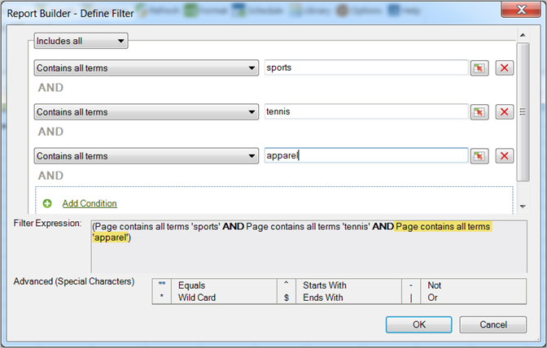

# Filtrera på mest populära

Ranknings- och villkorsstyrda filter som du konfigurerar med hjälp av boolesk logik med OCH/ELLER-sökuttryck.

De flesta populära filtren är uttrycksfilter som du konfigurerar med hjälp av boolesk logik med AND/OR-villkor, till exempel [!UICONTROL Page does not contain]*`<product name>`*med villkor eller grupper av villkor som [!UICONTROL Includes All], [!UICONTROL Includes Any], eller [!UICONTROL Excludes All]. Du kan [spara](/help/analyze/report-builder/layout/c-filter-dimensions/saved-filters.md) dessa uttryck för andra förfrågningar i den här arbetsboken eller i andra arbetsböcker.

**Skapa ett mest populärt filter**

1. Skapa eller redigera en förfrågan och gå vidare till [!UICONTROL Request Wizard: Step 2].

   

1. På [!UICONTROL Request Wizard: Step 2]klickar du på länken bredvid dimensionen i rutnätet och väljer **[!UICONTROL Filter]**.
1. På [!UICONTROL Choose Page] formulär, aktivera **[!UICONTROL Most Popular]** konfigurerar du följande alternativ:

   **Startram:** Startrangordningen för en dimension. Standardrangordningen 1 anger den översta posten i listan över rapporterade data. Till exempel för dimensionen [!UICONTROL Page], ett startmärke på 1 anger den mest begärda sidan på din webbplats. Du kan ange 10 eller ett annat värde som inledande rankningscell, vilket skapar en rapport som börjar med 10 som högst. Måtten ordnas i fallande ordning, så att radobjekt med störst aktivitet rapporteras först i listan. Om du behöver fler än 50 000 sidnamn i en begäran, men har tusentals sidor att rapportera på, kan du kopiera begäran och ändra startordningen för att hämta rätt data i block om 50 000.

   **Antal poster:** ( [!UICONTROL Pivot Layout] endast) Definierar hur många objekt som rapporteras för ett visst mätvärde över ett datumintervall. Vissa mätvärden kan visa hundra poster för ett mätresultat medan andra bara kan visa några få. Till exempel för dimensionen [!UICONTROL Site Section], ett antal poster på 25 anger att rapporten visar de 25 mest besökta sidorna.

   Med pilar kan du ändra [!UICONTROL Starting Rank] och [!UICONTROL Number of Entries] av den första datapunkten i bladet. Som standard är [!UICONTROL Starting Rank] är inställt på 1 och [!UICONTROL Number of Entries] till 10. Dessa värden kan justeras från minst ett till högst 50 000 för vissa mätvärden. Varje mätvärde har ett eget tak på [!UICONTROL Number of Entries]. Inga negativa värden eller noll tillåts i dessa fält. Om du väljer en [!UICONTROL Starting Rank] som 15 och [!UICONTROL Number of Entries] som 10 returnerar dataförfrågningar för måttet de tio mest besökta sidorna, där den första besökta sidan är nummer 15 i listan för det angivna datumintervallet. Alla de mest önskade sidorna, rankade 15 till 25, listas i fallande ordning.

   >[!NOTE]
   >
   >Om du använder filter på befintliga begäranden ändras de data som visas. Anta att du mappade de tio översta [!UICONTROL Pages] till cellerna $A$1 till $A$10, med 1 för [!UICONTROL Starting Rank] och 10 för [!UICONTROL Number of Entries]. Om du ändrar dessa värden till att visa 1 för [!UICONTROL Starting Rank] och endast 3 för [!UICONTROL Number of Entries]kommer de data som tidigare fyllde cellerna $A$4 till $A$10 inte längre att visas.

1. Om du vill skapa ett sökuttryck klickar du på **[!UICONTROL Add]**.

   

1. På [!UICONTROL Define Filter] -formulär, konfigurera de villkor som passar dina behov.

   : Gör att du kan hitta ett villkor som definieras i värdet för en cell.

   **Lägg till villkor:** Lägger till ett villkor i uttrycket. Det finns ingen gräns för hur många villkor du kan lägga till.

1. Klicka på **[!UICONTROL OK]**.

   

1. På [!UICONTROL Choose Page] formulär, klicka **[!UICONTROL Save]** för att spara uttrycket.
1. Klicka på **[!UICONTROL OK]**.
