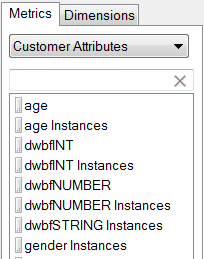

# Kundattribut

Kundattribut lagras i en ny typ av element som kallas VisAttr, som kan konfigureras som en dimension eller ett mått.

Mer detaljerad information om hur du överför kundattribut finns i [hjälpen för Experience Cloud](https://experienceleague.adobe.com/docs/core-services/interface/customer-attributes/attributes.html).

* Om den är konfigurerad som ett mått visas VisAttr både som mått och&quot;dimension&quot;.

   

* Det har stöd för samma uppdelning som en eVar (allt kan delas upp efter vad som helst).
* VisAttr har stöd för alla eVar-mått.
* VisAttr som ett mätvärde stöder&quot;buffring&quot; (som Time Spent on Site: 0 to 30, 31 to 60, ...)
* VisAttr finns som segmenteringsdimension.
