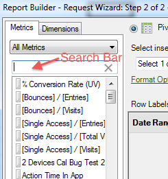

# Lägga till mätvärden och dimensioner

Steg för att lägga till mått och mått i en begäran.

1. [Skapa databegäran ](/help/analyze/report-builder/data-requests/data-requests.md) i  [!UICONTROL Request Wizard: Step 1]och klicka sedan på  **[!UICONTROL Next]**.
1. Dubbelklicka på mätvärdena i [!UICONTROL Request Wizard: Step 2] eller dra dem till önskad plats.

   

   När du lägger till mått tas de inte bort från fliken [!UICONTROL Metrics] eftersom du kan visa mått flera gånger i en begäran. Du kan t.ex. visa delsumman för mått utöver varje värde. Listan med tillgängliga mätvärden ändras dock varje gång du lägger till eller tar bort en dimension.

   Du kan bara lägga till mått i layoutavsnittet [!UICONTROL Metrics]. Mått läggs till i [!UICONTROL Column Label]-layouten som [!UICONTROL Metric Header]. Om du flyttar en [!UICONTROL Metric Header] från [!UICONTROL Column Layout] till [!UICONTROL Row Layout] visas den där och används som ett mått för nedbrytning.

   Observera att ett sökfält visas på fliken Metrisk, precis ovanför listan Metrisk.

   

   Tänk på detta:

   * När du anger en sökterm uppdateras listan automatiskt så att endast de mått vars etikett matchar söktermen visas.
   * Matchningen är inte skiftlägeskänslig och motsvarar en&quot;innehåller&quot;-sökning.
   * Fullordssökningar eller annan särskild sökflagga (börjar med, slutar med OCH, ELLER osv.) stöds inte.

      Söktermen kommer att rensas om du avslutar Request Wizard (d.v.s. klickar på Finish (Slutför) eller Cancel), eller går tillbaka till Request Wizard Step 1, eller ändrar kategorin Metric.

      Söktermen kommer inte att rensas i följande fall:

   * Du kan dra och släppa (eller dubbelklicka) ett av måttobjekten från listan så att det läggs till på panelen Pivottayout/Anpassade layoutmått.
   * Du tar bort ett eller flera måttobjekt från panelen Pivottext/Anpassade layoutmått.
   * Klicka på fliken Dimension och gå sedan tillbaka till fliken Metrisk.
   * Du anropar andra delformulär (modala eller modelllösa) som när du avslutar kommer att återgå till begärandeguiden steg 2. Exempel på dessa formulär är

      * Dimension Filter Forms
      * Forms för datumintervallformatering
      * Formulär för formatalternativ
      * Textformulär för att lägga till
      * Formulär för plats för utdataområde

1. (Valfritt) Om du vill sortera en begäran efter mått klickar du bara på måttetiketten.
1. Lägg till dimensioner på samma sätt som du lägger till mätvärden.

På fliken [!UICONTROL Dimensions] visar systemet dimensioner som bryts ned eller är en klassificering av en basrapport som du väljer i steg 1, och på rapportsvitens konfiguration. När du släpper en dimension i layoutstödrastret tas den bort från trädvyn och räknar om listan med återstående tillgängliga dimensioner.

Dimensionen [!UICONTROL Date] läggs till automatiskt. Tillgängliga datumdimensioner ändras beroende på den valda granulariteten från [!UICONTROL Request Wizard: Step 1]. (Giltiga värden är:

    * Timme
    * Dag
    * Vecka
    * Månad
    * År
    * Datumintervall (när ingen granularitet anges)

1. Ändra mått och mått genom att konfigurera [formatalternativ](/help/analyze/report-builder/layout/t-format-display-headers.md) och filter.
1. Klicka på **[!UICONTROL Finish]**.
I följande exempel relaterar dimensionerna till [!UICONTROL Page]-måttet. Här skapar dimensionen [!UICONTROL Referring Domain] en detaljrapport mellan [!UICONTROL Page] och [!UICONTROL Referring Domain]. Fliken [!UICONTROL Dimension] uppdateras endast med dimensioner som du kan lägga till i en detaljrapport.

