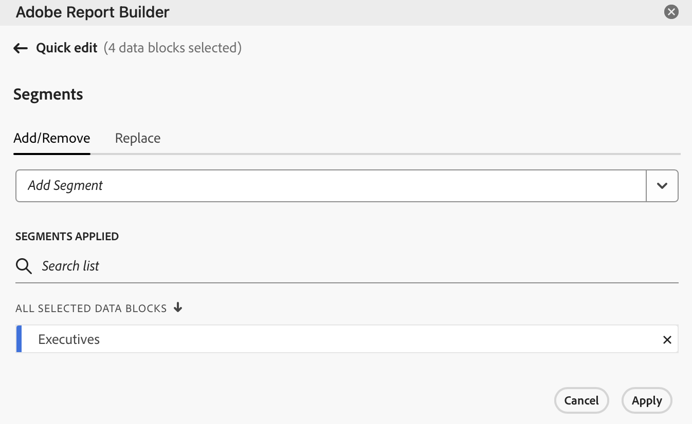

# Hantera datablock

Du kan visa och hantera alla datablock i en arbetsbok med [!UICONTROL Data block manager]. [!UICONTROL Data block manager] innehåller sök-, filter- och sorteringsfunktioner som gör att du kan hitta specifika datablock. När du har markerat ett eller flera datablock kan du redigera, ta bort eller uppdatera de markerade datablocken.

## Visa datablock

Om du vill visa en tabell med alla datablock i en arbetsbok väljer du  **[!UICONTROL Manage]**.

{zoomable="yes"}

**[!UICONTROL Data block manager]** visar en tabell med alla datablock i en arbetsbok.

{zoomable="yes"}

Du kan använda  för att välja vilka kolumner du vill visa.

## Sortera datablock

Du kan sortera datablockstabellen efter en kolumn som visas. Du kan till exempel sortera datablock efter rapportsviter, segment, datumintervall och andra variabler.

Om du vill sortera datablockstabellen väljer du en kolumnrubrik. Markera samma kolumnrubrik om du vill kasta om sorteringsordningen.

## Sök i datablock

Använd fältet  **[!UICONTROL _Sök_]** för att hitta något i datablockstabellen. Du kan till exempel söka efter mätvärden i datablocken eller rapportsviten. Du kan också söka efter datum i datumintervallet, ändringsdatumet eller sista körningsdatumkolumnen.

## Redigera datablock

Du kan redigera rapportsviter och datumintervall för datablock. Eller segmenten som tillämpas på datablock.

Du kan till exempel ersätta ett befintligt segment med ett nytt segment i ett eller flera datablock.

1. Markera de datablock som du vill uppdatera. Du kan markera kryssrutan på den översta nivån om du vill markera alla datablock, eller markera enskilda datablock.

   {zoomable="yes"}

1. Välj  för att visa fönstret **[!UICONTROL Quick edit]**.

   {zoomable="yes"}

1. Välj en länk för att uppdatera rapportsviter, datumintervall eller segment. I **[!UICONTROL Quick Edit]** - **[!UICONTROL Segments]** kan du lägga till, ta bort eller uppdatera segment för de markerade datablocken.

   {zoomable="yes"}

## Uppdatera datablock

Välj  om du vill uppdatera datablockstabellen.

Kontrollera om ett datablock har uppdaterats genom att visa ikonen för uppdateringsstatus:

- Ett uppdaterat datablock visar .

- Ett datablock som inte kunde uppdateras visar en .

## Ta bort datablock

Så här tar du bort ett eller flera datablock:

1. Markera ett eller flera datablock.
1. Välj .
1. Välj **[!UICONTROL Delete]** i dialogrutan **[!UICONTROL Delete data block]** eller **[!UICONTROL Cancel]** om du vill avbryta borttagningen.

## Gruppera datablock

Du kan gruppera datablock med hjälp av den nedrullningsbara menyn **[!UICONTROL Group by]** eller välja en kolumnrubrik.

Om du vill sortera datablock efter kolumn markerar du kolumnrubriken. Om du vill gruppera datablock efter grupper väljer du ett gruppnamn i listrutan **[!UICONTROL Group by]**. På skärmbilden nedan visas datablock grupperade efter rapportsviten.

Du kan använda gruppering för att snabbt markera datablock som du vill ändra ett vanligt element för, som segment.

{zoomable="yes"}

<!--

# Manage Data Blocks in Report Builder

You can view and manage all data blocks in a workbook using the Data Block Manager. The Data Block Manager provides search, filter, and sort capabilities that allow you to quickly locate specific data blocks. After selecting one or more data blocks, you can edit, delete, or refresh the selected data blocks.

## View Data Blocks

Click **Manage** to view a list of all data blocks in a workbook.

The Data Block Manager lists all data blocks present in a workbook. 

## Sort the Data Blocks list

You can sort the data block list by a displayed column. For example, you can sort the data block list by report suites, segments, date range, and other variables.

To sort the data block list, click a column heading.

## Search the Data Block list

Use the Search field to locate anything in the data block table. For example, you could search for metrics contained in the data blocks or report suite. You can also search for dates appearing in the date range, date modified, or last run date columns.

## Edit Data Blocks

You can edit the report suite, date range, or the segments applied to one or more data blocks.

For example, you can replace an existing segment with a new segment in one or more data blocks.

1. Select the data blocks that you want to update. You can select the top-level check box to select all data blocks or you can select individual data blocks.

   

1. Click the edit icon to display the Quick edit window.

   

1. Select a segment link to update report suites, date ranges, or segments.

   

## Refresh Data Blocks

Click the refresh icon to refresh the data blocks in the list.

To verify if a data block is refreshed, view the refresh status icon. 

A successfully refreshed data block displays a checkmark in a green circle: . 

A data block that has failed to refresh displays a warning icon: .This makes it easy to identify if any data blocks have errors.

## Delete a Data Block

1. Select a data block in the Data Block manager. 
1. Click the trash can icon to delete the selected data block.

## Group Data Blocks

You can group data blocks using the **Group by** drop-down menu or you can click a column title. To sort data blocks by column, click the column title. To group data blocks by groups, select a group name from the **Group by** drop-down menu. For example, the screenshot below shows data blocks grouped by Sheet. It shows data blocks grouped by Sheet1 and Sheet2.  This is useful, for example, in the segment-replacing use case. If you have multiple segments applied to each data block, it is helpful to create a group containing all the data blocks that you want to replace. Then you can easily select and edit them all at once.

## Modify the Data Block Manager view

You can modify which columns are visible in the Data Block Manager window.

Click the column list  icon to select which columns are listed in the Data Block Manager. Select a column name to display the column. Deselect the column name to remove the column from view.

-->