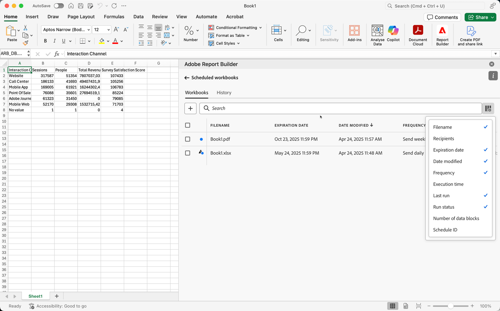

# Hantera schemalagda arbetsböcker

Du kan schemalägga en arbetsbok för delning via e-post eller genom att exportera den till ett molnmål, vilket beskrivs i följande artiklar:

* [Schemalägg arbetsböcker genom delning via e-post](/help/analyze/report-builder/schedule-reportbuilder.md)

* [Schemalägg arbetsböcker genom att exportera till molnmål](/help/analyze/report-builder/report-builder-export.md)

I följande avsnitt beskrivs hur du hanterar arbetsböcker efter att de har schemalagts:

## Visa och hantera schemalagda arbetsböcker

Du kan visa och hantera alla schemalagda arbetsböcker på fliken **[!UICONTROL Workbooks]**.

1. Välj **[!UICONTROL Schedule]** i Report Builder-hubben

1. Välj fliken **[!UICONTROL Workbooks]**. Du ser en lista över alla schemalagda arbetsböcker. (Du kan också välja fliken **[!UICONTROL Legacy]** om du vill visa en lista över äldre arbetsböcker som behöver migreras till den nya Report Builder.)

   {zoomable="yes"}

1. Gör något av följande:

   * Håll muspekaren över ikonen om du vill visa statusen för en schemalagd arbetsbok.

   * Sök efter specifika schemalagda arbetsböcker i sökfältet .

   * Välj kolumnikonen  för att definiera vilka kolumner som ska visas.

   * Markera filterikonen  och välj sedan [!UICONTROL **Visa alla**] för att visa alla schemalagda arbetsböcker för en viss organisation.

1. Markera en eller flera arbetsböcker.

   {zoomable="yes"}

   Följande alternativ är tillgängliga:

   | Alternativ | Beskrivning |
   |---|---|
   |  | Redigera schemat för en vald arbetsbok. |
   |  | Visa historiken för valda arbetsböcker. |
   |  | Pausa schemat för markerade arbetsböcker. |
   |  | Återuppta schemat för valda arbetsböcker. |
   |  | Hämta den markerade arbetsboken till en ny arbetsbok. |
   |  | Ta bort schemat för valda arbetsböcker. |

## Historik och status för schemalagda arbetsböcker

Du kan visa historik och status för schemalagda arbetsböcker på fliken **[!UICONTROL History]**.

1. Välj **[!UICONTROL Schedule]** i Report Builder-navet.

1. Välj fliken **[!UICONTROL History]**. Du ser en lista över alla schemalagda arbetsböcker.

   {zoomable="yes"}

   Använd  om du vill söka efter specifika arbetsböcker i listan.
Använd  för att definiera vilka kolumner som ska visas.

   På fliken **[!UICONTROL History]** kan du granska statusen för varje schemalagd aktivitet. En separat rad visar statusändringen för varje schemalagd aktivitet.

   * En  anger att arbetsboken har skickats.
   * Ett  indikerar att ett fel har inträffat.

Du kan också välja  för en eller flera markerade arbetsböcker på fliken **[!UICONTROL Workbooks]**. Den här åtgärden visar fliken **[!UICONTROL History]** med en lista filtrerad efter din markering. Välj  om du vill ta bort ett filter.
