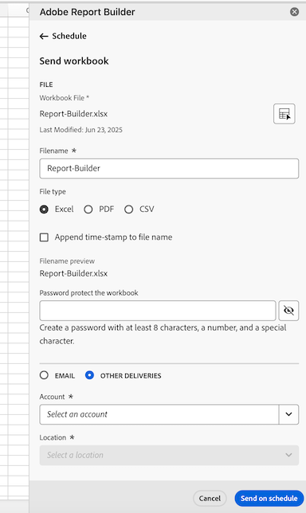

# Schemalägg arbetsböcker genom att exportera till molnmål

Du kan exportera Adobe Analytics-arbetsböcker från Report Builder till molnleverantörer som Google, Azure och Amazon.

Du kan också dela arbetsböcker med andra via e-post, vilket beskrivs i [Schemalägg arbetsböcker för delning via e-post](/help/analyze/report-builder/schedule-reportbuilder.md).

[Fördelarna med att exportera rapporter från Report Builder till molnet](#advantages-of-exporting-to-the-cloud) är bland annat möjligheten att använda rapporter i tredjepartsverktyg eller kombinera dem med externa data.

Innan du exporterar arbetsböcker från Report Builder till ett molnmål bör du kontrollera att dina datablock, din miljö och dina behörigheter uppfyller [exportkraven](#export-requirements).

## Förstå exportprocessen

Använd följande process när du exporterar arbetsböcker från Report Builder till molnet:

1. [Konfigurera ett molnkonto](/help/components/locations/configure-import-accounts.md)

1. [Konfigurera en plats på kontot](/help/components/locations/configure-import-locations.md)

1. [Exportera en rapport från Report Builder](#export-a-report-from-report-builder)

<!--

1. Access data in your cloud account and [Manage exports in Adobe](/help/components/exports/manage-exports.md)

-->

## Exportera en rapport från Report Builder {#export-from-report-builder}

>[!NOTE]
>
>Läs mer om [exportprocessen](#understand-the-export-process) i avsnittet ovan innan du exporterar data enligt beskrivningen i det här avsnittet.

Så här exporterar du rapporter från Report Builder:

1. Om du inte redan har det konfigurerar du ett exportkonto och en plats enligt beskrivningen i [Konfigurera molnexportkonton](/help/components/locations/configure-import-accounts.md).

1. Öppna den högra panelen i Excel-kalkylbladet som innehåller de data som du vill exportera.**[!UICONTROL Adobe Report Builder]**

1. Välj [!UICONTROL **Schema**].

<!-- add screenshot -->

1. På fliken **[!UICONTROL Workbooks]** väljer du plusikonen för att skapa ett nytt schema

   

   eller

   Om du vill exportera arbetsboken enligt ett schema som du redan har skapat, markerar du schemat i listan med scheman och väljer sedan **[!UICONTROL Send on schedule]**.

1. Ange följande information i den högra panelen [!UICONTROL **Adobe Report Builder**] för att fortsätta skapa ett nytt schema:

   | Fältnamn | Funktion |
   |---------|----------|
   | **[!UICONTROL File]** | Visar arbetsboksfilen som är markerad för export. Välj arbetsboksikonen  bredvid filnamnet för att välja den aktuella arbetsboken om den inte redan är markerad. |
   | **[!UICONTROL Filename]** <!--should be File name --> | Gör att du kan ändra filnamnet innan du exporterar arbetsboken.
Arbetsbokens filnamn är som standard arbetsbokens namn
 |
   | **[!UICONTROL File type]** | Välj filtyp för den exporterade filen. Du kan välja Excel, PDF eller CSV.
När du väljer **[!UICONTROL CSV]** ska du vara medveten om att den schemalagda arbetsboken skickas som en ZIP-bilaga. Vissa e-postadministrationer kan blockera e-post med ZIP-bilagor. Du ser en varning i enlighet med detta.
 |
   | **[!UICONTROL Append time stamp to file name]** | Välj det här alternativet om du vill inkludera en tidsstämpel för exporten i namnet på den exporterade filen. |
   | **[!UICONTROL Filename preview]** <!--should be File name preview --> | Visar en förhandsgranskning av hur filnamnet kommer att visas efter exporten. |
   | **[!UICONTROL Password protect the workbook]** | Ange ett lösenord för att skydda den exporterade filen så att bara personer med lösenordet kan komma åt den. 
Lösenord måste innehålla minst 8 tecken och innehålla minst 1 siffra och 1 specialtecken (till exempel `!`,`@`,`#` och `$`).
 |
   | **[!UICONTROL Email]** | Välj det här alternativet om du vill skicka filen till en viss e-postadress. Mer information om det här alternativet finns i [Schemalägg arbetsböcker genom delning via e-post](/help/analyze/report-builder/schedule-reportbuilder.md). |
   | **[!UICONTROL Other deliveries]** | Välj det här alternativet om du vill skicka filen till ett molnkonto och använd sedan de nedrullningsbara menyerna **[!UICONTROL Account]** och **[!UICONTROL Location]** som beskrivs nedan för att välja konto och plats. |
   | **[!UICONTROL Account]** | Välj det exportkonto i molnet där du vill att data ska skickas. 
Om du inte redan har konfigurerat ett molnkonto som du vill använda kan du konfigurera ett nytt konto:<ol><li>Välj [!UICONTROL **Lägg till konto**] och ange sedan följande information:<ul><li>[!UICONTROL **Platskontonamn**]: Ange ett namn för platskontot. Det här namnet visas när du skapar en plats </li><li>[!UICONTROL **Beskrivning av platskonto**]: Ange en kort beskrivning av kontot för att skilja det från andra konton av samma kontotyp.</li><li>**[!UICONTROL Make account available to all users in your organization]**: Välj det här alternativet om du vill tillåta andra användare i organisationen att använda kontot. Tänk på följande när du delar konton:<ul><li>Konton som du delar kan inte tas bort.</li><li>Delade konton kan bara redigeras av kontoägaren.</li><li>Vem som helst kan skapa en plats för det delade kontot.</li></ul></li><li>[!UICONTROL **Kontotyp**]: Välj den typ av molnkonto som du exporterar till. De tillgängliga kontotyperna är Amazon S3 Role ARN, Google Cloud Platform, Azure SAS och Azure RBAC.</li></ul><li>Om du vill slutföra konfigurationen av ditt konto fortsätter du med steg 6 i [Konfigurera molnimport- och exportkonton](/help/components/locations/configure-import-accounts.md) och expanderar sedan avsnittet som motsvarar den [!UICONTROL **kontotyp**] du valde. 
Följande kontotyper är tillgängliga:
<ul><li>Amazon S3 Role ARN</li><li>Google Cloud Platform</li><li>Azure SAS</li><li>Azure RBAC</li></ul></ol> |
   | **[!UICONTROL Location]** | Välj den plats på kontot där du vill att exportdata ska skickas.
Om du inte redan har konfigurerat platsen som du vill använda på kontot som du har valt kan du konfigurera en ny plats:<ol><li>Välj [!UICONTROL **Lägg till plats**] och ange sedan följande information: <ul><li>[!UICONTROL **Namn**]: Platsens namn.</li><li>[!UICONTROL **Beskrivning**]: Ange en kort beskrivning av platsen för att skilja den från andra platser på kontot.</li><li>**[!UICONTROL Make location available to all users in your organization]**: Välj det här alternativet om du vill tillåta andra användare i organisationen att använda platsen. Tänk på följande när du delar konton:<ul><li>Platser som du delar kan inte tas bort.</li><li>Delade platser kan bara redigeras av kontoägaren.</li><li>Platser kan bara delas om kontot som platsen är kopplad till också delas.</li></ul></li><li>[!UICONTROL **Platskonto**]: Välj det konto där du vill skapa platsen.</li></ul><li>Om du vill slutföra konfigurationen av din plats fortsätter du med länken nedan som motsvarar kontotypen som du valde i fältet [!UICONTROL **Platskonto**]:<ul><li>[Amazon S3-roll ARN](/help/components/locations/configure-import-locations.md#amazon-s3-role-arn)</li><li>[Google Cloud-plattform](/help/components/locations/configure-import-locations.md#google-cloud-platform)</li><li>[Azure SAS](/help/components/locations/configure-import-locations.md#azure-sas)</li><li>[Azure RBAC](/help/components/locations/configure-import-locations.md#azure-rbac)</li></ul> |
   | **[!UICONTROL Show scheduling options]** | Välj det här alternativet om du vill visa ytterligare alternativ för att schemalägga exporten. Låt alternativet vara avmarkerat om du bara vill skicka exporten en gång. När det här alternativet är avmarkerat påbörjas exporten omedelbart. |
   | **[!UICONTROL Starting on]** | Den dag och tid då den schemalagda exporten ska börja. 
Det här alternativet är bara tillgängligt när du väljer en schemalagd exportfrekvens.
 |
   | **[!UICONTROL Ending on]** | Den dag och tid då den schemalagda exporten upphör. Den schemalagda exporten körs inte längre efter det datum och den tidpunkt som du angav. 
Det här alternativet är bara tillgängligt när du väljer en schemalagd exportfrekvens.
 |
   | **[!UICONTROL Frequency]** | Du kan ange att frekvensen ska vara timme, dag, vecka, månad eller år för en viss dag. Du kan till exempel ställa in ett schema för att skicka arbetsboken den första söndagsklickningen i månaden så att dina mottagare får e-postmeddelandet i sin inkorg första gången på måndagsmorgonen. |

   {style="table-layout:auto"}

1. Välj [!UICONTROL **Skicka enligt schema**] om du vill exportera arbetsboken.

   Data skickas till molnkontot som du angav med den frekvens som du angav.

   En bekräftelsetabell visas längst ned i Report Builder-navet och den schemalagda arbetsboken visas på fliken Arbetsböcker.

## Fördelar med att exportera till molnet {#advantages}

Genom att exportera Adobe Analytics-data till molnet kan du:

* Exportera till en delad plats, som Google Cloud Platform, Microsoft Azure och Amazon S3.

* Lagra stora mängder historiska data.

  Denna typ av data kan användas för att upptäcka långsiktiga trender för att få affärsinformation och i slutändan leda till bättre beslutsunderlag.

* Inkludera beräknade värden i exporterade Adobe Analytics-data.

* Strukturera utdata som sammanfogade värden.

* Exportera en gång eller enligt ett schema.

* Exportera filer i Excel-, PDF- eller CSV-format.

* Exportera datablock som innehåller flera dimensioner.

## Exportkrav {#export-requirements}

### Minimikrav

Kontrollera att dina datablock, din miljö och dina behörigheter uppfyller följande krav:

* **Datablock:** Alla datablock måste innehålla minst en komponent till en kolumn, rad eller ett värde.

* **Miljö:** Kontrollera att de [IP-adresser](/help/technotes/ip-addresses.md) och [domäner](/help/technotes/domains.md) som används av Adobe Analytics tillåts via organisationens brandvägg.

<!--
## Manage exports

After data is exported from Analysis Workspace, you can edit, re-export, duplicate, tag, or delete existing exports, as described in [Manage exports](/help/components/exports/manage-exports.md). 

-->

## Hantera schemalagda arbetsböcker

Mer information om hur du hanterar arbetsböcker som redan är schemalagda finns i [Hantera schemalagda arbetsböcker](/help/analyze/report-builder/manage-schedules-reportbuilder.md).

