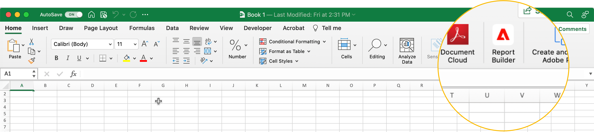

# Konfigurera Report Builder

Du kommer snabbt åt Report Builder via Excel-tilläggsmenyn.

## Krav

Report Builder för Adobe Analytics stöds av följande operativsystem och webbläsare.

### macOS

- macOS Version 10.x eller senare
- Alla Microsoft Excel-versioner

### Windows

- Windows 10, version 1904 eller senare
- Excel version 2106 eller senare

  Alla Excel-användare med Windows-datorer måste installera Microsoft Edge Webview2 för att kunna använda tillägget. Så här installerar du styrenheten:

   1. Gå till <https://aka.ms/webview2installer>.
   1. Välj och hämta Evergreen Standalone Installer.
   1. Följ installationsanvisningarna.

### Webbkontor

- Stöder alla webbläsare och versioner

## Excel-tillägg för Report Builder

Du måste installera Report Builder Excel-tillägget för att kunna använda Report Builder för Adobe Analytics. När du har installerat tillägget Report Builder Excel kan du komma åt Report Builder från en öppen Excel-arbetsbok.

### Hämta och installera tillägget Report Builder

Hämta och installera tillägget Report Builder

1. Starta Excel och öppna en ny arbetsbok.

1. Välj **[!UICONTROL Insert]** > **[!UICONTROL Get Add-ins]**.

1. I dialogrutan för Office-tillägg väljer du fliken Store.

1. Sök efter Report Builder och klicka på **[!UICONTROL Add]**.

1. Klicka på **[!UICONTROL Continue]** i dialogrutan Licensvillkor och sekretesspolicy.

**Om fliken Store inte visas**

1. I Excel väljer du Arkiv > Konto > Hantera inställningar.

1. Markera rutan bredvid&quot;Aktivera valfria anslutna upplevelser&quot;

1. Starta om Excel.

**Om din organisation blockerar åtkomsten till Microsoft Store**

Kontakta IT-avdelningen eller säkerhetsteamet och be om godkännande av tillägget Report Builder. När godkännande har beviljats väljer du fliken Administratörshanterad i dialogrutan för Office-tillägg.

När du har installerat tillägget Report Builder visas ikonen Report Builder i Excel-menyfliksområdet på fliken Hem.

## Logga in i Report Builder

När du har installerat tillägget Report Builder for Excel för din operativplattform eller webbläsare följer du de här stegen för att logga in på Report Builder.

1. Öppna en Excel-arbetsbok.

1. Klicka på ikonen Report Builder för att starta Report Builder.

1. Klicka på **[!UICONTROL Login]** i verktygsfältet i Adobe Report Builder.

   

1. Ange din kontoinformation för Adobe Experience ID. Kontoinformationen ska överensstämma med dina Adobe Analytics-uppgifter.

   

När du har loggat in visas din inloggningsikon och organisation högst upp på panelen

## Byt organisation

När du loggar in första gången loggas du in på den standardorganisation som tilldelats din profil.

1. Klicka på namnet på organisationen som visas när du loggar in.

1. Välj en organisation i listan över tillgängliga organisationer. Endast organisationer som du har åtkomst till listas.

   

## Logga ut

Du kan logga ut från Report Builder från användarprofilen.

1. Spara ändringar i alla öppna arbetsböcker.

1. Klicka på avatarikonen för att visa din användarprofil.

   

1. Klicka på **Logga ut**.
