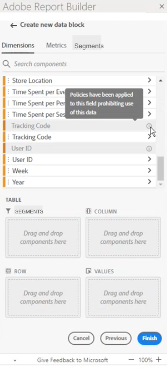

# Begränsade etiketter i Report Builder

Vanligtvis ärvs datastyrningsrelaterade inställningar i Adobe Analytics från Adobe Experience Platform. Integrationen mellan Adobe Analytics och Adobe Experience Platform Data Governance möjliggör märkning av känsliga Adobe Analytics-data och tillämpning av sekretesspolicyer.

Sekretessetiketter och integritetspolicyer som har skapats för datauppsättningar som används av Experience Platform kan visas i arbetsflödet för Adobe Analytics rapportsviter. Dessa etiketter stoppar eller varnar användare som skapar mätvärden och/eller dimensioner från känsliga fält. Mer information om datauppsättningar finns i [Datauppsättningsöversikt](https://experienceleague.adobe.com/docs/experience-platform/catalog/datasets/overview.html?lang=sv-SE)

När data exporteras från Adobe Analytics (via rapportering, export, API osv.) läggs dessutom varningar eller etiketter till för att meddela användarna att en rapport innehåller känslig information som behöver behandlas på ett visst sätt.

Tack vare den här integreringen kan ni hantera regelefterlevnaden enklare. Datahanteringen i organisationen kan ange regler som begränsar användningen. Detta innebär att era Adobe Analytics-användare kan använda data med större tillförsikt, eftersom de vet att de följer de regler som definieras av datasegmenter.

Mer information finns i [Adobe Analytics och datastyrning](https://experienceleague.adobe.com/docs/analytics-platform/using/cja-privacy/privacy-overview.html?lang=sv-SE)

## Visa begränsade data i Report Builder

I Adobe Analytics finns två Adobe-definierade policyer som påverkar rapportering, hämtning och delning:

* Använd Analytics-policy
* Tillämpa hämtningspolicy

Komponenter som påverkas av dessa principer är nedtonade. När du hovrar över en komponent som har en tillämpad princip visas en anteckning som anger följande: **Principer har tillämpats på det här fältet som förbjuder användning av dessa data.** Mer information finns i [Etiketter och profiler](https://experienceleague.adobe.com/docs/analytics-platform/using/cja-dataviews/data-governance.html?lang=sv-SE).

## Uppdatera rapporter som innehåller begränsade data

Om en användare har skapat en Report Builder-rapport med dataelement som senare är begränsade visas ett felmeddelande när rapporten uppdateras.

