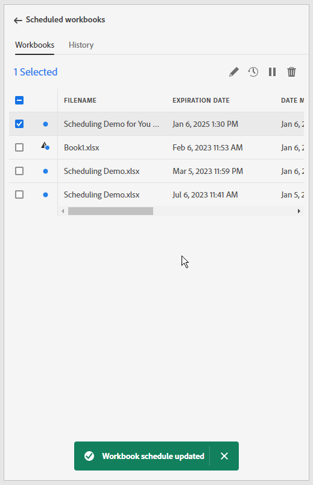

# Schemalägg arbetsböcker genom delning via e-post

>[!NOTE]
>
>Förutom att schemalägga arbetsböcker för delning via e-post, så som beskrivs i det här avsnittet, kan du schemalägga att arbetsböcker ska exporteras till molnmål, så som beskrivs i [Schemalägg arbetsböcker för export till molnmål](/help/analyze/report-builder/report-builder-export.md).

När du har sparat arbetsboken och slutfört analysen kan du enkelt dela arbetsboken med andra i teamet med hjälp av schemaläggningsfunktionen. Med funktionen Schemalägg kan du skapa ett schema som automatiskt uppdaterar data i arbetsboken och skickar Excel-arbetsbokens .xlsx-fil med e-post som en bifogad fil till den angivna målgruppen vid ett visst datum och en viss tidpunkt. Genom att ställa in ett schema får mottagarna regelbundna uppdateringar automatiskt. Du kan också använda schemafunktionen för att skicka ut arbetsboken en gång utan att schemalägga automatiska uppdateringar.

Du kan skapa flera scheman för en enskild arbetsbok. Du kan till exempel skicka en arbetsbok till ditt team dagligen och du kan skicka arbetsboken till din chef en gång i veckan genom att skapa två olika scheman.

Med funktionen Schemalägg kan du även konfigurera lösenordsskydd för en arbetsbok och redigera tidigare schemalagda arbetsböcker.

>[!BEGINSHADEBOX]

Se  [Schemalägg arbetsböcker](https://video.tv.adobe.com/v/3413079?quality=12&learn=on){target="_blank"} för en demonstrationsvideo.

>[!ENDSHADEBOX]

## Schemalägg en arbetsbok

Använd knappen Schema i Report Builder nav för att snabbt skapa ett schema så att du automatiskt kan distribuera en Excel-arbetsboksfil (.xlsx) till en individ eller grupp.

1. Klicka på knappen Schema i Report Builder-navet.

   {width="55%"}

1. Klicka på Schemalägg arbetsbok eller plusknappen i det övre vänstra hörnet för att skapa en ny schemalagd arbetsbok.

   {width="55%"}

   I schemaläggningsrutan visas viss fördefinierad information om arbetsboken, t.ex. arbetsbokens namn och det senaste datumet som arbetsboken ändrades.

   {width="55%"}

1. (Valfritt) Ange ett filnamn.

   Arbetsbokens filnamn är som standard arbetsbokens namn, men du kan ändra det om du vill. Om du skickar samma arbetsbok till flera olika målgrupper och vill ge den ett lite mer användarvänligt namn för en viss målgrupp, kan du ändra namnet.

1. (Valfritt) Välj **Lägg till tidsstämpel i filnamn**.

   Du kan lägga till en tidsstämpel till filnamnet för att identifiera vilket datum arbetsboken uppdaterades. Detta är praktiskt om du snabbt vill se vilken version av en arbetsbok som skickades på ett visst datum. **Filnamnsförhandsgranskningen** visar hur arbetsbokens filnamn kommer att visas i e-postmeddelandet när arbetsboken distribueras. Tidsstämpelformatet är YYY-MM-DD.

1. (Valfritt) Välj **.zip-komprimering** om du vill komprimera filen och ange lösenordsskydd för filen.

   När du väljer det här alternativet uppmanas du att ange ett lösenord för att öppna filen. Detta är praktiskt om du är orolig för datasäkerheten och vill lösenordsskydda arbetsboken. Om du vill skydda filen med ett lösenord måste du välja **.zip-komprimering**. Lösenordet måste innehålla minst 8 tecken och innehålla en siffra och ett specialtecken.

   {width="55%"}

1. Ange **mottagare**. Du kan ange namnet på en person som är erkänd i organisationen eller ange en e-postadress för en person inom eller utanför organisationen.

1. Ange **Ämne** för e-postmeddelandet och en beskrivning för mottagarna. Ämnet får som standard arbetsbokens filnamn, men du kan ändra ämnet om det behövs. Du kan lägga till information i beskrivningsavsnittet.

   {width="55%"}

1. Ställ in schemaläggningsalternativen för att ange det datum och den tidpunkt då du vill att arbetsboken ska skickas med e-post till mottagarna.

   Välj start- och slutdatum och tidsramar. Det kan vara dagens datum eller ett datum i framtiden.

   Välj **Frekvens** i listrutan. Du kan ange att frekvensen ska vara timme, dag, vecka, månad eller år för en viss dag. Du kan till exempel ställa in ett schema för att skicka arbetsboken den första söndagsklickningen i månaden så att dina mottagare får e-postmeddelandet i sin inkorg första gången på måndagsmorgonen.

   {width="55%"}

1. När du har angett schemat klickar du på **Skicka enligt schema**.

   {width="55%"}

   En bekräftelsetabell visas längst ned i Report Builder-navet och den schemalagda arbetsboken visas på fliken Arbetsböcker.

   {width="55%"}

## Schemalägg en konverterad arbetsbok {#converted}

1. Schemalägg en [konverterad](/help/analyze/report-builder/convert-workbooks.md) äldre arbetsbok.

   Ett popup-fönster visas där du tillfrågas om du vill använda schemaläggningsmetadata från den äldre arbetsboken för att skapa en ny schemalagd aktivitet.

1. Om du väljer **[!UICONTROL Use]** fyller Report Builder automatiskt i den gamla schemaläggningsinformationen.

1. Kontrollera att informationen är korrekt och schemalägg.

1. Om du vill skicka arbetsboken med ett annat schema schemalägger du en helt ny schemalagd aktivitet.

## Skicka arbetsboken endast en gång

Du kan också skicka ut arbetsboken endast en gång.

1. Avmarkera **Visa schemaläggningsalternativ**

   {width="40%"}

1. Klicka på **Skicka nu**.

## Hantera schemalagda arbetsböcker

Mer information om hur du hanterar arbetsböcker som redan är schemalagda finns i [Hantera schemalagda arbetsböcker](/help/analyze/report-builder/manage-schedules-reportbuilder.md).
