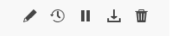

# Schemalägg arbetsböcker

När du har sparat arbetsboken och slutfört analysen kan du enkelt dela arbetsboken med andra i teamet med hjälp av schemaläggningsfunktionen. Med funktionen Schemalägg kan du skapa ett schema som automatiskt uppdaterar data i arbetsboken och skickar Excel-arbetsbokens .xlsx-fil med e-post som en bifogad fil till den angivna målgruppen vid ett visst datum och en viss tidpunkt. Genom att ställa in ett schema får mottagarna regelbundna uppdateringar automatiskt. Du kan också använda schemafunktionen för att skicka ut arbetsboken en gång utan att schemalägga automatiska uppdateringar.

Du kan skapa flera scheman för en enskild arbetsbok. Du kan till exempel skicka en arbetsbok till ditt team dagligen och du kan skicka arbetsboken till din chef en gång i veckan genom att skapa två olika scheman.

Med funktionen Schemalägg kan du även konfigurera lösenordsskydd för en arbetsbok och redigera tidigare schemalagda arbetsböcker.

>[!VIDEO](https://video.tv.adobe.com/v/3413079/?quality=12&learn=on)

## Schemalägg en arbetsbok

Använd knappen Schema i Report Builder-navet för att snabbt skapa ett schema så att du automatiskt kan distribuera en Excel-arbetsboksfil (.xlsx) till en individ eller en grupp.

1. Klicka på knappen Schema i navet Report Builder.

   {width="55%"}

1. Klicka på Schemalägg arbetsbok eller plusknappen i det övre vänstra hörnet för att skapa en ny schemalagd arbetsbok.

   {width="55%"}

   I schemaläggningsrutan visas viss fördefinierad information om arbetsboken, t.ex. arbetsbokens namn och det senaste datumet som arbetsboken ändrades.

   {width="55%"}

1. (Valfritt) Ange ett filnamn.

   Arbetsbokens filnamn är som standard arbetsbokens namn, men du kan ändra det om du vill. Om du skickar samma arbetsbok till flera olika målgrupper och vill ge den ett lite mer användarvänligt namn för en viss målgrupp, kan du ändra namnet.

1. (Valfritt) Välj **Lägg till tidsstämpel i filnamn**.

   Du kan lägga till en tidsstämpel till filnamnet för att identifiera vilket datum arbetsboken uppdaterades. Detta är praktiskt om du snabbt vill se vilken version av en arbetsbok som skickades på ett visst datum. **Filnamnsförhandsgranskningen** visar hur arbetsbokens filnamn kommer att visas i e-postmeddelandet när arbetsboken distribueras. Tidsstämpelformatet är YYY-MM-DD.

1. (Valfritt) Välj **.zip-komprimering** om du vill komprimera filen och ange lösenordsskydd för filen.

   När du väljer det här alternativet uppmanas du att ange ett lösenord för att öppna filen. Detta är praktiskt om du är orolig för datasäkerheten och vill lösenordsskydda arbetsboken. Om du vill skydda filen med ett lösenord måste du välja **.zip-komprimering**. Lösenordet måste innehålla minst 8 tecken och innehålla en siffra och ett specialtecken.

   {width="55%"}

1. Ange **mottagare**. Du kan ange namnet på en person som är erkänd i organisationen eller ange en e-postadress för en person inom eller utanför organisationen.

1. Ange **Ämne** för e-postmeddelandet och en beskrivning för mottagarna. Ämnet får som standard arbetsbokens filnamn, men du kan ändra ämnet om det behövs. Du kan lägga till information i beskrivningsavsnittet.

   {width="55%"}

1. Ställ in schemaläggningsalternativen för att ange det datum och den tidpunkt då du vill att arbetsboken ska skickas med e-post till mottagarna.

   Välj start- och slutdatum och tidsramar. Det kan vara dagens datum eller ett datum i framtiden.

   Välj **Frekvens** i listrutan. Du kan ange att frekvensen ska vara timme, dag, vecka, månad eller år för en viss dag. Du kan till exempel ställa in ett schema för att skicka arbetsboken den första söndagsklickningen i månaden så att dina mottagare får e-postmeddelandet i sin inkorg första gången på måndagsmorgonen.

   {width="55%"}

1. När du har angett schemat klickar du på **Skicka enligt schema**.

   {width="55%"}

   En bekräftelsetabell visas längst ned i Report Builder och den schemalagda arbetsboken visas på fliken Arbetsböcker.

   {width="55%"}

## Skicka arbetsboken endast en gång

Du kan också skicka ut arbetsboken endast en gång.

1. Avmarkera **Visa schemaläggningsalternativ**

   {width="40%"}

1. Klicka på **Skicka nu**.

## Visa och redigera schemalagda arbetsböcker

Du kan visa och hantera alla schemalagda arbetsböcker på ett ställe under fliken Arbetsböcker.

1. Klicka på fliken Arbetsböcker i avsnittet Schema på Report Builder-hubben. Använd den här vyn om du vill visa en lista över alla schemalagda arbetsböcker.

1. Välj en arbetsbok. Flera verktyg visas som gör att du kan redigera arbetsboken, redigera schemaaktiviteten, pausa och starta om schemaaktiviteten, hämta en schemalagd aktivitetsrapport eller ta bort schemaaktiviteten.

   {width="20%"}

* (Valfritt) Klicka på pennikonen för att redigera arbetsbokens schemauppgift.

* (Valfritt) Klicka på klockikonen om du vill visa en historik för varje schemalagd aktivitet.

* (Valfritt) Klicka på pausikonen för att pausa och starta om distributionsschemaaktiviteten. Detta är praktiskt om du behöver ändra arbetsboken innan arbetsboken skickas. Klicka på pausikonen igen när du vill starta om distributionen.

* (Valfritt) Klicka på nedladdningsikonen för att hämta en kopia av arbetsbokens schemauppgift.

* (Valfritt) Klicka på papperskorgen för att ta bort schemaaktiviteten.

  {width="40%"}

## Granska status för schemalagda aktiviteter

I historikvyn kan du granska statusen för varje schemalagd aktivitet. Det finns en separat rad som dokumenterar statusändringen för varje schemalagd aktivitet. I exemplet nedan startades *New Timly Schedule* den 5 januari kl. 17:04. Senast 17:05 uppdaterades programmet och skickades till mottagarna. Nästa arbetsbok, *Ogiltig arbetsbok*, påträffade ett fel under uppdateringsprocessen. Om det inte går att skicka en arbetsbok kan du felsöka på historikfliken genom att visa var i processen felet uppstod. I det här fallet beror det troligtvis på ett fel i datablocket, kanske en komponent som saknas, som hindrade arbetsboken från att uppdateras.

En grön bock anger att arbetsboken har skickats. Ett utropstecken i en röd triangel anger att ett fel har inträffat.

Du kan välja vilka kolumner som ska visas på fliken Historik genom att klicka på kolumninställningsikonen till höger om sökfältet.

{width="55%"}

Du kan filtrera ned historiken så att endast en schemalagd arbetsbok visas genom att gå till fliken Arbetsböcker, välja arbetsboken och klicka på ikonen Historik.

Du kan även visa historiken för en viss arbetsbok på fliken Arbetsböcker. Markera arbetsboken på fliken Arbetsböcker och klicka sedan på ikonen Historik.

{width="55%"}

Arbetsboksfiltret visas sedan högst upp i historiken. Om du vill visa historiken för alla schemalagda aktiviteter igen klickar du på x bredvid filtret.

{width="55%"}
