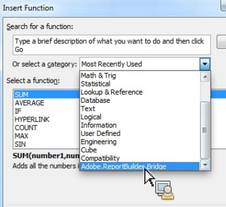

# Anropa Report Builder-funktioner från Microsoft Excel-funktioner

Den här funktionen integrerar Report Builder-användningen ytterligare i det naturliga Excel-arbetsflödet, utan att du behöver använda gränssnittet i Report Builder.

Du kanske vill uppdatera Report Builder-begäranden automatiskt, vars indatafilter baseras på data som hämtats i Excel från andra källor. Nu kan du göra detta med strängen RefreshRequestsInCellsRange(..) funktion. Alla anrop är asynkrona. De returnerar omedelbart och väntar inte på att ett anrop ska köras helt.

>[!NOTE]
>
>Du måste ha Report Builder 5.0 (eller senare) installerat för att den här funktionen ska fungera.

Här följer en tabell med en lista över funktioner som visas:

| Funktionsnamn | Beskrivning |
|---|---|
| string AsyncRefreshAll() | Uppdaterar alla Report Builder-begäranden som finns i en arbetsbok. |
| string AsyncRefreshRange(strängintervallAddressInA1Format) | Uppdaterar alla Report Builder-begäranden som finns i den angivna cellintervalladressen (ett stränguttryck som representerar ett cellintervall i A1-format, till exempel &quot;Sheet1!A2:A10&quot;). |
| string AsyncRefreshRangeAltTextParam() | Uppdaterar alla Report Builder-begäranden som finns i det angivna cellområdet som skickas via den alternativa texten i MS Form Control. |
| string AsyncRefreshActiveWorksheet() | Uppdaterar alla Report Builder-begäranden som finns i det aktiva kalkylbladet. |
| string AsyncRefreshWorksheet(string worksheetName) | Uppdaterar alla Report Builder-begäranden som finns i det angivna kalkylbladet (kalkylbladets namn så som det visas på fliken). |
| string AsyncRefreshWorksheetAltTextParam(); | Uppdaterar alla Report Builder-begäranden som finns i det specifika kalkylbladsnamnet som skickades via den alternativa texten i MS Form Control |
| string GetLastRunStatus() | Returnerar en sträng som beskriver statusen för den senaste körningen. |

Om du vill få åtkomst till de här funktionerna i Report Builder går du till [!UICONTROL Formulas] > [!UICONTROL Insert Function]. Längst ned i kategorilistan finns Adobe.ReportBuilder.Bridge:



## Använd de här funktionerna i en formel {#section_034311081C8D4D7AA9275C1435A087CD}

Formeln

```
=IF(OR(ISTEXT(P5),ISBLANK(P5)),AsyncRefreshRange("P9"),"")
```

säger&quot;Om värdet i cell P5 är text eller tomt, uppdaterar du det intervall som finns i cell P9.&quot;

## Använd Report Builder-funktioner med formatkontroll {#section_26123090B5BD49748C8D8ED7A1C5ED84}

Nu kan du tilldela ett makro till en kontroll som du har skapat och den kontrollen kan vara en funktion som uppdaterar en arbetsboksförfrågan. Funktionen AsyncRefreshActiveWorksheet uppdaterar till exempel alla begäranden i ett kalkylblad. Ibland kanske du bara vill uppdatera vissa förfrågningar, inte alla.

1. Ange makroparametern.
1. Högerklicka på kontrollen och välj **[!UICONTROL Assign Macro]**.
1. Ange funktionsnamnet för Report Builder (inga parametrar eller parenteser).


## Skicka parametrar till Report Builder-funktioner via formatkontroll {#section_ECCA1F4990D244619DFD79138064CEF0}

De två funktionerna som tar en parameter kan användas med Formatkontroll, men endast via fältet Alt-text:

* AsyncRefreshRange(strängintervallAddressInA1Format)
* AsyncRefreshWorksheet(string worksheetName)

1. Högerklicka på kontrollen och välj **[!UICONTROL Format Control]**.

   

1. Klicka på [!UICONTROL Alt Text] fliken.

   

1. Under [!UICONTROL Alternative text]anger du cellområdet som du vill uppdatera.
1. Öppna listan med parametrar för Report builder under [!UICONTROL Formulas] > [!UICONTROL Insert Function]> [!UICONTROL Adobe.ReportBuilder.Bridge].

1. Välj en av de två funktionerna som slutar med AltTextParam och klicka på **[!UICONTROL OK]**.

